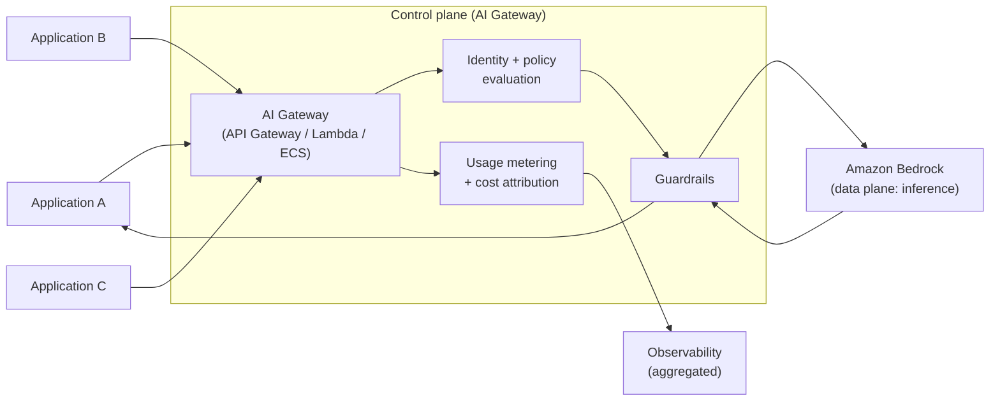
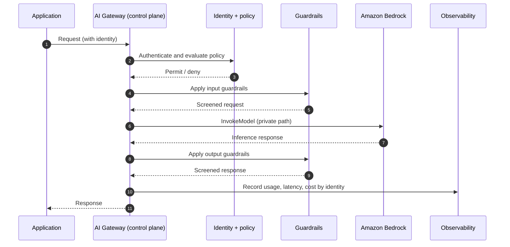

# Chapter 7: The AI Gateway Pattern

Chapter 6 ended with a signal. When several applications each integrate with Amazon Bedrock directly, the organisation ends up reimplementing the same controls in each one, with no shared view of usage, no consistent policy and no single place to govern access. Direct integration is the right pattern until that moment, and the wrong one after it. This chapter is about what to do when that moment arrives: place a deliberate control plane, an AI Gateway, between your applications and the models.

The AI Gateway is one of the most consequential patterns in enterprise GenAI, because it is where governance, security, observability and cost control stop being per-application afterthoughts and become properties of the system. It is also a pattern that can be over-applied, so the chapter gives as much attention to when it is unnecessary as to when it is essential.

---

## 1. The Architectural Problem

An organisation has moved past its first GenAI application. Several teams now want to use foundation models, and the concerns that were absent for a single application have all arrived at once.

Access is inconsistent: each application decides for itself which models it may call and how it authenticates, so there is no uniform policy and no way to enforce one. Usage is invisible: model spend is spread across accounts and roles with no aggregated view, making it impossible to answer simple questions about total cost or which team is driving it. Controls are duplicated: guardrails, logging, rate limiting and retry logic are reimplemented, slightly differently, in every application, which is both wasteful and a source of inconsistency. And governance has no home: when the organisation needs to change which models are permitted, apply a new content policy, or demonstrate control for an audit, there is no single point at which to do so.

The underlying architectural constraint is that these are cross-cutting concerns. They apply to every application's use of models, and cross-cutting concerns are poorly served by being solved separately in each consumer. The problem is not that any single application is wrong; it is that the collection of applications has no shared control point.

The architectural question is therefore: how do we provide consistent access, policy, observability and cost control across many applications, without forcing every team to build those controls themselves, and without creating a bottleneck that undermines the very autonomy the teams need?

---

## 2. 🧩 The Pattern at a Glance

- **Pattern name:** AI Gateway
- **Problem solved:** Inconsistent, invisible and duplicated control over foundation model access across many applications.
- **Primary objective:** A single control plane that enforces access, identity, policy, observability and cost control consistently, in front of the inference data plane.
- **When to use:** Multiple applications or teams consuming models; a need for consistent governance, aggregated usage visibility or centralised policy.
- **When not to use:** A single application or a few genuinely independent ones with no shared governance requirement, where the gateway would add latency and operational overhead without benefit.
- **Key AWS services:** Amazon Bedrock as the data plane; the gateway itself built from API Gateway, Lambda or containers, IAM, and guardrails; observability and cost tooling behind it.
- **Primary architectural concern:** Separating the control plane from the data plane so that cross-cutting concerns are enforced in one place.

The AI Gateway is the architectural realisation of the control plane described in Chapter 3. Applications no longer call Bedrock directly; they call the gateway, which applies control and then invokes inference on their behalf.

---

## 3. The Architecture

The reference architecture introduces a control plane between the applications and the models:

- **Applications** call the AI Gateway instead of calling Bedrock directly.
- **The AI Gateway** authenticates the caller, evaluates policy, applies guardrails, records usage, and then invokes the model. It is the single control point for model access.
- **Identity and policy** are evaluated at the gateway, using the caller's identity to decide what is permitted.
- **Guardrails** are applied consistently at the boundary rather than reimplemented per application.
- **Amazon Bedrock** remains the data plane where inference occurs, reached over a private path.
- **Observability and cost tooling** behind the gateway aggregate usage, latency, errors and spend across all consumers.

The key structural change from Chapter 6 is the interposition of a control point that every request passes through. That single fact is the source of both the pattern's benefits and its costs.

---

## 4. Request and Data Flow

> **Step 1:** An application sends a request to the AI Gateway, carrying its identity.
> **Step 2:** The gateway authenticates the caller.
> **Step 3:** The gateway evaluates policy: is this identity permitted to use this model for this purpose?
> **Step 4:** The gateway applies input guardrails to the request.
> **Step 5:** The gateway invokes Bedrock over the private path.
> **Step 6:** Bedrock performs inference and returns a response.
> **Step 7:** The gateway applies output guardrails to the response.
> **Step 8:** The gateway records usage, latency and cost, attributed to the calling identity.
> **Step 9:** The gateway returns the response to the application.

Every step that was the individual application's responsibility in Chapter 6, authentication, policy, guardrails, metering, now happens once, at the gateway, on behalf of all applications.

---

## 5. Why This Pattern Works

The pattern works because it moves cross-cutting concerns to where they can be enforced once and applied uniformly. Policy defined at the gateway applies to every consumer without each team implementing it. Guardrails at the boundary cannot be forgotten by an individual application. Usage recorded at the gateway produces the aggregated visibility that fragmented integration could never provide. When the organisation needs to change which models are permitted or tighten a content policy, there is a single place to do it.

It also works because it cleanly separates the control plane from the data plane. The gateway concerns itself with whether and how a request should proceed; Bedrock concerns itself with producing the result. This separation, introduced in Chapter 3, is what allows governance to evolve independently of inference, and it is the structural reason the pattern scales to many consumers where repeated direct integration does not.

---

## 6. 🏗️ Architectural Decisions

| Decision | Options | Recommended approach | Reason |
| --- | --- | --- | --- |
| Control point | None / AI Gateway | AI Gateway | Consistent cross-cutting control across many consumers |
| Gateway placement | Per application / Central | Central (often platform account) | One place to govern access and see usage |
| Identity to gateway | Shared key / Caller identity | Caller identity | Per-consumer policy and attribution |
| Guardrails | Per application / At gateway | At gateway | Consistency and non-bypassability |
| Model selection | In application / At gateway | At gateway (enables routing) | Central policy over which models are used |
| Gateway compute | Lambda / Containers | Match traffic profile | Balance latency, concurrency and cost |

Each decision leans towards centralised control, but each remains contingent. If autonomy matters more than consistency for a given concern, that concern can be left with the application, and the gateway can be scoped to the concerns that genuinely benefit from centralisation.

---

## 7. ⚖️ Trade-offs

**Benefits:** Consistent policy and guardrails, aggregated observability and cost visibility, a single governance point, elimination of duplicated controls, and a natural place to add routing and caching later.

**Costs and limitations:** The gateway is an additional hop, adding latency. It is a shared dependency, and therefore a potential single point of failure and a potential bottleneck. It is infrastructure that must itself be built, operated, scaled and secured. It can become an organisational chokepoint if it is run in a way that slows teams down.

**Complexity:** Moderate to high. This is a genuine platform component, not a library, and it brings platform responsibilities.

**Operational overhead:** Higher than direct integration for the platform team, but lower for the organisation overall once several consumers exist, because controls are built and operated once rather than many times.

**Security implications:** Strongly positive when done well: a consistent, non-bypassable enforcement point. The flip side is that the gateway becomes a high-value target and a concentration of trust, so it must be secured accordingly.

**Performance implications:** An added hop and added processing. For most workloads the latency is modest and acceptable; for the most latency-sensitive paths it must be measured and justified.

**Cost implications:** Introduces the gateway's own running cost, offset by better cost visibility and control, and by the routing and caching opportunities the boundary enables. Net cost usually improves at scale, but not automatically; it depends on how the gateway is used.

---

## 8. 🔐 Security and Governance

The AI Gateway is, above all, a security and governance pattern. Its value is that it provides a single, non-bypassable point at which identity is verified, policy is enforced and guardrails are applied. Applications should reach models only through the gateway; a design that lets applications also call Bedrock directly undermines the guarantee the gateway exists to provide, so the network and IAM configuration should make the gateway the only path to inference.

Identity should flow to the gateway as the caller's own identity, not a shared secret, so that policy and attribution can be per-consumer. Guardrails applied at the gateway cannot be omitted by an individual team, which is precisely their strength. Because the gateway concentrates trust and sees every request, it is a high-value target: it must be secured with the same rigour as any critical control plane, with least privilege, strong isolation and thorough auditing. The concentration of control is the benefit; the concentration of risk is the cost, and both follow from the same structural choice.

Governance improves markedly. Which models are permitted, for whom, under what policy, becomes a decision made and enforced in one place, and the gateway's records provide the evidence that auditors and risk functions require.

---

## 9. 🌐 Networking

The gateway typically lives in a central location, often a dedicated platform account in a multi account organisation, and applications reach it across account boundaries using the connectivity patterns an enterprise already operates. Behind the gateway, inference traffic to Bedrock should travel a private path over a VPC endpoint, exactly as in Chapter 6. The network design should enforce the security intent from section 8: applications reach the gateway, and only the gateway reaches Bedrock, so that the control point cannot be bypassed at the network level. Cross-account access, private connectivity and DNS are the same concerns handled for any shared platform service, applied here to the inference path.

---

## 10. ⚠️ Failure Modes and Resilience

Interposing a control plane introduces failure modes that direct integration does not have, and they must be designed for.

- **Gateway unavailable:** Because every request passes through it, the gateway is a shared dependency whose failure affects all consumers. It must be designed for availability, with redundancy and no single instance of failure, appropriate to how critical model access is to the business.
- **Gateway as bottleneck:** Under load the gateway can throttle or add latency for everyone. It must scale with aggregate demand, and its capacity planning must consider all consumers together, not one at a time.
- **Added latency:** The extra hop and processing add latency that, for sensitive paths, may matter. This must be measured, not assumed away.
- **Downstream failures still apply:** Model unavailability, throttling and malformed output from Chapter 6 remain, now handled centrally at the gateway, which can implement consistent retry, backoff and fallback on behalf of all consumers, an advantage, provided it is built to do so.
- **Policy or guardrail rejection:** The gateway may legitimately refuse a request. Applications must handle a denial as a defined outcome rather than an error.

The recurring theme is that centralisation concentrates both control and risk: the gateway can provide resilience to every consumer, but only if it is itself resilient.

---

## 11. 👁️ Observability and Operations

Observability is one of the strongest reasons to adopt the pattern. Because every request passes through the gateway, it is the natural place to record latency, token consumption, model usage, error and throttling rates, guardrail events and cost, all attributed to the calling identity. This produces the aggregated, per-consumer visibility that fragmented direct integration cannot, and it is the foundation for both operational management and cost control.

Operationally, the gateway is a platform service with the responsibilities that implies: it must be monitored, kept available, scaled, and treated as a production dependency of every consumer. As always, distinguish technical observability from evaluation of output quality; the gateway can capture the signals, but assessing whether responses are actually good remains a separate discipline addressed later.

---

## 12. 💷 Cost and FinOps

The pattern changes the cost picture in two ways. It introduces the gateway's own running cost, the compute and infrastructure needed to operate a shared control plane. And it dramatically improves cost visibility and control, because usage is metered centrally and attributed per consumer, turning the fragmented, unattributable spend of Chapter 6 into something an organisation can actually see, allocate and charge back.

The boundary also creates cost-control opportunities that direct integration cannot: because model selection can happen at the gateway, routing to cheaper models where appropriate and caching common results become architectural options, both developed in later chapters. Whether the pattern reduces net cost depends on how these opportunities are used; the gateway makes them possible but does not deliver them automatically.

---

## 13. When to Use This Pattern

Use this pattern when:

- multiple applications or teams consume foundation models and need consistent policy;
- the organisation requires an aggregated view of model usage and cost;
- guardrails and access policy must be enforced uniformly and non-bypassably;
- governance requires a single point to control which models are used and by whom; or
- the same controls are otherwise being reimplemented in application after application.

It is the natural successor to direct integration once an organisation has more than a few consumers, and it is often the centrepiece of the enterprise platform developed in Part III.

---

## 14. When NOT to Use This Pattern

Do not use this pattern when:

- there is a single application, or a few genuinely independent ones, with no shared governance requirement, direct integration is simpler and faster;
- the added latency of an extra hop is unacceptable for the workload and cannot be justified;
- the organisation lacks the maturity or capacity to operate a shared platform service reliably, an unreliable gateway is worse than no gateway, because it becomes a single point of failure for everyone; or
- introducing a central control point would create an organisational bottleneck that does more harm than the consistency it provides.

The gateway earns its complexity through scale and the need for shared governance. Applied to a problem that does not have those characteristics, it is complexity without a corresponding benefit, the same mistake as building a platform for a single application, in the opposite direction.

---

## 15. Pattern Variations

- **Small organisation:** Often no gateway at all; direct integration (Chapter 6) is sufficient until multiple consumers appear.
- **Medium enterprise:** A central AI Gateway providing consistent access, guardrails and usage visibility for several applications.
- **Large enterprise:** A gateway as part of a federated platform, centralising governance and guardrails while application accounts retain autonomy over their own data and workloads, the subject of Part III.
- **Highly regulated enterprise:** A gateway with stronger policy enforcement, stricter isolation and more comprehensive auditing, reflecting tighter constraints.

The pattern scales in sophistication with the organisation's size, maturity and regulatory burden, rather than being a single fixed design.

---

## 16. Architecture Decision Checklist

- [ ] Is there genuinely more than one consumer, or a clear near-term need for shared governance?
- [ ] Is the gateway the only path to inference, enforced by network and IAM configuration?
- [ ] Does the caller's own identity reach the gateway, enabling per-consumer policy and attribution?
- [ ] Are guardrails applied at the gateway rather than per application?
- [ ] Is the gateway designed for availability appropriate to how critical model access is?
- [ ] Can the gateway scale with aggregate demand across all consumers?
- [ ] Is added latency measured and acceptable for the workloads involved?
- [ ] Is usage metered and attributed per consumer for cost control?
- [ ] Does the organisation have the capacity to operate the gateway as a production platform service?

---

## 17. 📐 The Architect's Verdict

> The AI Gateway is the right pattern when multiple consumers need consistent governance, security and cost control over foundation models, and it is the point at which GenAI stops being a set of applications and starts becoming a platform. Its strength is a single, non-bypassable control plane; its cost is an added hop, a shared dependency and a genuine platform to operate. The same structural choice that concentrates control also concentrates risk, so the gateway is only as good as its own resilience and security. Adopt it when scale and shared governance justify it, scope it to the concerns that truly benefit from centralisation, and resist imposing it where a single application would be better served by direct integration. Centralise deliberately, not reflexively.
