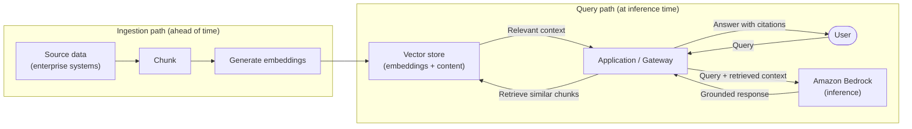
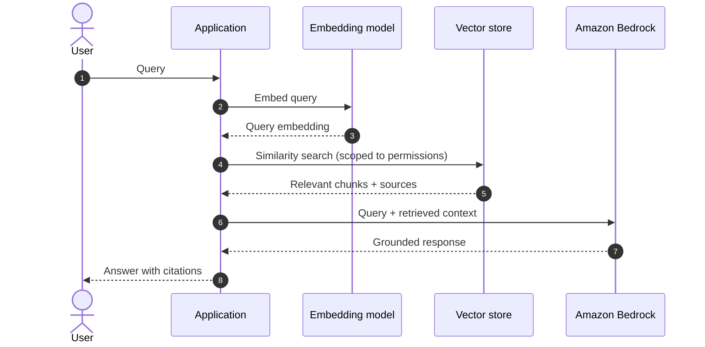

# Chapter 8: Retrieval Augmented Generation (RAG) Architectures

Chapter 4 established a hard limit of any foundation model: its knowledge is frozen at training time and contains nothing of your enterprise unless you supply it. Retrieval Augmented Generation (RAG) is the primary architectural answer to that limit. It supplies the model with relevant, authoritative information at inference time, so that responses rest on your data rather than on the model's training alone.

RAG is often described as a technique. For an architect it is better understood as a pattern with its own components, data flows, boundaries, failure modes and costs. This chapter treats the base RAG pattern in that way. The deeper retrieval concerns, hybrid search, re-ranking, vector store selection and retrieval evaluation, are developed in Chapter 9; here the goal is to get the fundamental architecture and its decisions right.

---

## 1. The Architectural Problem

An application needs the model to answer using specific, current, enterprise information: policies, product data, documentation, records, that the model was never trained on and could not know.

Two problems sit underneath this. The first is knowledge: the model simply does not contain the information, and cannot answer correctly without it. The second is trust: asked about something it does not know, a model may produce a fluent, plausible answer that is unsupported, because it generates output probabilistically rather than by consulting a source. In an enterprise setting, a confident but unsupported answer can be worse than no answer.

The constraints are familiar from earlier chapters. The information lives in enterprise systems with owners, classifications and access rules. Context supplied to the model is finite and costs tokens, so you cannot simply send everything. And the information changes, so whatever mechanism supplies it must stay reasonably current.

The architectural question is: how do we supply the model, at inference time, with the right enterprise information for a given request, drawn from authoritative sources, while respecting ownership and access, staying within context limits, and keeping the information current?

---

## 2. 🧩 The Pattern at a Glance

- **Pattern name:** Retrieval Augmented Generation (RAG)
- **Problem solved:** The model lacks current, private enterprise knowledge and may produce unsupported answers without it.
- **Primary objective:** Ground responses in authoritative enterprise data retrieved at inference time.
- **When to use:** Responses must draw on specific, current or private information; grounding and the ability to cite sources matter.
- **When not to use:** The task needs no external knowledge, the required knowledge is small and static enough to place directly in the instruction, or the problem is better solved by customising the model itself.
- **Key AWS services:** Amazon Bedrock for inference and embeddings; a vector store for retrieval; an ingestion pipeline; managed knowledge base capabilities where appropriate.
- **Primary architectural concern:** The context supply chain, how data becomes retrievable and how the right data reaches the model for each request.

RAG turns the abstract need for context from Chapter 4 into concrete machinery: an ingestion path that prepares data for retrieval, and a query path that retrieves and supplies it at inference time.

---

## 3. The Architecture

RAG has two distinct flows, and separating them is the key to understanding the pattern. An **ingestion path** prepares enterprise data for retrieval, ahead of time. A **query path** uses that prepared data to answer a request, at inference time.

- **Source data** in enterprise systems is the authoritative material to be grounded on.
- **An ingestion pipeline** reads that data, splits it into chunks, generates embeddings for each chunk, and stores them.
- **A vector store** holds the embeddings and their associated content, enabling retrieval by similarity.
- **The application (or gateway)** receives a request, retrieves relevant chunks, assembles them into the context, and calls the model.
- **Amazon Bedrock** generates the response, grounded in the retrieved content, and can cite what it used.

The ingestion path is where most of the enduring architectural work lives; the query path is where the pattern is felt at runtime.

---

## 4. Request and Data Flow

The query path, step by step:

> **Step 1:** A user submits a query to the application.
> **Step 2:** The application converts the query into an embedding.
> **Step 3:** The application searches the vector store for chunks most similar to the query, scoped to what this user is permitted to see.
> **Step 4:** The vector store returns the most relevant chunks with their source references.
> **Step 5:** The application assembles the context: the query, the retrieved chunks, and instructions to answer from that content.
> **Step 6:** The application calls Bedrock for inference.
> **Step 7:** Bedrock generates a response grounded in the supplied context.
> **Step 8:** The application returns the answer, with citations to the sources used.

The ingestion path runs separately and ahead of this: source data is chunked, embedded and stored so that step 3 has something to search. How often ingestion runs determines how current the retrievable knowledge is.

---

## 5. Why This Pattern Works

RAG works because it addresses both underlying problems at once. It gives the model knowledge it does not have, by supplying it at inference time, and it reduces unsupported answers, by grounding responses in retrieved content and enabling citation of sources. A grounded, cited answer is one a user can verify and an enterprise can trust.

It also works because it keeps the model and the knowledge separate. The model is not retrained as data changes; instead the retrievable data is updated through ingestion, which is far cheaper and faster than customising the model and keeps knowledge current without touching inference. This separation of the knowledge layer from the model layer is the structural reason RAG is usually the first tool to reach for when a task needs enterprise information.

---

## 6. 🏗️ Architectural Decisions

| Decision | Options | Recommended approach | Reason |
| --- | --- | --- | --- |
| Grounding approach | Model customisation / RAG / Prompt | RAG (for current or private data) | Keeps knowledge current without retraining |
| Data ownership | Shared index / Local per domain | Local per domain (usually) | Preserves ownership and access boundaries |
| Chunking | Fixed size / Structure aware | Structure aware where feasible | Better retrieval relevance |
| Ingestion cadence | Batch / Event driven | Match data freshness need | Balances currency against cost |
| Retrieval scope | Global / Permission filtered | Permission filtered | Prevents cross-tenant and unauthorised access |
| Managed vs self-built | Managed knowledge base / Custom | Managed unless a constraint forbids it | Lower operational burden |

The most consequential of these is data ownership, treated next, because it determines the security and organisational shape of the whole pattern.

---

## 7. ⚖️ Trade-offs

**Benefits:** Current and private knowledge without retraining; grounded, citable answers; a knowledge layer that updates independently of the model; lower cost and faster iteration than model customisation.

**Costs and limitations:** RAG introduces real machinery, an ingestion pipeline, a vector store, an embedding model, that must be built, operated and kept current. Answer quality now depends on retrieval quality: if the wrong chunks are retrieved, the model is grounded in the wrong information, and the answer is confidently wrong. Retrieved content also consumes context tokens, adding cost per request.

**Complexity:** Moderate. More than direct prompting, considerably less than customising a model.

**Operational overhead:** Ongoing. Ingestion must run, the vector store must be maintained, and data currency must be managed.

**Security implications:** Significant and double-edged. Copying data into an index creates a new place the data lives, which must be protected and access-controlled as carefully as the source. Done carelessly, retrieval can leak data across tenants or to unauthorised users.

**Performance implications:** Adds a retrieval step and larger contexts, increasing latency somewhat. Usually acceptable, but not free.

**Cost implications:** Embedding generation, vector storage, and the extra context tokens per request are the added cost drivers, offset by avoiding the far greater cost of model customisation.

---

## 8. 🔐 Security and Governance

RAG's central security fact is that it copies data into a new location. Content that was governed in its system of record is now also in a vector store, and that store must inherit the same protection: encryption, access control, and respect for the data's classification and residency. An index that aggregates data from many sources can quietly become a place where someone can reach information they could never reach in the originals.

The most important control is that retrieval must respect the requesting identity. A user must only ever retrieve chunks they are permitted to see, which means access must be enforced at retrieval time, through permission-filtered search, not left to the model. Relying on the instruction to tell the model "only answer from content this user may see" is not a security control; the control must be in the retrieval, so that unauthorised content is never placed in the context at all. This is the retrieval-time expression of the trust boundary and tenancy concerns from Chapter 3.

Governance also covers provenance: because RAG can cite sources, the architecture should preserve the link between a retrieved chunk and its origin, which supports both user trust and audit.

---

## 9. 🌐 Networking

The network concerns follow from the components. The ingestion pipeline reaches source systems, sometimes across accounts, and those paths should be private and least-privileged. Embedding generation calls a model, over a private path to Bedrock as in earlier chapters. The vector store is reached by the query path and must be network-isolated so that only authorised components can query it. In a multi account organisation, where the vector store lives relative to the data and the application, and how it is reached across account boundaries, is an architectural decision with both security and latency consequences, and it connects directly to the data ownership question in section 6.

---

## 10. ⚠️ Failure Modes and Resilience

RAG adds failure modes beyond those of plain inference.

- **Poor retrieval:** The most important failure. If retrieval returns irrelevant chunks, the model grounds its answer in the wrong content and produces a confident, wrong answer, with no error raised. This is a quality failure, not a technical one, and it is why retrieval quality is treated as a first-class concern in Chapter 9.
- **Empty retrieval:** Sometimes nothing relevant is found. The system must handle this deliberately, by saying it cannot answer rather than letting the model invent one, which requires designing for the empty case explicitly.
- **Stale data:** If ingestion lags behind the source, the model grounds on out-of-date information. Freshness is a design parameter, not an accident.
- **Vector store unavailable:** Retrieval fails; the system must degrade gracefully, for example by declining to answer rather than answering ungrounded.
- **Ingestion pipeline failure:** New or changed data does not become retrievable, silently degrading currency until noticed, so ingestion must itself be monitored.
- **Model failure modes:** All of Chapter 4's limits still apply to the grounded call.

The theme is that RAG's most dangerous failures are silent quality failures rather than loud technical ones, which makes evaluation and monitoring, addressed later, essential rather than optional.

---

## 11. 👁️ Observability and Operations

Two kinds of signal matter, and both must be watched. Technical signals, retrieval latency, vector store health, ingestion success and lag, embedding and inference latency, tell you the machinery is working. Quality signals, whether retrieval returns relevant content and whether answers are actually grounded and correct, tell you the pattern is doing its job. A RAG system can be perfectly healthy technically while quietly answering badly, which is why the quality signals cannot be neglected.

Operationally, ingestion is a pipeline that must be scheduled or triggered, monitored, and recovered when it fails; the vector store is a datastore that must be maintained; and data currency must be tracked against the freshness the business requires. Distinguishing technical observability from quality evaluation, a recurring theme, is especially important here because the two fail independently.

---

## 12. 💷 Cost and FinOps

RAG has three added cost drivers beyond inference. **Embedding generation** costs at ingestion and for each query embedding. **Vector storage** costs to hold embeddings and content, and grows with the corpus. **Extra context tokens** are consumed on every request, because retrieved chunks are added to the prompt, and this is often the largest ongoing driver, tying directly to Chapter 4's point that tokens are the currency of GenAI.

The main cost levers are architectural: retrieving fewer, more relevant chunks reduces tokens per request; sensible chunking and indexing reduce waste; and ingestion cadence trades currency against cost. Set against the alternative, RAG is almost always far cheaper than customising a model to hold the same knowledge, and it keeps that knowledge current without repeating the cost.

---

## 13. When to Use This Pattern

Use this pattern when:

- responses must draw on current, private or enterprise-specific information the model does not contain;
- grounding and the ability to cite sources are important for trust or audit;
- the knowledge changes often enough that baking it into the model would be impractical; or
- you need enterprise knowledge quickly and cost-effectively, without the effort of model customisation.

RAG is the default answer to "the model needs to know about our data", and for most enterprise knowledge problems it is the right starting point.

---

## 14. When NOT to Use This Pattern

Do not use this pattern when:

- the task needs no external knowledge, adding retrieval is needless complexity, latency and cost;
- the required knowledge is small and static enough to place directly in the instruction, a few facts do not justify an ingestion pipeline and a vector store;
- the need is for the model to behave differently or acquire a durable skill rather than to know current facts, which points towards customisation (Chapter 4) rather than retrieval; or
- the data cannot be copied into an index for security or regulatory reasons and no compliant retrieval design is available.

RAG solves a knowledge problem. Applied to a problem that is not about knowledge, or where a far simpler mechanism suffices, it is complexity without benefit.

---

## 15. Pattern Variations

- **Small organisation:** A single application with one ingestion pipeline and one vector store, often using managed knowledge base capabilities to minimise operational burden.
- **Medium enterprise:** Several domains, each owning its own data, ingestion and index, with retrieval often reached through the AI Gateway of Chapter 7.
- **Large enterprise:** Local, domain-owned retrieval across many accounts within a federated platform, preserving data ownership while sharing governance, developed in Part III.
- **Highly regulated enterprise:** Stricter isolation of indexes, tighter permission-filtered retrieval, and careful control over where indexed data resides.

The recurring variation is shared versus local retrieval. Most enterprises are better served by local, domain-owned indexes that preserve ownership and access boundaries, with a shared index reserved for genuinely shared, uniformly accessible knowledge.

---

## 16. Architecture Decision Checklist

- [ ] Does this task genuinely require external knowledge, rather than a fixed instruction?
- [ ] Who owns the data, and should the index be local to that domain or shared?
- [ ] Is retrieval permission-filtered so users only ever receive content they may see?
- [ ] Is the vector store protected and access-controlled to the standard of the source data?
- [ ] What freshness does the business need, and does ingestion cadence meet it?
- [ ] Is chunking chosen to support relevant retrieval rather than arbitrary splitting?
- [ ] Is the empty-retrieval case handled by declining to answer rather than inventing one?
- [ ] Are both technical and quality signals monitored?
- [ ] Are context tokens per request controlled to manage cost?

---

## 17. 📐 The Architect's Verdict

> RAG is the right pattern when a task needs current, private or enterprise-specific knowledge and answers must be grounded and citable. It solves the model's frozen-knowledge limit cheaply and keeps knowledge current without retraining, by separating the knowledge layer from the model. Its two defining risks are architectural, not incidental: security, because it copies governed data into a new index that must be protected and retrieved under the user's own permissions, and quality, because a wrong retrieval yields a confidently wrong answer with no error raised. Build it with permission-filtered retrieval, deliberate freshness, controlled context, and monitoring of both technical and quality signals. Prefer local, domain-owned indexes that preserve ownership, and reserve a shared index for knowledge that is genuinely shared. Done with that discipline, RAG is the most reliable way to make a model useful about your enterprise.
