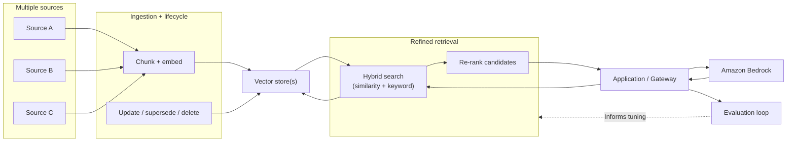
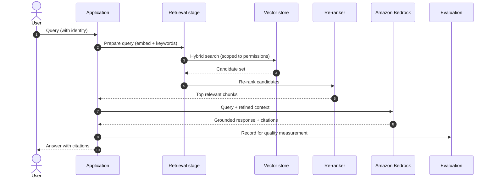

# Chapter 9: Advanced Retrieval and Knowledge Architectures

Chapter 8 established the base RAG pattern and made a claim that this chapter now takes seriously: in a RAG system, answer quality depends on retrieval quality. If the wrong content is retrieved, the model is grounded in the wrong information and produces a confident, wrong answer, with no error raised. The base pattern gets a system working. It does not, on its own, make retrieval good.

This chapter is about the difference between retrieval that runs and retrieval that works. It treats the harder concerns deferred from Chapter 8, improving relevance, choosing and operating a vector store, keeping knowledge current across its lifecycle, grounding across many sources and domains, and evaluating retrieval as a measured discipline rather than an assumption. It is less a single new pattern than a set of decisions that determine whether RAG delivers on its promise.

---

## 1. The Architectural Problem

A RAG system is in production and technically healthy: ingestion runs, the vector store responds, inference succeeds. Yet the answers are inconsistent. Sometimes the retrieved content is exactly right; sometimes it is plausible but tangential, and the answer is subtly wrong. Users lose trust not because the system fails loudly, but because it is unreliable quietly.

The problem is that naive retrieval, embed the query, return the most similar chunks, is a first approximation, not a solution. Pure similarity can miss content that uses different words for the same idea, or surface content that is superficially similar but not actually relevant. As the corpus grows and spans multiple sources and domains, these weaknesses compound. Meanwhile the knowledge itself is not static: documents change, are superseded and are deleted, and an index that does not track that lifecycle grounds answers in stale or withdrawn information.

The constraints from Chapter 8 all still hold, ownership, access, context limits, cost, and a new one becomes central: retrieval quality must be measurable, because a quality problem that cannot be measured cannot be managed, and silent quality failures are the defining risk of RAG.

The architectural question is: how do we make retrieval reliably relevant, across a growing and changing body of enterprise knowledge spanning many sources, and how do we know, by measurement, that it is working?

---

## 2. 🧩 The Pattern at a Glance

- **Pattern name:** Advanced Retrieval and Knowledge Architecture (an evolution of base RAG)
- **Problem solved:** Naive similarity retrieval is unreliable at scale, across many sources, and over time as knowledge changes.
- **Primary objective:** Reliable, relevant, current retrieval across a large multi-source corpus, with retrieval quality treated as a measured concern.
- **When to use:** Base RAG relevance is insufficient; the corpus is large, multi-source or fast-changing; retrieval quality materially affects outcomes.
- **When not to use:** A small, stable, single-source corpus where base RAG already retrieves well, added sophistication would be unjustified complexity.
- **Key AWS services:** Amazon Bedrock for embeddings and inference; a vector store chosen for the workload; ingestion and lifecycle pipelines; evaluation tooling.
- **Primary architectural concern:** Retrieval quality as a first-class, measured property of the system, not an assumed one.

This chapter assumes the base RAG architecture of Chapter 8 and improves its retrieval layer; it does not replace the pattern.

---

## 3. The Architecture

The architecture extends Chapter 8's query path with retrieval refinement, and its ingestion path with lifecycle management, across potentially many sources.

- **Multiple sources** feed ingestion, each with its own owner, classification and change cadence.
- **Ingestion and lifecycle pipelines** chunk and embed content, and also handle updates, supersession and deletion so the index reflects current reality.
- **One or more vector stores** hold embeddings and content, chosen and organised to fit the workload and ownership boundaries.
- **A retrieval stage** does more than a single similarity search: it may combine similarity with keyword search (hybrid search) and then re-rank candidates to put the most relevant first.
- **The application or gateway** assembles the refined results into context and calls the model.
- **An evaluation loop** measures retrieval quality continuously and feeds improvements back into the design.

The additions are concentrated in the retrieval stage and the lifecycle handling; the rest of the RAG architecture is unchanged.

---

## 4. Request and Data Flow

The refined query path, step by step:

> **Step 1:** A user submits a query, carrying their identity for permission-filtered retrieval.
> **Step 2:** The application prepares the query for retrieval, embedding it and, for hybrid search, deriving keyword terms.
> **Step 3:** The retrieval stage runs a hybrid search: semantic similarity and keyword matching, scoped to the user's permissions.
> **Step 4:** The vector store returns a candidate set larger than the final number of chunks needed.
> **Step 5:** A re-ranking step orders the candidates by relevance to the query and keeps the best few.
> **Step 6:** The application assembles the top chunks into context and calls Bedrock.
> **Step 7:** Bedrock generates a grounded response, with citations to the retained sources.
> **Step 8:** The interaction is recorded for evaluation, feeding the quality loop.

The essential change from Chapter 8 is between retrieval and inference: retrieve broadly, then re-rank to keep only the most relevant, so the model receives better context rather than merely more of it.

---

## 5. Why This Pattern Works

The refinements work because they attack the specific weaknesses of naive similarity retrieval. Hybrid search combines semantic similarity, which finds content that means the same thing in different words, with keyword matching, which reliably catches exact terms, names and identifiers that pure similarity can miss; together they retrieve relevant content that either method alone would overlook. Re-ranking then addresses a subtler problem: the most similar chunks are not always the most relevant, so ordering a broad candidate set by relevance and keeping only the best delivers better context within the same token budget.

Lifecycle management works because it keeps the index honest. Knowledge changes, and an architecture that ingests once and never reconciles will ground answers in content that no longer reflects reality. Handling updates, supersession and deletion keeps retrieval current.

And treating evaluation as a measured loop works because it converts retrieval quality from an assumption into a fact you can act on. You cannot improve what you cannot see, and the silent nature of retrieval failures makes measurement the only reliable way to know the system is working.

---

## 6. 🏗️ Architectural Decisions

| Decision | Options | Recommended approach | Reason |
| --- | --- | --- | --- |
| Retrieval method | Similarity only / Hybrid | Hybrid where terms matter | Catches both meaning and exact terms |
| Re-ranking | None / Re-rank candidates | Re-rank when relevance is critical | Better context within the token budget |
| Vector store | Managed / Self-operated; general / specialised | Fit to scale, latency, ownership | No single store suits every workload |
| Corpus organisation | One shared index / Per source or domain | Per domain, aligned to ownership | Preserves boundaries; often improves relevance |
| Lifecycle | Ingest once / Reconcile changes | Reconcile updates and deletions | Keeps knowledge current and correct |
| Evaluation | Assumed / Measured loop | Measured, continuous | Makes silent quality failures visible |

The vector store choice deserves emphasis: it is a genuine trade-off, not a default. Managed stores lower operational burden; self-operated ones offer control. Scale, latency, cost, existing operational capability and data ownership all bear on the choice, and different workloads in the same organisation may legitimately choose differently.

---

## 7. ⚖️ Trade-offs

**Benefits:** More reliable, relevant retrieval; better answers within the same or smaller token budget; current knowledge across a changing corpus; the ability to serve many sources and domains coherently; and, through evaluation, visibility into a quality dimension that base RAG leaves dark.

**Costs and limitations:** Every refinement adds machinery. Hybrid search and re-ranking add retrieval steps and latency. Lifecycle management adds pipeline complexity. Evaluation adds its own tooling and effort. Applied to a small, stable corpus that base RAG already serves well, this is complexity without return.

**Complexity:** Higher than base RAG, and it rises with the number of sources, the rate of change and the strictness of the quality requirement.

**Operational overhead:** Meaningfully higher: more pipeline, more retrieval stages, and an ongoing evaluation practice to sustain.

**Security implications:** The multi-source, multi-index shape increases the surface over which permission-filtered retrieval and isolation must hold. Aggregating sources must not aggregate access; each source's boundaries must survive into the index.

**Performance implications:** Extra retrieval and re-ranking steps add latency, usually justified by the quality gain, but to be measured rather than assumed.

**Cost implications:** More retrieval computation and re-ranking, offset by fewer, better chunks reducing context tokens, and by the avoided cost of unreliable answers.

---

## 8. 🔐 Security and Governance

The security concerns of Chapter 8 intensify as retrieval spans more sources. Permission-filtered retrieval remains the non-negotiable control: a user must only ever receive content they are entitled to, enforced at retrieval time and not delegated to the model. With many sources feeding one retrieval layer, the risk is that aggregation quietly erodes boundaries, that content assembled from several sources lets someone reach, in combination, what they could not reach individually. The architecture must ensure each source's classification and access rules survive into the index and into every query, which often argues for organising indexes by domain and ownership rather than pooling everything into one store.

Governance also grows in importance. With more sources and an active lifecycle, provenance, knowing which source a retrieved chunk came from and whether it is current, becomes essential for both trust and audit. The lifecycle itself is a governance concern: withdrawn or superseded content must actually leave the retrievable set, or the system will ground answers in information the organisation has formally retired.

---

## 9. 🌐 Networking

The networking builds on Chapter 8 with more sources and, often, more stores. Ingestion now reaches multiple source systems, frequently across accounts, and each path should be private and least-privileged. Where multiple vector stores exist, perhaps one per domain, each must be network-isolated so that only authorised retrieval components can query it, and cross-account query paths must be deliberately designed. In a federated organisation, the placement of indexes relative to the data they represent and the applications that query them is an architectural decision with security, latency and ownership consequences, and it connects directly to the multi-account patterns of Part III.

---

## 10. ⚠️ Failure Modes and Resilience

The advanced pattern refines Chapter 8's failure modes and adds its own.

- **Subtle relevance failure:** The most important. Retrieval returns plausible but not-quite-right content, and the answer is confidently wrong. Hybrid search and re-ranking reduce this, and evaluation is what surfaces it when it persists.
- **Re-ranking or hybrid stage failure:** An added stage is an added dependency. The system should degrade to simpler retrieval rather than failing entirely.
- **Stale or withdrawn content served:** A lifecycle gap causes the index to serve superseded or deleted information. Lifecycle handling and monitoring guard against this; it is a correctness and sometimes compliance failure.
- **Source drift:** As sources evolve, chunking or extraction that once worked may degrade. This erodes quality silently and is caught only by evaluation.
- **Cross-source boundary failure:** A permission or isolation gap in one source contaminates a multi-source result, a security failure that the multi-source shape makes more likely if boundaries are not carefully preserved.
- **Vector store unavailability:** As in Chapter 8, retrieval must degrade gracefully rather than answer ungrounded.

The unifying theme, again, is that the dangerous failures are silent quality and boundary failures, which is precisely why evaluation is elevated to a first-class concern.

---

## 11. 👁️ Observability and Operations

Observability here must cover both the machinery and the quality, and the quality half is what distinguishes this chapter. Technical signals, retrieval and re-ranking latency, vector store health, ingestion and lifecycle success and lag, remain necessary. But the defining practice is measuring retrieval quality: whether retrieved content is actually relevant to the query, and whether answers are genuinely grounded in it. This is the evaluation loop, and it turns retrieval from something you hope works into something you know works.

Approaches to measuring retrieval quality, from automated relevance scoring to human review, belong to the broader evaluation discipline developed in Chapter 24; the architectural point here is that the loop must exist, must be fed by recorded interactions, and must inform tuning of chunking, retrieval and re-ranking. Operationally, the lifecycle pipeline joins ingestion as something that must be scheduled, monitored and recovered, and the evaluation practice becomes an ongoing responsibility rather than a one-off test.

---

## 12. 💷 Cost and FinOps

The advanced pattern shifts cost in both directions. It adds computation, hybrid search, re-ranking, richer ingestion and lifecycle processing, and evaluation, and it may add storage where multiple or specialised indexes are used. Against that, it tends to reduce the largest ongoing driver from Chapter 8, context tokens, because retrieving fewer, better chunks means less material sent to the model per request while improving the answer.

The clearest cost lever is relevance: better retrieval lets you send less context for a better result, improving both cost and quality at once. Vector store choice is also a cost decision, managed convenience against self-operated control, to be made on the workload's economics. And the largest, least visible cost the pattern addresses is the cost of unreliable answers: rework, lost trust and bad decisions, which good retrieval and evaluation exist to prevent.

---

## 13. When to Use This Pattern

Use this pattern when:

- base RAG retrieval is not reliably relevant, and answer quality suffers as a result;
- the corpus is large, spans multiple sources or domains, or changes frequently;
- exact terms, names or identifiers matter and pure similarity misses them, favouring hybrid search;
- retrieval quality materially affects outcomes and must be measured, not assumed; or
- knowledge has a real lifecycle of updates, supersession and deletion that the index must track.

These refinements are adopted incrementally, adding hybrid search, then re-ranking, then lifecycle rigour, then evaluation, as the corpus and quality demands grow, rather than all at once.

---

## 14. When NOT to Use This Pattern

Do not use this pattern when:

- the corpus is small, stable and single-source, and base RAG already retrieves well, the refinements add latency, cost and operational burden for no meaningful gain;
- the quality requirement is modest and occasional imperfect retrieval is acceptable;
- the organisation cannot yet operate base RAG reliably, adding sophistication on an unstable foundation makes things worse, not better; or
- the added retrieval latency is unacceptable and the simpler path meets the need.

Advanced retrieval earns its complexity through scale, diversity, change and a genuine quality requirement. Without those, base RAG is the better architecture, and reaching for sophistication is the same error this book warns against throughout: complexity beyond what the problem requires.

---

## 15. Pattern Variations

- **Small organisation:** Base RAG (Chapter 8), adopting a single refinement such as hybrid search only if a specific relevance gap appears.
- **Medium enterprise:** Hybrid search and re-ranking over a few domain-owned indexes, with a basic lifecycle and an emerging evaluation practice.
- **Large enterprise:** Multi-source, domain-owned retrieval within a federated platform, full lifecycle management, and a mature, continuous evaluation loop, connecting to Part III.
- **Highly regulated enterprise:** Strict per-domain isolation, rigorous lifecycle to guarantee withdrawn content is unretrievable, strong provenance, and auditable evaluation.

The variations are cumulative: each larger context tends to add refinements on top of the previous, rather than replacing them.

---

## 16. Architecture Decision Checklist

- [ ] Is base RAG relevance genuinely insufficient, or is the added sophistication premature?
- [ ] Would hybrid search help, do exact terms, names or identifiers matter here?
- [ ] Is re-ranking justified by the value of better context within the token budget?
- [ ] Is the vector store chosen for this workload's scale, latency, cost and ownership, not by default?
- [ ] Are indexes organised so each source's classification and access rules survive into retrieval?
- [ ] Does retrieval remain permission-filtered across all sources, with no aggregation of access?
- [ ] Does the lifecycle ensure updated, superseded and deleted content is correctly reflected?
- [ ] Is provenance preserved for trust and audit?
- [ ] Is there a measured evaluation loop, fed by real interactions, that informs tuning?

---

## 17. 📐 The Architect's Verdict

> Advanced retrieval is the right investment when base RAG is not reliably relevant, when the corpus is large, multi-source or fast-changing, and when retrieval quality genuinely affects outcomes. Its refinements, hybrid search, re-ranking, lifecycle management, address the specific weaknesses of naive similarity retrieval, and its most important discipline is treating retrieval quality as a measured property rather than an assumption, because the defining risk of RAG is the silent, confident, wrong answer. Choose the vector store on the workload's economics rather than by default, organise indexes so that source boundaries and permissions survive into every query, and keep the index honest with a real lifecycle. Adopt the refinements incrementally, only as scale and quality demands justify them. On a small, stable corpus, base RAG remains the better architecture; on a large, changing, multi-source one, measured advanced retrieval is what separates a RAG system that works from one that merely runs.
