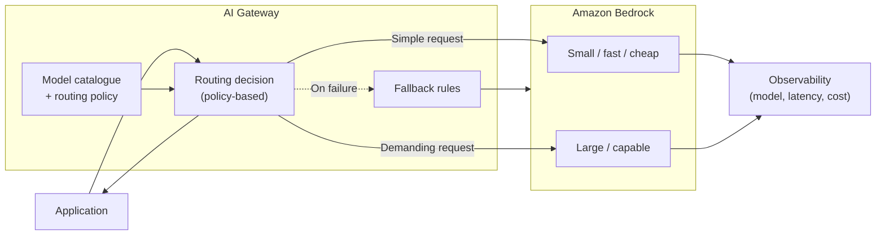
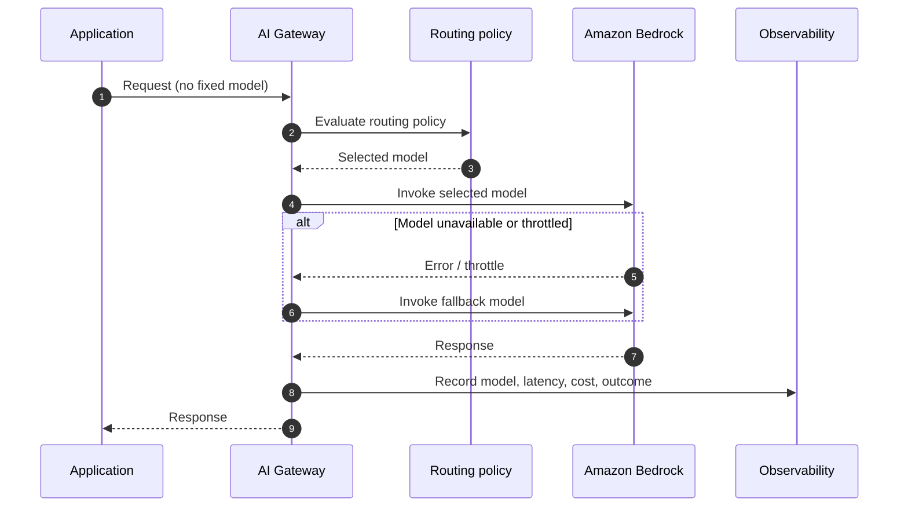

# Chapter 10: Model Routing and Model Selection

Chapter 4 described a triangle of trade-offs, capability, latency and cost, and observed that no single model optimises all three, so the right model depends on the task. Chapter 7 then placed a control plane between applications and models. This chapter joins those two threads. Once you accept that different requests are best served by different models, and you have a gateway through which requests already pass, model routing becomes a natural architectural capability rather than a hard-coded choice buried in each application.

Routing is often treated as an optimisation to add later. That undersells it. Deciding which model serves a request is a genuine architectural concern with consequences for cost, latency, quality and governance, and where that decision is made shapes the whole system. This chapter treats model selection as a first-class design variable and routing as the pattern that operationalises it.

---

## 1. The Architectural Problem

An organisation uses foundation models across many requests that are not alike. Some are simple classifications that a small, fast, inexpensive model handles perfectly well. Others need the strongest available reasoning and can tolerate higher latency and cost. Most sit somewhere between.

If every request goes to a single model, one of two things happens. Choose a powerful model for everything, and you pay premium cost and accept higher latency even for trivial requests that did not need it. Choose a cheaper model for everything, and the demanding requests are served badly. Either way, a single fixed choice is wrong for most of the traffic, because the traffic is heterogeneous and the choice is uniform.

Hard-coding the model into each application makes this worse. The choice is scattered, inconsistent and hard to change; adopting a new model, or responding to a price or availability change, means editing many applications. And there is no central policy over which models may be used at all, which matters for governance and cost control.

The architectural question is: how do we match each request to an appropriate model, balancing capability, latency and cost, in a way that is consistent, centrally governable and easy to change as models and requirements evolve?

---

## 2. 🧩 The Pattern at a Glance

- **Pattern name:** Model Routing
- **Problem solved:** A single fixed model serves heterogeneous traffic badly, over-paying for simple requests or under-serving demanding ones, with the choice scattered and hard to govern.
- **Primary objective:** Direct each request to an appropriate model by policy, balancing capability, latency and cost, from one governable place.
- **When to use:** Traffic is heterogeneous, multiple models are viable, and cost, latency or quality would benefit from matching model to request; a control point already exists or is justified.
- **When not to use:** A single model genuinely serves all traffic well, or the added routing complexity and its own latency are not justified by the gain.
- **Key AWS services:** Amazon Bedrock (multiple models); the routing logic hosted in the AI Gateway (Chapter 7); observability and cost tooling to inform and verify routing.
- **Primary architectural concern:** Where and how the model-selection decision is made, and how it is governed.

Routing is most naturally an extension of the AI Gateway: the gateway already sees every request and already enforces policy, so it is the obvious place to decide which model serves each one.

---

## 3. The Architecture

Routing adds a decision step to the request path, ideally at the gateway.

- **Applications** send requests to the gateway without specifying, or without dictating, which model to use.
- **A routing decision** at the gateway selects a model based on policy: the nature of the request, its requirements, cost and latency targets, and any governance rules about which models are permitted.
- **A model catalogue or policy** defines the available models and the rules for choosing among them.
- **Amazon Bedrock** serves the selected model.
- **Fallback rules** define what happens when the chosen model is unavailable or throttled.
- **Observability** records which model served each request, with its latency, cost and outcome, both to verify routing and to inform its tuning.

The catalogue and policy are the durable part of the design; the routing decision is where the policy is applied at runtime.

---

## 4. Request and Data Flow

> **Step 1:** An application sends a request to the gateway, without dictating the model.
> **Step 2:** The gateway evaluates the routing policy against the request and its requirements.
> **Step 3:** The gateway selects an appropriate model from the catalogue.
> **Step 4:** The gateway invokes the selected model on Bedrock.
> **Step 5:** If that model is unavailable or throttled, the gateway applies its fallback rule and selects an alternative.
> **Step 6:** Bedrock serves the chosen model and returns a response.
> **Step 7:** The gateway records which model served the request, with latency, cost and outcome.
> **Step 8:** The gateway returns the response to the application.

The application is deliberately insulated from the choice, so that routing policy can change without changing applications.

---

## 5. Why This Pattern Works

Routing works because it matches a uniform mechanism to non-uniform demand. Heterogeneous traffic served by a single model is mispriced or mis-served for most requests; routing lets each request be served by a model appropriate to it, improving cost and latency for the many simple requests while preserving quality for the demanding ones.

It works structurally because it centralises a decision that should not be scattered. Placing model selection at the gateway means the policy lives in one governable place: adopting a new model, adjusting the balance of cost against quality, or restricting which models may be used, becomes a single change rather than an edit across many applications. And because the gateway already sees every request, routing reuses infrastructure that exists rather than adding a new layer. The application is insulated from the choice, which is what allows the policy to evolve freely, exactly the separation of concerns the gateway pattern was built to provide.

---

## 6. 🏗️ Architectural Decisions

| Decision | Options | Recommended approach | Reason |
| --- | --- | --- | --- |
| Selection | Fixed model / Routed | Routed when traffic is heterogeneous | Match model to request |
| Decision location | In application / At gateway | At gateway | Central governance and easy change |
| Routing basis | Static rules / Dynamic | Start with clear rules | Predictable, explainable, easy to reason about |
| Fallback | None / Defined alternative | Defined fallback | Resilience when a model is unavailable |
| Policy ownership | Per team / Central platform | Central, with input from teams | Consistency and cost control |

Routing basis deserves a note. Simple, explicit rules, by request type, required capability, or explicit tier, are predictable and easy to reason about, and are usually the right starting point. More dynamic selection can follow once the value is proven, but added sophistication in the routing decision must justify itself against the simplicity and explainability of clear rules.

---

## 7. ⚖️ Trade-offs

**Benefits:** Better cost and latency for the bulk of traffic, preserved quality for demanding requests, a single governable point for model policy, easy adoption of new models, and resilience through fallback.

**Costs and limitations:** Routing adds a decision step, which adds a little latency and some complexity. The routing policy is itself an artefact that must be designed, maintained and kept correct as models and requirements change. A poor policy can route requests to unsuitable models, degrading quality or cost in ways that are not obvious without measurement.

**Complexity:** Modest when built on an existing gateway with clear rules; higher if dynamic or fine-grained selection is pursued.

**Operational overhead:** The policy and catalogue must be maintained, and routing outcomes monitored to confirm requests are served by appropriate models.

**Security implications:** Generally neutral to positive: central policy can restrict which models are permitted and ensure requests only reach approved models. The routing logic must not be manipulable by the caller to bypass policy.

**Performance implications:** A small added decision cost, usually outweighed by routing many requests to faster models.

**Cost implications:** Typically the strongest benefit, routing simple requests to cheaper models can reduce spend materially, provided the policy is sound and verified by measurement rather than assumed.

---

## 8. 🔐 Security and Governance

Routing strengthens governance more than it complicates security. Because the decision sits at the gateway, the organisation gains a single place to enforce which models may be used, by whom and for what, which is a genuine governance control: a model that is not in the catalogue cannot be reached, and policy can restrict sensitive workloads to approved models. This complements the gateway's existing role as the enforcement point for access and guardrails.

The security requirement is that the routing decision be trustworthy. The caller should influence routing only within policy, never override it to reach a model they should not use, so the gateway, not the application, must own the final selection. Governance also depends on visibility: recording which model served each request is both an operational signal and a governance record, showing that policy was actually applied. Where different models carry different data-handling characteristics, routing policy becomes a way to enforce that sensitive data is served only by models permitted to handle it.

---

## 9. 🌐 Networking

Routing adds little to the network design of Chapter 7. All model invocation still travels the gateway's private path to Bedrock; routing simply changes which model is invoked, not how it is reached. Where routing spans models in different regions, for capability or residency reasons, the region choice carries the latency and data-residency consequences discussed in Chapter 5, and the routing policy must respect residency constraints as a first-order rule rather than treating region as a free variable.

---

## 10. ⚠️ Failure Modes and Resilience

Routing both introduces and mitigates failure modes.

- **Chosen model unavailable or throttled:** The primary case routing is well placed to handle. A defined fallback to an alternative model turns a would-be failure into a graceful degradation, and this resilience benefit is one of routing's quiet advantages.
- **Poor routing decisions:** A flawed policy sends requests to unsuitable models, cheap models to demanding requests (quality suffers) or expensive models to trivial ones (cost suffers). This is a silent failure detectable only by measuring outcomes per model.
- **Fallback masking problems:** If fallback is invoked constantly, it may hide a systemic issue with a primary model while quietly changing cost and quality. Fallback frequency must itself be monitored.
- **Routing stage failure:** The decision step is a dependency; it must have a safe default so a routing failure does not block all inference.
- **Policy drift:** As models and prices change, a once-good policy silently becomes suboptimal. The policy needs periodic review against measured outcomes.

The recurring theme is that routing's failures, like RAG's, are largely silent and economic rather than loud and technical, which makes measurement the control that keeps them in check.

---

## 11. 👁️ Observability and Operations

Observability is what makes routing trustworthy. The gateway should record, for every request, which model served it, at what latency, at what cost, and with what outcome, and it should track fallback frequency. This data does double duty: it verifies that routing is behaving as intended, and it informs how the policy should evolve. Without it, routing is a set of assumptions about which models suit which requests, and assumptions about cost and quality are exactly what this pattern exists to replace with evidence.

Operationally, the routing policy and model catalogue are living artefacts. New models appear, prices change, and request patterns shift, so the policy must be reviewed and adjusted against measured outcomes rather than set once. As always, technical signals (latency, errors, fallback rate) are distinct from quality (whether the chosen model actually answered well); both are needed, because a request can be routed successfully in technical terms and still be served by the wrong model for the job.

---

## 12. 💷 Cost and FinOps

Cost is routing's headline benefit. Serving the large volume of simple requests with smaller, cheaper models, while reserving expensive models for the requests that need them, can reduce total spend substantially, because in typical traffic the simple requests dominate by volume. This is a direct expression of Chapter 4's point that paying for capability a task does not need is waste, applied systematically.

The benefit is real but conditional. It depends on a sound policy that genuinely matches model to need, and on measurement to confirm the match, because a policy that over-routes to expensive models, or that degrades quality enough to cause rework, can erase the saving. Routing makes cost a governable variable; realising the saving requires monitoring cost per model and per request type and tuning the policy accordingly. Routing also pairs naturally with caching, introduced at the gateway, as a further cost lever, though caching is developed elsewhere.

---

## 13. When to Use This Pattern

Use this pattern when:

- traffic is heterogeneous and different requests are genuinely best served by different models;
- multiple models are viable and cost, latency or quality would improve by matching model to request;
- a central control point exists or is justified, making routing a natural extension;
- the organisation wants a single, governable place to control which models are used; or
- resilience through model fallback is valuable.

Routing is a natural next step once an organisation runs a gateway and uses more than one model, and it is often where the gateway starts to pay for itself in reduced cost.

---

## 14. When NOT to Use This Pattern

Do not use this pattern when:

- a single model genuinely serves all traffic well, routing would add complexity and a decision step for no benefit;
- the added routing latency is unacceptable for the workload and the gain does not justify it;
- traffic is too uniform for model choice to matter; or
- there is no capacity to maintain and monitor a routing policy, an unmonitored policy silently drifts into mis-routing.

Routing earns its place through heterogeneous traffic and a genuine spread of model options. Applied to uniform traffic or a single viable model, it is machinery without a problem to solve.

---

## 15. Pattern Variations

- **Small organisation:** Often a single model, no routing; introduce routing only when a clear cost or quality case appears.
- **Medium enterprise:** Rule-based routing at the gateway across a small set of models, with defined fallback and cost monitoring.
- **Large enterprise:** Governed routing across many models within a federated platform, central policy with team input, and measured, evolving rules, connecting to Part III.
- **Highly regulated enterprise:** Routing constrained by strict policy over which models may handle which data, with residency and approval rules enforced in the routing decision.

The variations differ mainly in the sophistication of the policy and the strictness of the governance around it, not in the underlying idea.

---

## 16. Architecture Decision Checklist

- [ ] Is traffic genuinely heterogeneous enough that one model serves it badly?
- [ ] Are there multiple viable models with a real spread of capability, latency and cost?
- [ ] Is the routing decision made at the gateway, owned by the platform rather than the caller?
- [ ] Is the routing basis clear and explainable, starting from simple rules?
- [ ] Is there a defined fallback for when a chosen model is unavailable?
- [ ] Does the policy respect governance and residency constraints as first-order rules?
- [ ] Is the model served per request recorded, with latency and cost, to verify routing?
- [ ] Is fallback frequency monitored so it does not mask a systemic problem?
- [ ] Is the policy reviewed against measured outcomes as models and prices change?

---

## 17. 📐 The Architect's Verdict

> Model routing is the right pattern when traffic is heterogeneous and multiple models are viable, and it is where the AI Gateway often begins to pay for itself. By matching each request to an appropriate model from one governable place, it improves cost and latency for the bulk of traffic, preserves quality where it is needed, and provides resilience through fallback, while keeping applications insulated from a policy that can then evolve freely. Its benefits are conditional on a sound policy and on measurement, because its failures are silent and economic: mis-routing degrades cost or quality with no error raised. Start with clear, explainable rules, own the decision at the gateway rather than the caller, respect governance and residency as first-order constraints, and verify outcomes with data rather than assumption. Where traffic is uniform or a single model suffices, routing is unnecessary machinery; where it is not, routing turns model selection from a scattered guess into a governed, measurable decision.
