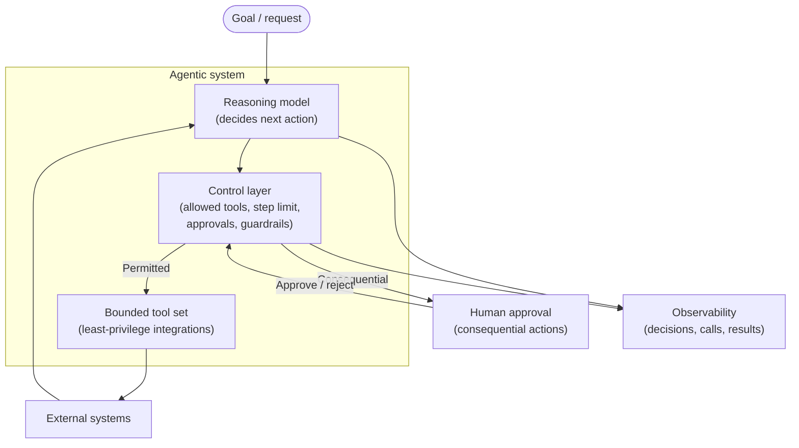
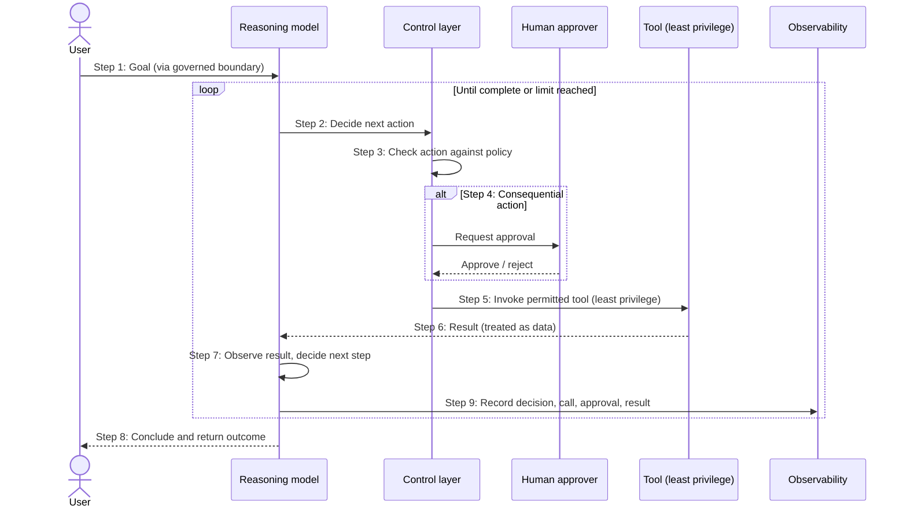

# Chapter 11: Agentic Architectures

Every pattern so far has treated the model as something that responds. A request goes in, inference happens, a response comes out, and the surrounding system decides what to do next. Agentic architectures change that relationship. An agent does not merely respond; it decides what to do, choosing which tools to call, in what order, and when the work is finished. That shift, from a component that answers to a component that acts, is the most significant change in trust model in this book, and it is the source of both the power and the risk of agents.

This is where the recurring instruction, design the system not just the prompt, matters most. An agent with access to enterprise systems is a component whose authority you must bound deliberately, because the consequences of it acting incorrectly are larger than a wrong answer. This chapter treats agentic systems as an architecture problem in which controlled autonomy, not maximal autonomy, is the objective.

---

## 1. The Architectural Problem

Some tasks cannot be completed in a single inference. They require multiple steps, decisions between them, and interaction with external systems: look something up, decide what it means, take an action, check the result, perhaps try again. A fixed, pre-programmed workflow can handle this only when every step and branch is known in advance. When the path depends on what is discovered along the way, a more flexible approach is needed.

An agent addresses this by letting the model drive the workflow: it reasons about the goal, selects a tool, interprets the result, and decides the next step, iterating until done. This is genuinely useful, and genuinely dangerous. The same autonomy that lets an agent handle open-ended tasks also lets it do things you did not intend, invoke the wrong tool, take an action with real-world consequences, pursue a goal in an unexpected way, or be manipulated by untrusted input into acting against your interests.

The constraints are sharper than in earlier chapters. The blast radius is larger, because an agent acts rather than merely answers. The trust boundary is more exposed, because content the agent processes may attempt to influence its decisions. And behaviour is harder to predict, because the agent, not a fixed program, chooses the path.

The architectural question is: how do we let an agent act with enough autonomy to be useful, while bounding that autonomy so tightly that its worst possible behaviour remains within acceptable limits?

---

## 2. 🧩 The Pattern at a Glance

- **Pattern name:** Agentic Architecture
- **Problem solved:** Multi-step, open-ended tasks whose path depends on intermediate results, which fixed workflows cannot handle.
- **Primary objective:** Useful autonomous or semi-autonomous action, with authority deliberately bounded and behaviour observable.
- **When to use:** The task genuinely requires dynamic, multi-step reasoning and tool use; the value justifies the added risk and complexity.
- **When not to use:** A fixed workflow or a single inference suffices; the consequences of incorrect action are unacceptable and cannot be adequately bounded.
- **Key AWS services:** Amazon Bedrock AgentCore for building agents; Bedrock for inference; tools exposed as governed, least-privilege integrations; guardrails and observability.
- **Primary architectural concern:** 🤖 Controlled autonomy, bounding what the agent is permitted to do and containing its blast radius.

An agent combines three things: a model that reasons and decides, a set of tools it may invoke, and a loop that lets it act, observe and continue. The architecture is largely about governing the second and third of these.

---

## 3. The Architecture

An agentic architecture surrounds the reasoning model with tools, controls and observation.

- **A goal or request** enters the agent, ideally through the same governed boundary as other model traffic.
- **The agent (reasoning model)** decides the next action: which tool to call, or that the task is complete.
- **A bounded tool set** defines exactly what the agent can do; each tool is a governed integration with least-privilege access to a specific capability.
- **A control layer** enforces limits: which tools are allowed, how many steps may run, when human approval is required, and what guardrails apply.
- **External systems** are reached only through tools, never directly.
- **A human-in-the-loop checkpoint** intervenes for consequential actions where autonomy should stop short of acting alone.
- **Observability** records every decision, tool call and result, so the agent's behaviour is traceable.

The reasoning model is the smallest part of the design. The controls around it, the bounded tools, the limits, the approvals, the observation, are the architecture.

---

## 4. Request and Data Flow

> **Step 1:** A goal enters the agent through the governed boundary.
> **Step 2:** The reasoning model decides the next action: invoke a tool, or conclude.
> **Step 3:** The control layer checks the proposed action against policy: is this tool permitted, is the step limit respected, is approval required?
> **Step 4:** If the action is consequential, it is paused for human approval; a rejection ends or redirects it.
> **Step 5:** A permitted tool is invoked with least-privilege access to the external system.
> **Step 6:** The tool returns a result, which is treated as data, not as instruction.
> **Step 7:** The model observes the result and decides the next step, repeating from step 2 within the step limit.
> **Step 8:** When the goal is met (or a limit is reached), the agent concludes and returns its outcome.
> **Step 9:** Every decision, tool call, approval and result is recorded for traceability.

The loop is the defining feature, and the step limit and approval checkpoints are what keep the loop from running away.

---

## 5. Why This Pattern Works

The pattern works, when it works, because it matches a flexible mechanism to genuinely open-ended tasks. For work whose path cannot be fully specified in advance, letting the model reason and choose is more capable than any fixed workflow, because it adapts to what it discovers.

But the pattern only works safely because of the controls, not the autonomy. The bounded tool set means the agent can only ever do things you have explicitly permitted; capabilities not exposed as tools simply do not exist for it. Least-privilege tools mean each action reaches only what it needs. Step limits prevent runaway loops. Human approval keeps consequential actions from happening without oversight. Treating tool results as data, not instruction, defends the reasoning loop against manipulation. And observation makes the agent's behaviour traceable rather than opaque. Remove these, and the same pattern becomes an autonomous component with broad access and unpredictable behaviour, which is not a feature but a liability. The architecture is what turns raw autonomy into controlled autonomy, and that is the whole point.

---

## 6. 🏗️ Architectural Decisions

| Decision | Options | Recommended approach | Reason |
| --- | --- | --- | --- |
| Autonomy level | Full / Bounded / Human-approved | Bounded, with approval for consequential actions | Contain blast radius |
| Tool access | Broad / Least privilege per tool | Least privilege per tool | Limit what any action can reach |
| Tool scope | Many capabilities / Only what the task needs | Only what the task needs | Unexposed capabilities cannot be misused |
| Step control | Unbounded loop / Step limit | Step limit | Prevent runaway behaviour |
| Human-in-the-loop | None / For consequential actions | For consequential or irreversible actions | Oversight where it matters |
| Tool results | Trusted as instruction / Treated as data | Treated as data | Defend against manipulation |

The unifying principle across every row is the same: grant the least autonomy that still lets the agent do its job. Autonomy is not the goal; a completed task within safe bounds is.

---

## 7. ⚖️ Trade-offs

**Benefits:** The ability to handle open-ended, multi-step tasks that fixed workflows cannot; adaptability to what is discovered at runtime; and, done well, automation of genuinely complex work.

**Costs and limitations:** Agents are the most complex and highest-risk pattern in this book. Their behaviour is harder to predict, their blast radius is larger because they act, and they expand the attack surface through their tools and their reasoning loop. They are harder to test, harder to reason about, and harder to operate than responsive patterns.

**Complexity:** High, and irreducibly so; the controls that make agents safe are themselves substantial.

**Operational overhead:** Significant: agents must be closely observed, their tool integrations maintained and secured, and their behaviour continuously evaluated.

**Security implications:** The most serious in the book. Excessive agency, tool abuse and manipulation through untrusted input are real risks, addressed by bounding autonomy, least-privilege tools, and treating inputs and tool results as data. These are developed further in the threat-modelling chapter.

**Performance implications:** Multi-step loops mean higher latency and more inference calls than a single response; an agent may call the model many times to complete one task.

**Cost implications:** Correspondingly higher: each step is an inference, so an agent's cost per task can far exceed a single call, which must be planned for.

---

## 8. 🔐 Security and Governance

Agents concentrate the security concerns of the whole book, because an agent both processes untrusted input and takes action. The governing principle is to bound autonomy so that the agent's worst possible behaviour is still acceptable.

Three controls matter most. First, **least-privilege tools**: an agent can only do what its tools allow, so each tool must grant the minimum access needed and nothing more, and capabilities the task does not require should not be exposed at all. Second, **defending the reasoning loop**: tool results and retrieved content may contain text that attempts to redirect the agent, so such content must be treated as data to be considered, never as instruction to be obeyed, the trust-boundary discipline of Chapter 3 applied to the agent's inputs. Third, **human oversight for consequential actions**: where an action is irreversible or high-impact, autonomy should stop short of acting alone and require approval.

Governance follows from observation. Because an agent decides and acts, the record of what it decided, which tools it called, what results it saw and what it did must be complete enough to reconstruct its behaviour, for trust, for debugging and for audit. Excessive agency, an agent able to do more than its task requires, is the characteristic failure to design against, and it is prevented not by trusting the agent but by limiting it. The threat-modelling chapter treats these risks in terms of attack surface, likelihood and impact; the architectural stance here is that autonomy is granted grudgingly and bounded tightly.

---

## 9. 🌐 Networking

An agent's tools reach external systems, and those paths are where the network design concentrates. Each tool integration should reach only the specific system it needs, over a private, least-privilege path, so that the agent's network access is as bounded as its tool set. Inference still travels the governed path to Bedrock as in earlier chapters. The principle is that the network is another place to enforce least privilege: an agent should be unable, at the network level, to reach systems its tools do not legitimately require, so that a reasoning failure cannot become access to something it should never have touched.

---

## 10. ⚠️ Failure Modes and Resilience

Agents have the richest and most consequential failure modes in the book, because failure can mean incorrect action, not merely a wrong answer.

- **Excessive agency:** The defining failure, an agent doing more than intended, reaching systems or taking actions beyond its task. Prevented by least-privilege tools and bounded scope, not by hoping the agent behaves.
- **Runaway loops:** An agent that never concludes, consuming cost and time. Step limits and timeouts contain this.
- **Tool failure:** A tool errors or returns unexpected output; the agent must handle it rather than proceed on a false result, and the control layer must cope with tool failure gracefully.
- **Manipulation through input:** Untrusted content redirects the agent's reasoning. Treating inputs and tool results as data, and applying guardrails, defends against this.
- **Wrong or harmful action:** The agent takes a consequential action incorrectly. Human approval for consequential actions is the guard, along with preferring reversible actions where possible.
- **Malformed reasoning or output:** As with all models, the agent may reason or respond incorrectly; validation and observation catch this.
- **Cascading failure in multi-step work:** An early wrong step corrupts everything after it, so intermediate checks and the ability to stop matter.

The theme is stark: because an agent acts, its failures can have real consequences, so resilience here means bounding and containing behaviour, not merely retrying it.

---

## 11. 👁️ Observability and Operations

Observability is not optional for agents; it is a safety control. Because the agent decides its own path, the only way to understand, trust, debug or audit it is to record every step: each decision, each tool call and its arguments, each result, each approval, and the final outcome. This trace is what makes an agent's behaviour legible rather than opaque, and it is the difference between an agent you can operate responsibly and one you cannot.

Beyond the trace, operations must watch for the failure modes above, excessive tool use, runaway loops, unusual patterns of action, rising cost per task, and be able to intervene, including stopping an agent that is misbehaving. Evaluating agent behaviour, whether it completes tasks correctly and safely, is harder than evaluating a single response and is a continuous discipline, connecting to the evaluation chapter. The operational posture for agents is closer to supervising an autonomous process than to running a request-response service.

---

## 12. 💷 Cost and FinOps

Agents are the most expensive pattern per task, because a single task may involve many inference calls as the agent reasons, acts and observes across multiple steps, plus the cost of the tools it invokes. A task that a single call could not solve may take many calls to complete, and cost scales with the number of steps.

The main cost levers are architectural and align with the safety controls. Step limits cap the worst-case cost of any single task as well as containing runaway loops. Routing the agent's reasoning to an appropriately capable model, rather than the most powerful by default, controls per-step cost. And restricting agents to tasks that genuinely need them, rather than using an agent where a fixed workflow or single call would do, avoids paying agent-level cost for non-agent problems. As with earlier patterns, cost must be planned at design time, in steps per task and cost per step, and monitored, because an unbounded agent is an unbounded cost as well as an unbounded risk.

---

## 13. When to Use This Pattern

Use this pattern when:

- the task genuinely requires multi-step reasoning and tool use whose path depends on intermediate results;
- a fixed workflow cannot express the task because the branches are not known in advance;
- the value of automating the task justifies the added complexity, cost and risk; and
- the autonomy required can be adequately bounded, and consequential actions can be gated by approval.

Agents are powerful for genuinely open-ended work, and they should be reached for when that is the actual shape of the problem, not because autonomy is appealing in the abstract.

---

## 14. When NOT to Use This Pattern

Do not use this pattern when:

- a single inference or a fixed workflow already solves the task, an agent adds risk, cost and complexity for no benefit;
- the consequences of incorrect action are unacceptable and cannot be adequately bounded or gated by human approval;
- the task is well-defined enough to express as explicit steps, in which case a deterministic workflow is safer and cheaper; or
- the organisation cannot yet observe and operate an autonomous component responsibly.

This is the pattern most often reached for prematurely, because autonomy is exciting. The discipline is to use an agent only when the task truly needs one. Where a simpler, more predictable pattern suffices, it is almost always the better architecture, and choosing it over an agent is not timidity but judgement.

---

## 15. Pattern Variations

- **Small organisation:** Usually no agents; fixed workflows and single inference cover most needs, with an agent introduced only for a genuinely open-ended task.
- **Medium enterprise:** Narrowly-scoped agents with small, least-privilege tool sets and human approval for consequential actions.
- **Large enterprise:** Governed agents within a platform, with strong controls, comprehensive observation, and clear limits on autonomy, often coordinating in the multi-agent designs of the next chapter.
- **Highly regulated enterprise:** Tightly bounded agents, extensive human-in-the-loop gating, exhaustive auditability, and conservative limits on what any agent may do autonomously.

Across all variations the constant is that autonomy is granted narrowly and bounded tightly; what changes is how narrow and how tight.

---

## 16. Architecture Decision Checklist

- [ ] Does the task genuinely require dynamic, multi-step reasoning, or would a fixed workflow suffice?
- [ ] Is the agent's autonomy bounded to the least needed to complete the task?
- [ ] Does each tool grant least-privilege access, and are only necessary capabilities exposed?
- [ ] Is there a step limit and timeout to prevent runaway loops?
- [ ] Are consequential or irreversible actions gated by human approval?
- [ ] Are tool results and inputs treated as data, never as instruction?
- [ ] Can the agent reach, at the network level, only the systems its tools require?
- [ ] Is every decision, tool call and result recorded to make behaviour traceable?
- [ ] Is the worst-case cost per task bounded, and cost per task monitored?
- [ ] Can a misbehaving agent be stopped?

---

## 17. 📐 The Architect's Verdict

> Agentic architectures are the right pattern only when a task genuinely requires dynamic, multi-step reasoning and tool use that no fixed workflow can express, and when the value justifies the cost, complexity and risk. An agent's power is its autonomy, and its danger is the same autonomy, because it acts rather than merely answers, its blast radius is larger and its behaviour harder to predict than any other pattern in this book. What makes an agent safe is not the reasoning model but the architecture around it: a bounded, least-privilege tool set, step limits, human approval for consequential actions, inputs and tool results treated as data, and complete observation of every decision. The objective is controlled autonomy, the least autonomy that still gets the job done. This is the pattern most often adopted prematurely; the architect's discipline is to reach for it only when the problem truly demands it, and, when it does, to grant autonomy grudgingly and bound it tightly. Design the system, not just the prompt, applies here more than anywhere.
