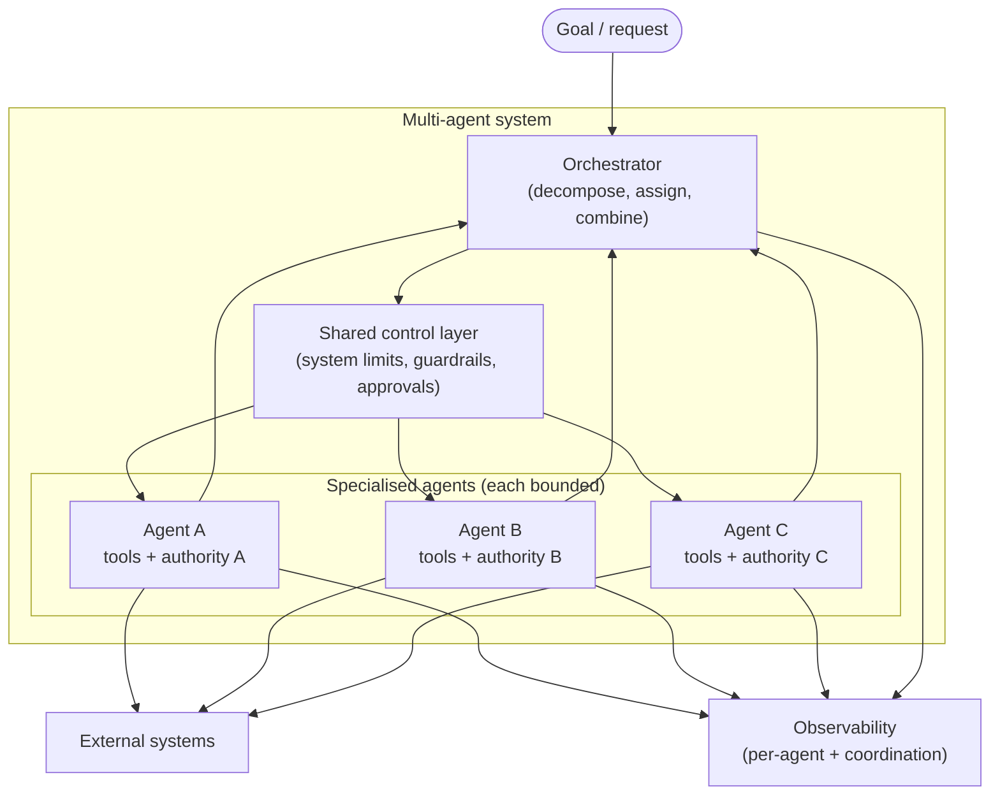
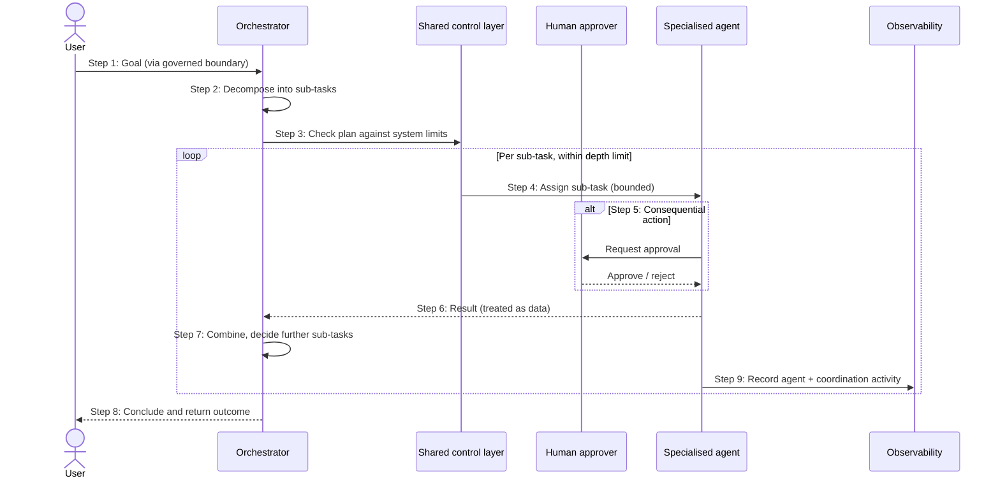

# Chapter 12: Multi Agent Systems

Chapter 11 established the single agent: a reasoning model that decides and acts within bounded tools, step limits and human oversight. This chapter asks what happens when one agent is not enough, when a task is large enough, or varied enough, that it is better served by several specialised agents working together than by one generalist agent doing everything.

Multi-agent systems are the natural extension of the previous chapter, and they inherit all of its risks, amplified. Every concern about autonomy, blast radius, excessive agency and unpredictable behaviour applies to each agent, and the interactions between agents add concerns of their own. This is the most sophisticated pattern in Part II, and also the one where the discipline of asking "is a simpler pattern preferable?" matters most, because the appeal of many collaborating agents often exceeds the need for them.

---

## 1. The Architectural Problem

A task is complex in a way that strains a single agent. Perhaps it spans several distinct domains, each needing different tools and different expertise, so that one agent equipped for all of them has an unwieldy tool set and a diffuse purpose. Perhaps the work naturally decomposes into sub-tasks that could proceed independently. Perhaps different parts of the task require different levels of authority, and bundling them into one agent means granting that single agent all of the authority at once, a large blast radius by construction.

The single-agent answer, give one agent every tool and every permission, works poorly here. It concentrates authority, making the agent's blast radius the union of everything it can touch. It muddles the agent's reasoning, because a broad, unfocused tool set makes each decision harder. And it couples concerns that would be safer kept apart.

The multi-agent idea is to decompose the problem: several agents, each specialised and narrowly scoped, each with only the tools and authority its part requires, coordinated to accomplish the whole. This can be genuinely better, but it introduces the hardest constraints in the book so far. Coordination must be designed. Boundaries between agents must be enforced. And the blast radius, now spread across several acting components, must be contained in aggregate, not merely per agent.

The architectural question is: when a task exceeds a single agent, how do we decompose it into collaborating specialised agents in a way that improves focus and contains authority, without the coordination and combined autonomy creating more risk than the decomposition removes?

---

## 2. 🧩 The Pattern at a Glance

- **Pattern name:** Multi-Agent System
- **Problem solved:** Tasks too large, varied or authority-diverse for a single agent, where one generalist agent would concentrate authority and muddle reasoning.
- **Primary objective:** 🤖 Coordinated, specialised agents each narrowly scoped, accomplishing together what one agent should not attempt alone.
- **When to use:** The task genuinely decomposes into distinct specialities or authorities, and the value justifies the coordination complexity and combined risk.
- **When not to use:** A single agent, a fixed workflow, or a simpler pattern suffices, the default assumption until proven otherwise.
- **Key AWS services:** Amazon Bedrock AgentCore for the agents; Bedrock for inference; per-agent least-privilege tools; orchestration, guardrails and observability across the system.
- **Primary architectural concern:** Coordination and boundaries, how agents collaborate, and how each agent's authority and blast radius stay contained within the whole.

A multi-agent system is not simply more agents; it is a system of agents, and the system, its orchestration, its boundaries, its aggregate behaviour, is what must be designed.

---

## 3. The Architecture

A multi-agent architecture adds coordination and inter-agent boundaries on top of the single-agent design of Chapter 11.

- **A goal** enters through the governed boundary, as before.
- **An orchestrator** decomposes the goal, assigns sub-tasks to specialised agents, and combines their results. It coordinates; it should not itself accumulate all authority.
- **Specialised agents**, each a bounded single agent from Chapter 11, handle their own part with only the tools and authority that part requires.
- **Boundaries between agents** ensure one agent cannot exceed its scope or reach another's tools and data.
- **A shared control layer** applies system-wide limits: overall step and depth limits, guardrails, and approval for consequential actions.
- **External systems** are reached only through each agent's own least-privilege tools.
- **Observability** records the behaviour of every agent and of the coordination between them.

The orchestrator and the boundaries between agents are the new architecture; each agent within is the bounded design already established in Chapter 11.

---

## 4. Request and Data Flow

> **Step 1:** A goal enters the system through the governed boundary.
> **Step 2:** The orchestrator decomposes the goal into sub-tasks and decides which agents to engage.
> **Step 3:** The shared control layer checks the plan against system-wide limits and policy.
> **Step 4:** Each engaged agent works on its sub-task, within its own bounded tools, authority and step limit, as in Chapter 11.
> **Step 5:** Consequential actions by any agent are gated for human approval.
> **Step 6:** Each agent returns its result to the orchestrator, treated as data.
> **Step 7:** The orchestrator combines results, and may assign further sub-tasks within the overall depth limit.
> **Step 8:** When the goal is met (or a system limit is reached), the orchestrator concludes and returns the outcome.
> **Step 9:** Every agent's decisions and actions, and the orchestration between them, are recorded for traceability.

The single-agent loop of Chapter 11 now runs inside each agent; this diagram shows the coordination layer above them.

---

## 5. Why This Pattern Works

When it is genuinely warranted, the pattern works because specialisation and separation improve both capability and safety. A narrowly-scoped agent reasons better than a generalist, because a focused purpose and a small tool set make each decision clearer. And separating agents separates authority: each agent holds only the permissions its part needs, so no single component carries the union of all authority, which keeps each agent's blast radius small even as the system as a whole does more.

The orchestrator works because coordination, made explicit, can be governed. Decomposition, assignment and combination happen in one place that can enforce system-wide limits and apply oversight, rather than being an emergent property of agents talking freely. This is the same instinct as the control plane elsewhere in the book: put the coordination somewhere you can see and constrain it.

The crucial caveat is that these benefits are real only when the task genuinely decomposes. Imposed on a task that a single agent handles well, multi-agent structure adds coordination overhead and new failure modes while delivering none of the focus or containment benefits, because there was nothing to separate.

---

## 6. 🏗️ Architectural Decisions

| Decision | Options | Recommended approach | Reason |
| --- | --- | --- | --- |
| Single vs multi-agent | One agent / Many | One unless the task truly decomposes | Avoid unwarranted complexity |
| Coordination | Free inter-agent / Orchestrated | Orchestrated | Coordination that can be governed |
| Agent authority | Shared / Isolated per agent | Isolated, least privilege per agent | Contain per-agent blast radius |
| Inter-agent boundaries | Trusted / Enforced | Enforced | One agent cannot exceed its scope |
| System limits | Per agent only / System-wide | System-wide depth and step limits | Contain aggregate behaviour |
| Inter-agent messages | Trusted / Treated as data | Treated as data | Defend against propagation of manipulation |

The recurring principle from Chapter 11, grant the least autonomy that does the job, now applies twice: to each agent, and to the system as a whole. Aggregate authority, not just per-agent authority, is what must be minimised.

---

## 7. ⚖️ Trade-offs

**Benefits:** Better focus through specialisation, contained per-agent authority, the ability to tackle tasks too large or varied for one agent, and governable coordination through an orchestrator.

**Costs and limitations:** This is the most complex pattern in Part II. Coordination must be designed and maintained. Behaviour is harder to predict than a single agent, because it now depends on interactions between autonomous components. The combined blast radius spans several acting agents. Debugging, testing and reasoning about the system are all harder, and failures can arise from the interactions rather than any single agent.

**Complexity:** Very high, and higher than the sum of its agents, because the coordination is itself substantial.

**Operational overhead:** The greatest in Part II: every agent must be observed and operated as in Chapter 11, plus the orchestration and inter-agent behaviour on top.

**Security implications:** The single-agent risks, excessive agency, tool abuse, manipulation, apply to each agent, and inter-agent communication adds a path along which manipulation or error can propagate. Aggregate authority must be contained, not just per-agent authority.

**Performance implications:** Coordination and multiple agents, each running multi-step loops, mean higher latency and many more inference calls than a single agent.

**Cost implications:** The highest per task of any pattern, since cost is the sum of every agent's steps plus coordination; a single goal can trigger a large number of inference calls.

---

## 8. 🔐 Security and Governance

Multi-agent systems concentrate and then spread the security concerns of Chapter 11, and the governing principle is to contain aggregate blast radius, not merely each agent's. Specialisation helps: because each agent holds only its own least-privilege tools and authority, no single agent carries the union of everything the system can do, which is safer than one generalist agent with all permissions. But the system as a whole still commands that union, so the aggregate must be reasoned about deliberately, the worst case is what the agents can do in combination.

Three controls are central. **Isolated, least-privilege agents**: each agent's tools and authority are scoped to its part, and enforced boundaries prevent one agent from reaching another's tools or data. **Inter-agent messages treated as data**: a result from one agent, like any tool result, may carry text that attempts to influence the receiving agent, so it must be handled as data to be considered, never as instruction, or a single manipulated agent could propagate its compromise through the system. **Governed orchestration**: coordination flows through the orchestrator and shared control layer, where system-wide limits, guardrails and approvals apply, rather than through unconstrained agent-to-agent conversation.

Governance again rests on observation. Because behaviour now emerges from interactions, the record must capture not only each agent's decisions and actions but the coordination between them, enough to reconstruct how the system as a whole reached its outcome. This is developed further in the threat-modelling chapter; the architectural stance is that a multi-agent system's authority must be bounded in aggregate and its interactions defended, or its blast radius becomes the sum of its parts.

---

## 9. 🌐 Networking

The networking principle from Chapter 11, least privilege at the network level, extends to each agent independently and becomes more important. Each agent should reach, at the network level, only the systems its own tools require, so that agents are network-isolated from one another's external systems as well as bounded by their tools. Inter-agent communication should flow through the governed coordination path rather than arbitrary direct connections, so that the orchestrator's oversight cannot be bypassed at the network level. Inference still travels the governed path to Bedrock. The effect is that network isolation reinforces the authority boundaries between agents, so a reasoning failure in one agent cannot become network access to systems belonging to another.

---

## 10. ⚠️ Failure Modes and Resilience

Multi-agent systems inherit every failure mode of Chapter 11, per agent, and add failures of coordination.

- **Aggregate excessive agency:** No single agent exceeds its scope, yet the agents in combination do more than intended. Contained by minimising aggregate authority, not just per-agent authority.
- **Coordination failure:** The orchestrator mis-decomposes, mis-assigns, or mis-combines, producing a wrong outcome from correct agents. The coordination logic is itself a component that can fail.
- **Cascading error:** A wrong result from one agent, treated as input by another, propagates and corrupts the whole. Treating inter-agent messages as data, and validating them, limits this.
- **Propagated manipulation:** A single manipulated agent influences others through inter-agent messages, spreading compromise. Defended by treating messages as data and by boundaries.
- **Runaway coordination:** Agents assigning work back and forth without converging. System-wide depth and step limits, not just per-agent limits, contain this.
- **Emergent behaviour:** The system behaves in ways not obvious from any single agent, because behaviour arises from interaction, the hardest failure to anticipate, which is why observation of coordination matters.
- **Per-agent failures:** All of Chapter 11's failure modes still apply within each agent.

The theme is that adding agents adds interaction, and interaction is where multi-agent systems fail in ways single agents cannot. Resilience means containing the aggregate and defending the interactions, and being able to stop the whole system, not just one agent.

---

## 11. 👁️ Observability and Operations

Observability must now span two levels, and both are safety controls. At the agent level, everything from Chapter 11 still applies: each agent's decisions, tool calls and results must be recorded. At the system level, the coordination itself must be observable, how the goal was decomposed, which agents were engaged, what they returned, and how results were combined, so that an outcome can be traced through the whole system and not just within one agent. Because behaviour emerges from interaction, a trace that captures only individual agents but not their coordination cannot explain why the system did what it did.

Operationally this is the most demanding pattern in Part II. Each agent is operated as in Chapter 11, and the orchestration adds its own monitoring: watching for runaway coordination, cascading errors, unusual interaction patterns and rising cost per goal, with the ability to intervene and stop the entire system. Evaluating whether the system as a whole completes tasks correctly and safely is harder than evaluating one agent, and belongs to the continuous evaluation discipline of the evaluation chapter. The posture is supervising a system of autonomous processes, with all the oversight that implies.

---

## 12. 💷 Cost and FinOps

Multi-agent systems are the most expensive pattern in the book per task, because the cost is the sum of every agent's multi-step reasoning plus the coordination overhead. A single goal can fan out into many sub-tasks, each an agent running its own loop of inference calls, so cost can grow quickly and, without limits, unpredictably.

The cost levers extend those of Chapter 11 to the system. System-wide depth and step limits cap the worst-case cost of a goal, as well as containing runaway coordination. Right-sizing the model for each agent, rather than using the most capable everywhere, controls per-step cost across the system. And, most importantly, the decision not to use a multi-agent system unless the task genuinely requires one is itself the largest cost lever, because paying multi-agent cost for a problem a single agent or a fixed workflow could solve is waste on the scale this pattern operates at. Cost must be planned in agents per goal, steps per agent and cost per step, and monitored per goal, because an unbounded multi-agent system is an unbounded cost as much as an unbounded risk.

---

## 13. When to Use This Pattern

Use this pattern when:

- a task genuinely decomposes into distinct specialities or authorities that are better handled separately;
- a single agent would need an unwieldy tool set or would concentrate too much authority;
- the sub-tasks benefit from focused, narrowly-scoped agents reasoning within their own domain; and
- the value of the decomposition clearly justifies the coordination complexity and combined risk.

Multi-agent systems suit genuinely large, varied or authority-diverse tasks, and they are at their best when specialisation both improves reasoning and contains authority.

---

## 14. When NOT to Use This Pattern

Do not use this pattern when:

- a single agent handles the task well, adding agents adds coordination and risk for no benefit;
- a fixed workflow or a non-agentic pattern would suffice, in which case it is almost always safer and cheaper;
- the task does not genuinely decompose, imposed structure creates overhead without the focus or containment that justify it; or
- the organisation cannot observe and operate a single agent responsibly, let alone a system of them.

This is the pattern most susceptible to being adopted for its sophistication rather than its fit. The default assumption should be that a simpler pattern is preferable, and multi-agent structure should be adopted only when the task's genuine decomposition overcomes that default. Choosing fewer agents, or none, is usually the more mature architectural decision.

---

## 15. Pattern Variations

- **Small organisation:** Almost never warranted; a single agent or a fixed workflow covers the need.
- **Medium enterprise:** Occasionally, a small set of specialised agents under a simple orchestrator for a genuinely decomposable task, with strong per-agent bounds.
- **Large enterprise:** Governed multi-agent systems within a platform, with orchestration, enforced boundaries, system-wide limits and comprehensive two-level observability, connecting to Part III.
- **Highly regulated enterprise:** Multi-agent systems used sparingly and conservatively, with tight aggregate authority limits, extensive human-in-the-loop gating, and exhaustive auditability of both agents and coordination.

Across all variations the constant is restraint: the pattern is used only where genuine decomposition justifies it, and authority is bounded both per agent and in aggregate.

---

## 16. Architecture Decision Checklist

- [ ] Does the task genuinely decompose into distinct specialities or authorities, or is one agent enough?
- [ ] Would a single agent, fixed workflow, or simpler pattern suffice instead?
- [ ] Does each agent hold only the least-privilege tools and authority its part requires?
- [ ] Is coordination orchestrated and governable rather than free inter-agent conversation?
- [ ] Are boundaries between agents enforced so none can exceed its scope or reach another's tools?
- [ ] Are inter-agent messages treated as data, not instruction?
- [ ] Are there system-wide depth and step limits, not just per-agent limits?
- [ ] Is the aggregate authority of all agents combined bounded and reasoned about?
- [ ] Is both per-agent behaviour and coordination between agents recorded?
- [ ] Can the entire system, not just one agent, be stopped?
- [ ] Is worst-case cost per goal bounded and monitored?

---

## 17. 📐 The Architect's Verdict

> Multi-agent systems are the right pattern only when a task genuinely decomposes into distinct specialities or authorities that a single agent should not shoulder alone, and when the value clearly justifies the coordination complexity and combined risk. Done well, specialisation improves reasoning and separation contains authority, so no single agent carries the union of all permissions. But the pattern inherits every risk of the single agent, per agent, and adds the risks of coordination and interaction, where multi-agent systems fail in ways single agents cannot. What makes such a system safe is the same discipline as Chapter 11, extended to the whole: least-privilege, isolated agents; enforced boundaries; inter-agent messages treated as data; governed orchestration; system-wide limits; and observation of both agents and their coordination, with the aggregate blast radius bounded, not just each agent's. This is the pattern most often reached for out of ambition rather than need. The default should be that a simpler pattern is preferable, and multi-agent structure earns its place only when genuine decomposition overcomes that default. More agents is rarely the answer; the right agents, tightly bounded and carefully coordinated, occasionally is.
