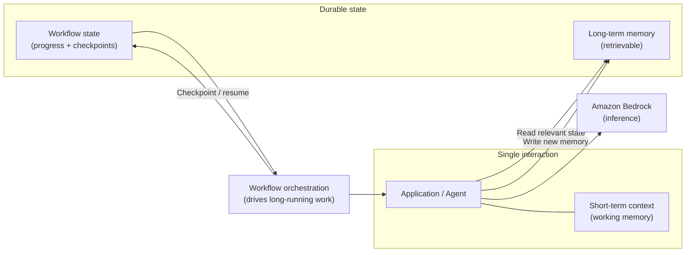
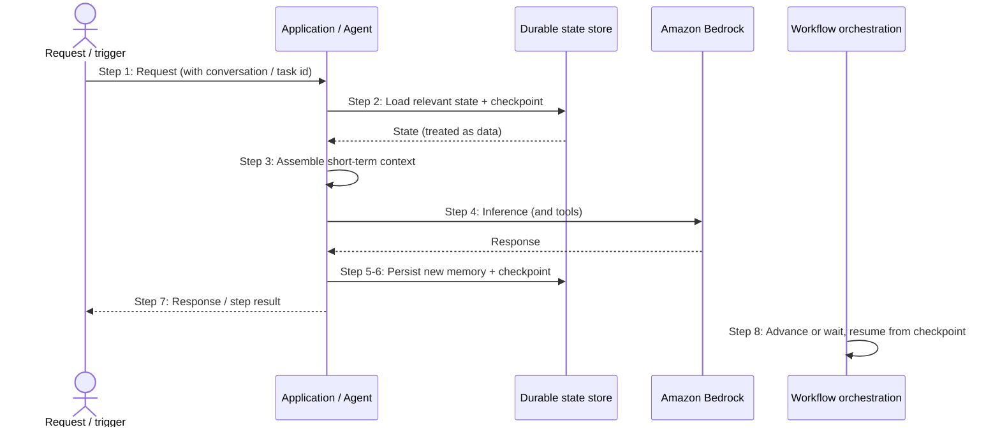

# Chapter 13: Memory, State and Long Running Workflows

The patterns so far have mostly treated each interaction as self-contained: a request arrives, context is assembled, inference happens, a response returns. Even the agents of Chapters 11 and 12, though they loop, largely complete their work within a single episode. But much enterprise work is not like that. A conversation continues across many turns. A task runs for minutes, hours or days. An agent needs to remember what it learned last time. The moment a GenAI system must carry information across interactions or persist through a long-running process, state becomes an architectural concern in its own right.

This chapter closes Part II by treating memory and state as architecture rather than as an implementation detail bolted onto the other patterns. It distinguishes the short-term context of a single interaction from durable, long-term memory, and it addresses what it takes to run workflows that outlive a single request: durability, checkpoints, consistency, recovery and the cost of remembering.

---

## 1. The Architectural Problem

A stateless interaction is simple: nothing is remembered, each request stands alone, and there is nothing to protect, corrupt or recover. Many useful GenAI systems, however, cannot be stateless.

A conversational assistant must remember earlier turns, or it will contradict itself and frustrate the user. An agent working a multi-step task over time must retain what it has done and learned, or it will repeat work or lose its place. A long-running workflow, an agent handling a case over days, say, must survive restarts, failures and delays without losing progress or acting twice. In each case the system must hold information beyond a single inference, and that information must be stored somewhere, kept consistent, protected, and recovered when things go wrong.

This introduces constraints the stateless patterns avoided. State can be lost, so it must be durable. State can be corrupted or become inconsistent, so it must be managed. State is data, often sensitive data drawn from interactions, so it must be governed like any other data store. And state persists, so it accumulates cost and risk over time rather than vanishing when a request completes.

The architectural question is: what information must persist beyond a single interaction, how is it stored, kept consistent, protected and recovered, and how do we run workflows that outlive a single request without losing progress or acting incorrectly?

---

## 2. 🧩 The Pattern at a Glance

- **Pattern name:** Memory, State and Long-Running Workflows
- **Problem solved:** GenAI systems that must carry information across interactions or persist through long-running processes cannot be stateless.
- **Primary objective:** Durable, consistent, governed state and workflow progress that survives failures and time.
- **When to use:** Conversations spanning turns, tasks running over time, agents needing memory, or workflows that must survive restarts.
- **When not to use:** Each interaction is genuinely self-contained; adding state introduces durability, consistency and cost burdens for no benefit.
- **Key AWS services:** Durable stores for state and memory; workflow orchestration services for long-running processes; Amazon Bedrock for inference; the retrieval stores of Chapters 8 and 9 where long-term memory is retrieved.
- **Primary architectural concern:** Managing state, its durability, consistency, protection, recovery and cost, across time.

The essential distinction the chapter turns on is between two kinds of state: the transient context of a single interaction, and durable memory or workflow state that persists beyond it. They have different lifetimes, different costs and different risks.

---

## 3. The Architecture

A stateful architecture adds durable storage and, for long-running work, orchestration, around the inference and agentic patterns already established.

- **Short-term context** is the working memory of a single interaction, assembled per request and not necessarily persisted.
- **Long-term memory** is durable information carried across interactions, stored so it can be retrieved when relevant, often using the retrieval mechanisms of Chapters 8 and 9.
- **Workflow state** captures the progress of a long-running process: what has been done, what remains, and where to resume.
- **A durable store** holds long-term memory and workflow state, protected and access-controlled as a data store.
- **A workflow orchestration service** drives long-running processes, checkpointing progress so the work can survive failures and resume.
- **The application or agent** reads relevant state before acting and writes updated state after, treating persisted state as data.

Short-term context lives and dies with the interaction; long-term memory and workflow state persist, and persistence is where the architectural work concentrates.

---

## 4. Request and Data Flow

A stateful interaction within a longer-running process:

> **Step 1:** A request or workflow trigger arrives, identifying the conversation or task it belongs to.
> **Step 2:** The system loads the relevant state: recent context, pertinent long-term memory, and, for a workflow, the current checkpoint.
> **Step 3:** The system assembles short-term context from the request plus the loaded state, within context limits.
> **Step 4:** The application or agent acts, calling Bedrock and any tools as in earlier chapters.
> **Step 5:** The system determines what should persist: new memory worth keeping, and updated workflow progress.
> **Step 6:** State is written durably, and a workflow checkpoint is recorded so progress survives failure.
> **Step 7:** The response or step result is returned.
> **Step 8:** For a long-running workflow, the orchestrator advances to the next step, or waits, resuming later from the checkpoint.

The read-act-persist cycle is the core of stateful operation, and the checkpoint is what lets a long-running workflow survive interruption.

---

## 5. Why This Pattern Works

The pattern works because it matches persistence to the two distinct needs it serves. Short-term context makes a single interaction coherent, remembering the conversation so far, without incurring the cost or risk of durable storage. Long-term memory lets a system carry knowledge across interactions, so an assistant recalls a user's prior context and an agent builds on what it learned, by persisting only what is worth keeping and retrieving it when relevant. Separating the two keeps each interaction lean while still allowing durable recall.

For long-running work, checkpointing is what makes durability practical. By recording progress at defined points, a workflow can survive a failure, a restart or a long wait and resume from where it left off rather than starting over or losing work. Combined with idempotent steps, checkpointing also prevents the workflow from acting twice when it resumes, the correctness problem that undoes naive long-running designs. The orchestration service exists to drive this reliably, so that a process spanning hours or days behaves as a single coherent task rather than a fragile chain of calls.

---

## 6. 🏗️ Architectural Decisions

| Decision | Options | Recommended approach | Reason |
| --- | --- | --- | --- |
| State model | Stateless / Stateful | Stateless unless the task needs memory | Avoid unnecessary durability and risk |
| Memory type | Short-term only / Long-term durable | Match to need; separate the two | Different lifetimes, costs and risks |
| Long-term memory store | In prompt / Retrieved from store | Retrieved when relevant | Keeps context lean, scales with history |
| Long-running work | Ad hoc calls / Orchestration service | Orchestration with checkpoints | Durable, resumable, reliable |
| Step behaviour | Non-idempotent / Idempotent | Idempotent where possible | Safe resumption without double action |
| Memory retention | Keep everything / Deliberate policy | Deliberate retention policy | Control cost, risk and relevance |

The first decision governs all the others: be stateless unless the task genuinely requires memory, because state brings durability, consistency, protection and cost obligations that a stateless design simply does not have. Add state deliberately, and only what is needed.

---

## 7. ⚖️ Trade-offs

**Benefits:** Coherent multi-turn interactions, memory that carries across sessions, and long-running workflows that survive failures and time, all things stateless patterns cannot provide.

**Costs and limitations:** State must be stored durably, kept consistent, protected and recovered, none of which a stateless design must do. Persisted state is a new data store with its own security, governance and residency obligations. Long-running workflows introduce consistency and idempotency concerns that are genuinely hard to get right. And state accumulates, growing cost and risk over time.

**Complexity:** Moderate for simple conversational memory; high for durable long-running workflows with strong consistency and recovery guarantees.

**Operational overhead:** State stores must be operated, backed up and maintained; workflows must be monitored and recovered; retention must be managed. All of this is ongoing.

**Security implications:** Significant. Persisted memory often contains sensitive information drawn from interactions, so it must be governed as carefully as any sensitive store, with access control, encryption, residency and retention all considered. Memory shared across users or tenants without isolation is a leak waiting to happen.

**Performance implications:** Reading and writing state adds latency to each interaction; the amount of state loaded into context also affects tokens and cost.

**Cost implications:** Durable storage costs continuously and grows with retained history; loading state into context adds tokens per request; long-running workflows consume resources over their lifetime.

---

## 8. 🔐 Security and Governance

Persisted state is data, frequently sensitive data captured from interactions, and it must be governed exactly as such. The moment a system remembers, it creates a store of information that must be protected: access-controlled, encrypted, and subject to the same classification and residency rules as any enterprise data, the concerns of Chapter 5 applied to memory. A common and serious mistake is to treat memory as ephemeral scratch space when it is, in fact, a durable record of what users said and what the system did.

Isolation is the sharpest concern. Long-term memory must be scoped to the right boundary, per user, per tenant, per task, so that one user's remembered context can never surface in another's interaction. This is the tenancy discipline of Chapter 3 applied to memory: shared memory without enforced isolation is a cross-tenant leak by construction. Retrieval of long-term memory must respect the requesting identity, just as retrieval of documents does in Chapter 8.

Governance also demands a retention policy. Because state accumulates, the architecture must decide deliberately what is kept, for how long, and when it is deleted, both to control cost and risk and to satisfy obligations that may require data to be retained for a period or removed on request. Memory that is kept indefinitely by default is a growing liability; retention should be a decision, not an accident.

---

## 9. 🌐 Networking

The state store is a data store, and it should be reached over a private, least-privilege path by only the components entitled to it, like any sensitive store. The workflow orchestration service coordinates components that may span accounts, and those coordination paths should be private and governed. Where long-term memory uses the retrieval mechanisms of Chapters 8 and 9, the same network isolation applies to the memory store as to any vector store. In a multi-account organisation, where state lives relative to the application and the users it concerns carries the residency and latency consequences discussed earlier, and connects to the multi-account patterns of Part III.

---

## 10. ⚠️ Failure Modes and Resilience

State introduces failure modes that stateless systems are immune to, and long-running workflows add more.

- **State loss:** Non-durable state disappears on failure, losing a conversation or a task's progress. Durability and checkpointing guard against this.
- **Inconsistent state:** Concurrent or interrupted writes leave state in a contradictory condition, from which the system reasons incorrectly. Consistency must be designed, not assumed.
- **Double action on resume:** A workflow resuming from a checkpoint repeats a step it already performed, acting twice, a serious failure when steps have real-world effects. Idempotent steps prevent this.
- **Stuck or abandoned workflows:** Long-running processes stall, wait forever, or are orphaned. Timeouts, monitoring and recovery are required.
- **Memory corruption or poisoning:** Bad or manipulated information persisted into memory influences all future interactions that retrieve it, a durable version of the manipulation risk from earlier chapters. Treating loaded state as data and validating what is persisted limits this.
- **Stale or contradictory memory:** Long-term memory grows inconsistent with current reality, grounding responses in outdated information, echoing the freshness concerns of Chapter 9.
- **Recovery failure:** The mechanism meant to restore state after a failure itself fails or restores incorrectly, so recovery must be tested, not assumed to work.

The theme is that remembering creates things that can be lost, corrupted, duplicated or leaked, so resilience here is about durability, consistency and safe recovery rather than simply retrying a request.

---

## 11. 👁️ Observability and Operations

Stateful systems must be observed along dimensions that stateless ones lack. Beyond the usual technical and quality signals, operations must watch the health of state, storage availability, consistency, and growth over time, and the progress of long-running workflows, which are running, stalled, waiting or failed, and how long they have taken. A workflow that has silently stalled or a state store that is quietly growing without bound are failures that only monitoring will reveal.

Operationally, the state store is a datastore to be maintained, backed up and recovered; long-running workflows are processes to be monitored and, when they fail, recovered from their checkpoints; and retention must be actively enforced rather than left to accumulate. Because memory influences future behaviour, evaluating whether persisted memory remains accurate and useful over time is part of the ongoing quality discipline, connecting to the evaluation chapter. The operational posture combines running a data store with supervising long-lived processes.

---

## 12. 💷 Cost and FinOps

State has a cost profile unlike the request-scoped patterns: it is continuous and accumulating rather than per-request and transient. Durable storage costs for as long as state is kept, and grows with retained history. Loading state into context consumes tokens on every interaction, tying back to the token-as-currency theme, so more memory in context means more cost per request as well as more storage. Long-running workflows consume resources across their entire lifetime, which may be long.

The main cost levers are retention and relevance. A deliberate retention policy, keeping only what is worth keeping and deleting the rest on a schedule, controls the accumulating storage cost and the risk that comes with it. Retrieving only the relevant memory into context, rather than loading a whole history, controls the per-request token cost, the same discipline as advanced retrieval in Chapter 9 applied to memory. And, as with every pattern in Part II, the largest lever is not adding state at all where a stateless design would serve, because the cheapest state to manage is the state you never keep.

---

## 13. When to Use This Pattern

Use this pattern when:

- an interaction must remember earlier turns to be coherent, such as a multi-turn conversation;
- a system needs to carry knowledge across sessions through long-term memory;
- an agent must retain what it has done and learned across a task or over time; or
- a workflow runs long enough that it must survive restarts, failures or delays without losing progress or acting twice.

State is warranted wherever information genuinely must persist beyond a single interaction, and the discipline is to add exactly the persistence the task needs and no more.

---

## 14. When NOT to Use This Pattern

Do not use this pattern when:

- each interaction is genuinely self-contained and nothing needs to be remembered, statelessness is simpler, cheaper and safer;
- the apparent need for memory can be met by including the necessary information in the request itself, without durable storage;
- the task is short enough that long-running workflow machinery is unwarranted; or
- the cost, security and consistency burdens of durable state outweigh the benefit for the workload.

Statelessness is the simpler and safer default, and it should be preferred wherever it suffices. State is added because the task requires memory, not because remembering seems generally useful; introduced without need, it brings durability, consistency, security and cost obligations in exchange for nothing.

---

## 15. Pattern Variations

- **Small organisation:** Simple conversational memory where needed, often using managed capabilities; long-running workflows only if a genuine long process exists.
- **Medium enterprise:** Durable long-term memory with per-user or per-tenant isolation, and orchestrated workflows with checkpoints for genuinely long-running tasks.
- **Large enterprise:** Governed state across a platform, strong isolation, robust long-running orchestration, and enforced retention, connecting to Part III.
- **Highly regulated enterprise:** Strict memory isolation and residency, rigorous retention and deletion to meet obligations, and auditable state and workflow history.

The variations differ mainly in how strong the isolation, durability, retention and auditability guarantees must be, rather than in the underlying read-act-persist idea.

---

## 16. Architecture Decision Checklist

- [ ] Does this task genuinely need to remember anything beyond a single interaction?
- [ ] Is short-term context distinguished from durable long-term memory, each matched to its need?
- [ ] Is long-term memory retrieved when relevant rather than loaded wholesale into context?
- [ ] Is persisted state protected, encrypted and access-controlled as a sensitive data store?
- [ ] Is memory isolated per user, tenant or task so it cannot leak across boundaries?
- [ ] Is there a deliberate retention policy governing what is kept, for how long, and when deleted?
- [ ] For long-running work, does checkpointing allow safe resumption after failure?
- [ ] Are steps idempotent so a resumed workflow does not act twice?
- [ ] Is state consistency designed for under concurrency and interruption?
- [ ] Are state health and workflow progress monitored, and is recovery tested?

---

## 17. 📐 The Architect's Verdict

> Memory and state are the right architecture when a system must genuinely carry information across interactions or run a process that outlives a single request, and statelessness is the simpler, cheaper, safer default wherever it suffices. The essential distinction is between the transient short-term context of one interaction and durable long-term memory or workflow state that persists, they have different lifetimes, costs and risks, and conflating them is a common error. Persisted state is a sensitive data store that must be protected, isolated per boundary, and governed by a deliberate retention policy; long-running workflows must checkpoint for durable, resumable progress and use idempotent steps so resumption never acts twice. State brings obligations, durability, consistency, protection, recovery and accumulating cost, that request-scoped patterns escape entirely, so add exactly the persistence the task requires and no more. The cheapest, safest state to manage remains the state you never keep.
