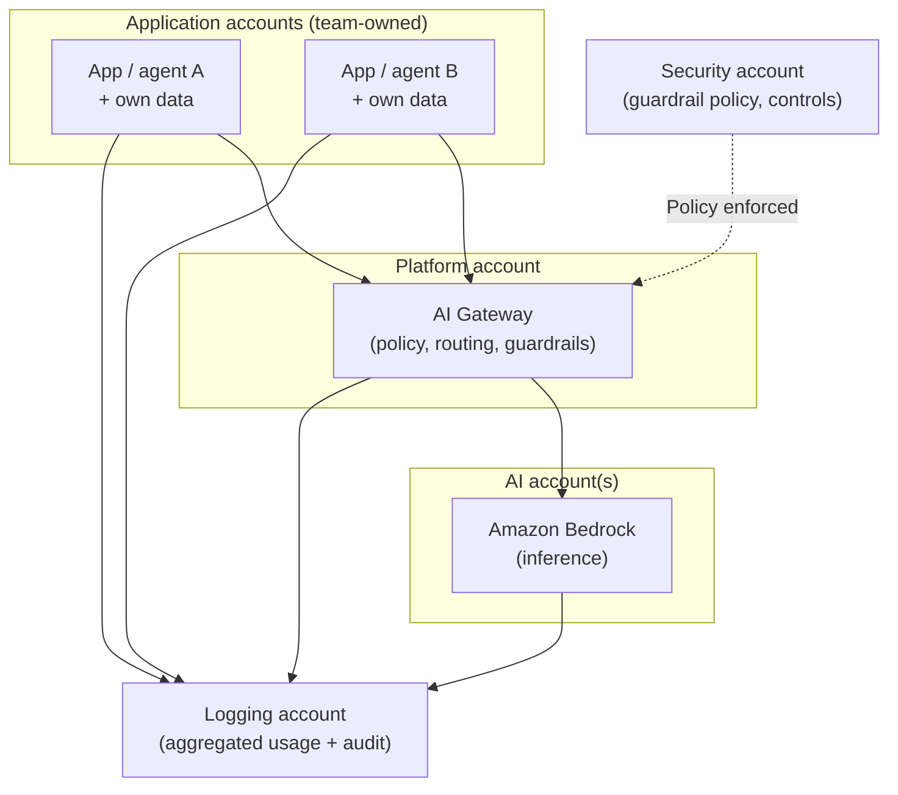
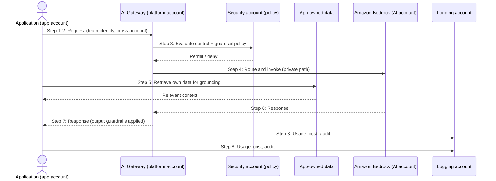

# Chapter 14: Federated and Multi Account AI

Part II built a toolkit of patterns: direct integration, the AI Gateway, RAG, routing, agents, multi-agent systems and state. Each was considered largely within a single boundary. Part III raises the level of the discussion from individual patterns to the enterprise platform, and it begins where enterprise architecture always begins on AWS: with accounts.

Enterprises do not run on a single account. They run on many, used to separate environments, teams, workloads and risk. A GenAI capability that matters to the whole enterprise therefore cannot live in one account and ignore the rest. It must be placed deliberately across the account structure, and that placement determines where inference happens, whose identity reaches the model, who owns the data, and how governance and autonomy are balanced. This chapter is about that structure, and about the word this book has used carefully since Chapter 3: federation.

---

## 1. The Architectural Problem

GenAI has spread across the enterprise. Multiple teams, in multiple accounts, want to use foundation models, ground them in their own data, and build their own applications and agents. Two instincts pull in opposite directions, and both, taken alone, fail.

The first instinct is to centralise everything: one account owns all GenAI, all data, all models, all governance. This gives consistency and control, but it makes the central team a bottleneck, forces every team's data into one place regardless of ownership, and creates a single point whose failure or compromise affects everyone. Teams lose the autonomy they need to move, and the central account accumulates a blast radius spanning the whole enterprise.

The second instinct is to distribute everything: every team does its own thing in its own account, integrating with models independently. This gives autonomy, but it fragments governance, duplicates effort, scatters cost, and leaves the enterprise unable to enforce consistent security or see what is happening across its estate.

Neither pure centralisation nor pure distribution serves a large enterprise well, because the enterprise genuinely needs both consistency and autonomy, in different places. The architectural problem is to find the structure that provides each where it belongs.

The question is: how do we place GenAI across many AWS accounts so that governance, security and cost control are consistent where they must be, while data ownership and application autonomy remain with the teams, without either a central bottleneck or a fragmented free-for-all?

---

## 2. 🧩 The Pattern at a Glance

- **Pattern name:** Federated Multi-Account AI
- **Problem solved:** Neither full centralisation nor full distribution serves enterprise GenAI; one bottlenecks and concentrates risk, the other fragments governance.
- **Primary objective:** Consistent central governance with retained application-level autonomy and data ownership, across many accounts.
- **When to use:** A multi-account enterprise with several teams using GenAI, needing both consistent governance and team autonomy.
- **When not to use:** A small organisation with one or few accounts, where multi-account federation is overhead without benefit.
- **Key AWS services:** A multi-account structure (application, AI, platform, security and logging accounts); the AI Gateway of Chapter 7; Amazon Bedrock; cross-account identity, networking and governance controls.
- **Primary architectural concern:** The balance of centralisation and federation, deciding which concerns are central and which stay with the teams.

Federation is the answer this chapter argues for: neither centralised nor distributed, but a deliberate division in which the centre governs and the teams retain autonomy under a common framework.

---

## 3. The Architecture

The architecture organises GenAI across a set of purpose-specific accounts, using the naming this book has used consistently.

- **Application accounts** are owned by the teams. They host applications and agents, and own their own data and its retrieval, retaining autonomy over how they build.
- **A platform account** hosts shared platform capabilities, most notably the AI Gateway of Chapter 7, through which applications reach models under consistent policy.
- **An AI account** (or per-domain AI resources) hosts foundation model access and inference, reached through the platform.
- **A security account** holds central security tooling, guardrail policy and controls enforced across the estate.
- **A logging account** aggregates logs, usage and audit records from across all accounts, giving the enterprise a single, tamper-resistant view.

The division is deliberate: the platform, security and logging accounts hold what should be central and consistent; the application accounts hold what should be autonomous and team-owned, above all their data.

---

## 4. Request and Data Flow

> **Step 1:** An application in its own account makes a request, carrying its team's identity.
> **Step 2:** The request reaches the AI Gateway in the platform account across the account boundary.
> **Step 3:** The gateway authenticates the caller and evaluates central policy, including guardrail policy defined in the security account.
> **Step 4:** The gateway routes to and invokes a model in the AI account, over a private path.
> **Step 5:** Where the request needs grounding, retrieval draws on the application's own data, which remains in or under the control of its account.
> **Step 6:** Bedrock performs inference and returns the response through the gateway.
> **Step 7:** The gateway applies output guardrails and returns the response to the application.
> **Step 8:** Usage, cost and audit records from every account flow to the logging account for a consolidated view.

The flow shows federation in action: the request passes through central governance, but the data grounding it stays with the team that owns it.

---

## 5. Why This Pattern Works

Federation works because it places each concern where it belongs. Governance, security policy, guardrails and usage visibility are enterprise concerns, and centralising them in the platform, security and logging accounts makes them consistent, enforceable and visible across the whole estate, which distribution could never achieve. Data ownership and application autonomy are team concerns, and leaving them in the application accounts lets teams move at their own pace and keep control of their own data, which centralisation would take away.

The structure also contains blast radius better than either extreme. Because data and workloads stay in team accounts, a problem in one team's account is bounded to that team rather than spilling across a single shared account. Because governance is central, a policy change applies everywhere at once rather than being reimplemented inconsistently. The account boundaries themselves become the isolation and blast-radius controls of Chapter 3, made concrete.

Crucially, federation is not a compromise that satisfies no one; it is a deliberate assignment of consistency and autonomy to where each is genuinely needed. That is why it suits large enterprises that pure centralisation or pure distribution cannot serve.

---

## 6. 🏗️ Architectural Decisions

| Decision | Options | Recommended approach | Reason |
| --- | --- | --- | --- |
| Overall model | Centralised / Federated / Distributed | Federated | Consistency where needed, autonomy where needed |
| Governance | Per team / Central | Central (platform + security) | Consistent, enforceable, visible |
| Data ownership | Central store / Team-owned | Team-owned in app accounts | Preserve ownership and contain blast radius |
| Model access | Direct per team / Via platform gateway | Via platform gateway | Consistent policy and usage visibility |
| Logging | Per account / Aggregated | Aggregated in logging account | Single audit and cost view |
| Inference location | Central only / Per domain as needed | As the workload and residency require | Balance isolation, latency and residency |

The defining decision is which concerns are central and which are federated. Govern centrally; own data and build applications locally. Getting that division right is the whole art of the pattern, and it should be revisited as the organisation matures.

---

## 7. ⚖️ Trade-offs

**Benefits:** Consistent enterprise governance, security and cost visibility; retained team autonomy and data ownership; blast radius contained by account boundaries; policy changes applied once across the estate; and a structure that scales with the organisation.

**Costs and limitations:** Multi-account federation is genuinely complex to design and operate. Cross-account identity, networking and governance must all be engineered. The platform, security and logging accounts are shared services that must be built and run. It demands organisational maturity, both the technical capability and the operating model, that not every enterprise has.

**Complexity:** High. This is enterprise-scale architecture, not a single-team pattern.

**Operational overhead:** Substantial: several shared-service accounts to operate, cross-account connectivity to maintain, and federated governance to sustain.

**Security implications:** Strongly positive when done well: account boundaries provide real isolation, central policy provides consistency, and aggregated logging provides auditability. The platform account becomes a high-value shared control point that must be secured accordingly.

**Performance implications:** Cross-account paths add some latency; the gateway hop from Chapter 7 applies. Usually acceptable, to be measured for sensitive paths.

**Cost implications:** Shared-service accounts have their own running cost, offset by aggregated cost visibility and central control, and by containing the fragmented, unattributable spend that pure distribution produces.

---

## 8. 🔐 Security and Governance

Federation is, at heart, a security and governance architecture. Its foundation is the AWS account as an isolation boundary: by keeping teams' data and workloads in their own accounts, a compromise or failure in one is bounded to that account rather than reaching the whole estate, the blast-radius principle of Chapter 3 realised through account structure. This is a stronger isolation than anything achievable within a single shared account.

Central governance is the counterweight. Guardrail policy defined in the security account and enforced through the platform gateway applies consistently to every team, so security posture does not depend on each team implementing it correctly. Identity flows across account boundaries as the team's own identity, so policy and attribution are per-consumer, and cross-account access is granted least-privilege, so the platform reaches what it must and no more. The logging account provides tamper-resistant, aggregated audit across the estate, the evidence that governance is actually being applied.

The concentration of control in the platform, security and logging accounts is the pattern's strength and its principal risk: these accounts govern the whole estate, so they are high-value and must be secured with the rigour their scope demands. The governance model must also decide clearly what is mandated centrally and what is left to teams, and enforce that division, because unclear ownership is where federated governance quietly breaks down.

---

## 9. 🌐 Networking

Networking is central to this pattern because the architecture spans accounts. Applications reach the platform gateway across account boundaries using private cross-account connectivity rather than the public internet, and the gateway reaches Bedrock over a private path as in Chapter 7. Each team's data stays reachable primarily within or under the control of its own account, so that data ownership is reinforced at the network level. Cross-account connectivity, private paths, DNS and the flow of logs to the logging account are all deliberate network design, using the enterprise connectivity patterns an organisation already operates. The networking should enforce the federation: teams reach shared services through governed private paths, and the isolation between team accounts is preserved rather than undermined by overly permissive connectivity. These concerns are developed in the dedicated networking chapter; here the point is that the account structure only delivers its isolation if the network respects it.

---

## 10. ⚠️ Failure Modes and Resilience

Federation changes the failure picture by distributing some risks and concentrating others.

- **Shared-service account failure:** The platform, security or logging account failing affects many teams, because they are shared dependencies. These accounts must be designed for availability appropriate to their enterprise-wide role.
- **Central bottleneck:** If the platform is under-provisioned, it throttles everyone. It must scale with aggregate demand across all teams.
- **Cross-account path failure:** Connectivity between accounts can fail, isolating teams from shared services. Cross-account paths need the resilience of any critical connectivity.
- **Governance gap:** An unclear or unenforced division between central and team responsibility leaves concerns owned by no one, a silent governance failure rather than a technical one.
- **Contained team failure:** A failure or compromise within one application account is, by design, bounded to that account, an advantage of the structure, provided isolation is genuine.
- **Downstream failures still apply:** Model, gateway, retrieval and agent failures from earlier chapters occur within this structure and are handled as before, now centrally at the gateway where appropriate.

The theme is that federation trades a single all-encompassing blast radius for contained team blast radii plus a smaller set of critical shared services, a better position overall, but only if those shared services are made resilient.

---

## 11. 👁️ Observability and Operations

Observability is one of federation's clearest wins, because the logging account provides what distribution cannot: a single, aggregated view of usage, cost, guardrail events and audit records across the entire estate. This consolidated visibility is the foundation for enterprise-wide operational management, cost control and compliance, and it is a primary reason to federate rather than distribute.

Operationally, the shared-service accounts are production platforms that must be operated, monitored, scaled and secured as enterprise dependencies, while each team operates its own applications within its account. The federated operating model must be explicit about who operates what, the platform team runs the shared services, the application teams run their workloads, so that operational ownership is as clearly divided as governance. As throughout, technical observability is distinct from AI quality evaluation; federation centralises the technical and usage signals, while quality evaluation remains a discipline applied where the workloads run.

---

## 12. 💷 Cost and FinOps

Federation transforms GenAI cost from something fragmented and invisible into something an enterprise can see, attribute and control. Because usage flows to the logging account and requests pass through the platform gateway, cost can be aggregated across the estate and attributed to the team that incurred it, enabling allocation, chargeback and informed decisions, which pure distribution, with its scattered and unattributable spend, cannot provide.

The pattern has its own cost: the shared-service accounts must be run. This is usually justified at enterprise scale, because the central visibility and control it buys reduce total cost more than the shared services add, and because the alternative, fragmented spend across many accounts with no oversight, is both more expensive and impossible to govern. The central gateway also enables the cost levers of earlier chapters, routing and caching, to be applied consistently across the enterprise rather than reinvented per team. Cost governance becomes a federated concern: central visibility and policy, with teams accountable for their own consumption.

---

## 13. When to Use This Pattern

Use this pattern when:

- the organisation is a multi-account enterprise with several teams using GenAI;
- both consistent enterprise governance and team-level autonomy are genuinely required;
- data ownership must stay with the teams while security and policy stay consistent;
- an enterprise-wide view of usage, cost and audit is needed; and
- the organisation has the maturity to design and operate a federated platform.

Federation is the natural structure for enterprise GenAI at scale, and it is the foundation on which the platform reference architecture of the next chapter is built.

---

## 14. When NOT to Use This Pattern

Do not use this pattern when:

- the organisation is small, with one or a few accounts and a single or handful of teams, federation is overhead without benefit, and the simpler patterns of Part II suffice;
- there is no genuine need for both central governance and team autonomy, if one clearly dominates, a simpler structure may serve;
- the organisation lacks the maturity or capacity to operate shared-service accounts and cross-account governance reliably, an unreliable federated platform is worse than none; or
- the added complexity and cross-account complexity are not justified by the scale of GenAI use.

Federation earns its considerable complexity through enterprise scale and the genuine, simultaneous need for consistency and autonomy. Imposed on a small organisation, it is the same error as building a platform for a single application, at the largest scale.

---

## 15. Pattern Variations

- **Small organisation:** No federation; one or a few accounts and the direct or gateway patterns of Part II.
- **Medium enterprise:** A lightweight federation, perhaps a platform account with the gateway and aggregated logging, with several team application accounts, growing central governance as use expands.
- **Large enterprise:** Full federation with distinct platform, security and logging accounts, per-domain AI resources where warranted, and mature federated governance, the basis for Chapter 15.
- **Highly regulated enterprise:** Stronger account isolation, stricter central policy, tighter cross-account controls, comprehensive aggregated audit, and conservative data residency across accounts.

The variations scale with organisational size, maturity and regulatory burden, from no federation at all to a rigorously governed multi-account estate.

---

## 16. Architecture Decision Checklist

- [ ] Is this genuinely a multi-account enterprise needing both governance and autonomy?
- [ ] Is the division between central and federated concerns explicit and enforced?
- [ ] Does data ownership stay with the teams in their application accounts?
- [ ] Do requests reach models through the platform gateway under consistent policy?
- [ ] Is guardrail and security policy defined centrally and enforced across the estate?
- [ ] Is identity propagated across accounts as the team's own identity, least-privilege?
- [ ] Do usage, cost and audit records aggregate in the logging account?
- [ ] Are the shared-service accounts secured and made resilient to their enterprise-wide role?
- [ ] Is operational ownership, who runs what, as clearly divided as governance?
- [ ] Does the organisation have the maturity to operate this structure?

---

## 17. 📐 The Architect's Verdict

> Federated multi-account AI is the right structure for a multi-account enterprise that genuinely needs both consistent governance and team autonomy, which neither full centralisation nor full distribution can provide. Its principle is to place each concern where it belongs: govern centrally through platform, security and logging accounts; own data and build applications locally in team accounts. Done well, account boundaries deliver real isolation and contained blast radius, central policy delivers consistency, and aggregated logging delivers enterprise-wide visibility and cost control. Its cost is genuine complexity and the maturity to operate shared services and cross-account governance, and the shared-service accounts concentrate control that must be secured and made resilient to their scope. The recurring failure is an unclear division of responsibility, so decide explicitly what is central and what is federated, and enforce it. For a small organisation, federation is unnecessary weight; for a large one, it is the foundation on which a real enterprise GenAI platform is built.
