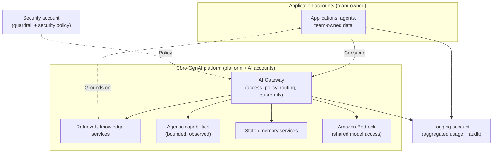
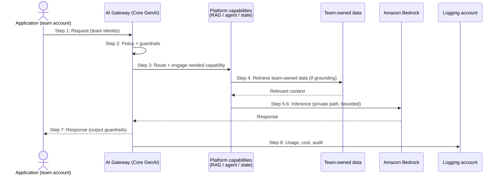

# Chapter 15: Core GenAI — An Enterprise AI Platform Reference Architecture

Every pattern in this book so far has stood somewhat on its own. The AI Gateway governs access. RAG grounds responses. Routing chooses models. Agents act. Federation places all of this across accounts. Individually useful, they raise an obvious question for the enterprise: how do they fit together into a single, coherent capability that many teams can rely on?

This chapter answers that question with a reference architecture the book calls **Core GenAI**: an enterprise AI platform that composes the earlier patterns into a shared capability, provided to application teams under federated governance. Core GenAI is not a new pattern so much as the deliberate integration of the patterns already established, and the shift in thinking it represents, from GenAI as a set of application features to GenAI as an enterprise platform, is the central idea of Part III. As a reference architecture it is illustrative rather than prescriptive: a worked composition to reason from, not a blueprint to copy unchanged.

---

## 1. The Architectural Problem

An enterprise has adopted GenAI widely. Teams use the gateway, ground with RAG, route between models, and build agents, and the whole estate is federated across accounts. Yet each team assembles these pieces itself. The result is capable but incoherent: every team solves the same integration problems, makes its own decisions about how the patterns combine, and reinvents the same platform concerns, onboarding, self-service, shared guardrails, consistent observability, with varying quality.

The problem is no longer any individual pattern; it is the absence of a platform. Without one, the enterprise has a collection of well-understood patterns but no shared, coherent capability that teams can simply consume. Common concerns are solved repeatedly instead of once. New teams face the full integration burden before they can deliver anything. And the organisation cannot offer GenAI as a dependable internal capability with predictable properties, because there is no such capability, only patterns each team must assemble.

The constraint is that a platform must serve many teams with different needs while remaining coherent and governable. It must provide enough to be genuinely useful, without becoming a rigid bottleneck that removes the autonomy federation was meant to preserve.

The architectural question is: how do we compose the established patterns into a single enterprise AI platform that teams can consume as a shared capability, providing consistent governance, security, observability and cost control, while preserving the autonomy and data ownership of the teams that use it?

---

## 2. 🧩 The Pattern at a Glance

- **Pattern name:** Core GenAI (enterprise AI platform reference architecture)
- **Problem solved:** The established patterns exist but are assembled repeatedly by each team, with no coherent shared platform.
- **Primary objective:** A composed enterprise AI platform, consumed as a shared capability, that integrates the patterns under federated governance while preserving team autonomy.
- **When to use:** A federated enterprise where many teams use GenAI and would benefit from a shared, governed platform rather than assembling patterns independently.
- **When not to use:** A small organisation, or one with too few teams to justify a platform, where the patterns of Part II suffice directly.
- **Key AWS services:** The composition of everything so far, AI Gateway, Amazon Bedrock, RAG and retrieval, routing, AgentCore, guardrails, state, across the federated multi-account structure of Chapter 14.
- **Primary architectural concern:** Coherent composition, integrating the patterns into a usable platform without creating a rigid central bottleneck.

Core GenAI is the name this book gives to the specific platform reference implementation; the AI Gateway remains the name for the gateway capability within it. The platform is the whole; the gateway is one of its components.

---

## 3. The Architecture

Core GenAI composes the earlier patterns into platform capabilities, hosted in the platform and AI accounts of Chapter 14, and consumed by teams in their application accounts.

- **Application teams**, in their own accounts, build applications and agents and own their data, consuming the platform rather than assembling it.
- **The AI Gateway** (Chapter 7) is the platform's front door: the control plane for access, identity, policy and guardrails, and the home of model routing (Chapter 10).
- **Shared model access** to Amazon Bedrock (Chapter 5) sits behind the gateway, with routing directing each request appropriately.
- **Retrieval and knowledge services** (Chapters 8 and 9) are offered as a platform capability, while each team's data stays team-owned, grounding without surrendering ownership.
- **Agentic capabilities** (Chapters 11 and 12), built on AgentCore, are provided with the platform's controls, bounds and observability built in.
- **State and memory services** (Chapter 13) are available where workloads need durability.
- **Central governance, security and observability** (Chapter 14) span the platform: guardrail policy from the security account, aggregated usage and audit in the logging account.

The platform provides the shared capabilities; the teams provide the applications and the data. The composition, not any single component, is the reference architecture.

---

## 4. Request and Data Flow

> **Step 1:** A team's application, in its own account, calls the Core GenAI platform through the AI Gateway, carrying its identity.
> **Step 2:** The gateway authenticates the caller and applies central policy and guardrails, using security-account policy.
> **Step 3:** The gateway routes the request to an appropriate model, and engages platform capabilities the request needs, retrieval, an agent, or state.
> **Step 4:** Where grounding is required, retrieval draws on the team's own data, which remains team-owned.
> **Step 5:** Model access invokes Bedrock over a private path, within the platform.
> **Step 6:** For agentic work, the platform's bounded, observed agent capabilities run within their controls.
> **Step 7:** The gateway applies output guardrails and returns the result to the application.
> **Step 8:** Usage, cost and audit records flow to the logging account for the enterprise-wide view.

The flow shows composition rather than a new mechanism: the request moves through the platform's integrated capabilities, each of which is a pattern from earlier chapters, under one consistent governance path.

---

## 5. Why This Pattern Works

Core GenAI works because it solves each concern once, for everyone. The integration problems that every team would otherwise face, how to reach models under policy, how to ground safely, how to route, how to bound an agent, how to observe and control cost, are solved in the platform and consumed by teams, rather than reinvented repeatedly. New teams consume a working capability instead of assembling one, which lowers the barrier to using GenAI well and raises the floor on quality and safety across the enterprise.

It works structurally because it composes patterns that were designed to compose. The gateway was always the natural home for routing and the enforcement point for guardrails; retrieval was always a capability to offer while data stayed owned; federation was always the structure to host shared services while preserving autonomy. Core GenAI is the deliberate assembly of these into a coherent whole, and the coherence is the value: teams get consistent, governed, observable GenAI as a dependable capability.

It preserves autonomy because it draws the line where Chapter 14 drew it: the platform provides shared capabilities and central governance, but data and applications remain team-owned. This is what keeps the platform from becoming the central bottleneck that pure centralisation produces, it governs and enables, rather than owning everything.

---

## 6. 🏗️ Architectural Decisions

| Decision | Options | Recommended approach | Reason |
| --- | --- | --- | --- |
| GenAI as | Per-team assembly / Shared platform | Shared platform (at scale) | Solve common concerns once |
| Platform scope | Minimal / Comprehensive | Enough to be useful, not rigid | Usefulness without bottleneck |
| Data | Platform-owned / Team-owned | Team-owned | Preserve ownership and autonomy |
| Capabilities | Mandatory / Consumable | Consumable, with governed defaults | Serve varied needs coherently |
| Governance | Optional / Built into the platform | Built in, non-bypassable | Consistency and safety by default |
| Autonomy line | Platform owns all / Platform enables | Platform enables, teams own | Avoid central bottleneck |

The defining decision is scope: a platform must provide enough to be genuinely useful without becoming so prescriptive that it removes the autonomy federation preserves. Provide governed, consumable capabilities with sensible defaults; do not force every team into a single rigid path.

---

## 7. ⚖️ Trade-offs

**Benefits:** Common concerns solved once; teams consume rather than assemble; consistent governance, security, observability and cost control by default; a lower barrier and higher floor for using GenAI well; and the enterprise able to offer GenAI as a dependable capability.

**Costs and limitations:** Core GenAI is a significant platform to build and operate, the sum of the patterns it composes plus the platform concerns of serving many teams. It requires a platform team and an operating model. Done badly, it can become the very bottleneck it was meant to avoid, slowing teams rather than enabling them. It demands real organisational maturity.

**Complexity:** The highest in the book, because it composes nearly everything that precedes it. But the complexity is consolidated in one platform rather than duplicated across teams.

**Operational overhead:** Substantial and ongoing: the platform is a production dependency of many teams and must be operated as such, on top of the federated structure of Chapter 14.

**Security implications:** Strongly positive: governance, guardrails and security are built into a platform every team consumes, so safety is the default rather than each team's separate responsibility. The platform is correspondingly a high-value, enterprise-wide control point.

**Performance implications:** The composed hops, gateway, retrieval, and so on, add latency, mostly inherited from the underlying patterns and usually acceptable, to be measured for sensitive paths.

**Cost implications:** The platform has real running cost, offset by consolidated cost visibility and control, shared efficiency, and the routing and caching levers applied enterprise-wide rather than per team.

---

## 8. 🔐 Security and Governance

Core GenAI's greatest security value is that it makes good security the default. Because governance, guardrails, identity and policy are built into a platform every team consumes, a team using the platform inherits the enterprise's security posture rather than having to construct it, and construct it correctly, itself. This raises the security floor across the whole enterprise, which is difficult to achieve when each team assembles its own GenAI.

The platform inherits the security architecture of Chapter 14: central guardrail and security policy from the security account, enforced non-bypassably through the gateway; identity propagated as the team's own; team-owned data that the platform grounds on but does not appropriate; and aggregated audit in the logging account. The composition adds the requirement that each capability, retrieval, agents, state, carries its own security discipline from its chapter into the platform: permission-filtered retrieval, bounded least-privilege agents, isolated memory. The platform must integrate these consistently so that no capability becomes the weak point.

The concentration of control is, once more, both strength and risk: Core GenAI governs GenAI for the whole enterprise, so it is among the highest-value control points in the organisation and must be secured accordingly. And its governance must preserve the autonomy line, enabling and governing teams rather than owning their data and dictating their applications, or it undermines the federation it rests on.

---

## 9. 🌐 Networking

The networking is the composition of Chapter 14's cross-account design with the private paths of the underlying patterns. Teams reach the platform across account boundaries over private connectivity; within the platform, model access, retrieval and agent tools all travel private, least-privilege paths as their chapters require; team-owned data stays reachable under the team's account so ownership is reinforced at the network level; and logs flow privately to the logging account. The network must enforce the platform's boundaries, teams consume shared capabilities through governed paths, and the isolation between team accounts is preserved, exactly as in the federation chapter. The dedicated networking chapter develops this; here the point is that a coherent platform requires a coherent network design underneath it.

---

## 10. ⚠️ Failure Modes and Resilience

As an enterprise-wide platform, Core GenAI concentrates dependency, and its failure modes reflect that.

- **Platform unavailability:** Because many teams depend on it, the platform failing affects the enterprise. It must be designed for high availability commensurate with its role, with the shared-service resilience of Chapter 14.
- **Platform as bottleneck:** Under-provisioning or an overly rigid design turns the platform into the chokepoint federation was meant to avoid. It must scale with aggregate demand and enable rather than constrain.
- **Composed failure modes:** Every underlying pattern's failure modes, model, retrieval, agent, state, gateway, cross-account, apply within the platform, now handled centrally where appropriate, which is an advantage if the platform implements consistent resilience on behalf of all teams.
- **Weak-link capability:** If one composed capability is less resilient or less secure than the rest, it becomes the platform's weak point, so consistency across capabilities matters.
- **Contained team failure:** As in Chapter 14, failures within a team's account stay bounded to that team, an advantage the platform preserves.

The theme is that consolidating capability consolidates dependency: the platform can provide resilience, security and governance to every team at once, but only if it is itself resilient, and its failure is correspondingly consequential.

---

## 11. 👁️ Observability and Operations

Core GenAI centralises observability as a platform property. Because every team consumes the platform, and usage flows to the logging account, the enterprise gets a consistent, aggregated view of GenAI usage, cost, guardrail events and audit across all teams and all capabilities, without each team building its own observability. This is a major benefit: a single, coherent operational picture of GenAI across the enterprise.

Operationally, Core GenAI is a first-class internal platform, and it must be run like one: monitored, kept available, scaled, secured, and supported for the teams that depend on it, with a clear operating model and platform team, developed in the next chapter. The composed capabilities each bring their operational concerns, retrieval pipelines, agent supervision, state and workflow management, which the platform team operates on behalf of consumers. As throughout, technical and usage observability, which the platform centralises, remain distinct from AI quality evaluation, which is applied where workloads run and belongs to the evaluation discipline.

---

## 12. 💷 Cost and FinOps

Core GenAI turns GenAI cost into a managed enterprise concern. Consolidating usage through the platform and into the logging account gives the enterprise aggregated cost visibility and per-team attribution across every capability, enabling allocation, chargeback and informed investment, the federated cost governance of Chapter 14 realised for the whole platform. It also lets the cost levers of earlier chapters, routing to cheaper models, caching, controlled context and bounded agents, be applied consistently enterprise-wide rather than reinvented per team.

The platform's own running cost is real and must be justified by scale: at enterprise scale, the consolidated efficiency, visibility and control typically reduce total cost below the fragmented alternative, while below a certain scale the platform is not worth its overhead, precisely the "when not to use" boundary. Cost governance becomes a platform capability: central visibility and levers, with teams accountable for their own consumption, and the platform team responsible for the shared efficiency.

---

## 13. When to Use This Pattern

Use this pattern when:

- a federated enterprise has many teams using GenAI who would benefit from a shared, governed platform;
- common concerns, access, grounding, routing, agents, governance, observability, are being solved repeatedly across teams;
- the enterprise wants to offer GenAI as a dependable internal capability with consistent properties; and
- the organisation has the maturity to build and operate an enterprise platform.

Core GenAI is the culmination of the patterns in this book for a large enterprise, and it is where GenAI genuinely becomes a platform capability rather than a set of features.

---

## 14. When NOT to Use This Pattern

Do not use this pattern when:

- the organisation is small or has too few teams to justify a platform, the patterns of Part II, used directly, are the right architecture;
- there is no real duplication to consolidate, a platform solves a problem the organisation does not yet have;
- the organisation lacks the maturity to operate an enterprise platform, an unreliable or bottlenecking platform is worse than none; or
- building the platform would remove more autonomy than the consistency it provides is worth.

Core GenAI is the most ambitious pattern in the book, and it is correspondingly the easiest to over-reach for. A platform is justified by genuine scale and genuine duplication; without them, it is complexity built ahead of need. The mature decision is often to grow into it, starting with the individual patterns and composing them into a platform only when the scale demands it.

---

## 15. Pattern Variations

- **Small organisation:** No platform; the patterns of Part II used directly.
- **Medium enterprise:** An emerging platform, a gateway with routing and guardrails, shared retrieval, aggregated logging, grown incrementally as more teams adopt GenAI.
- **Large enterprise:** A full Core GenAI platform composing all the capabilities under federated governance, with a platform team and operating model, the reference architecture in full.
- **Highly regulated enterprise:** A Core GenAI platform with stronger isolation, stricter central policy, comprehensive audit, conservative agent autonomy and residency, reflecting tighter constraints.

The reference architecture is a target to grow towards, not a starting point; the variations describe stages on the way and adaptations to constraint, and the platform should be assembled incrementally as scale justifies each part.

---

## 16. Architecture Decision Checklist

- [ ] Is there genuine scale and duplication that a shared platform would consolidate?
- [ ] Does the platform provide enough to be useful without becoming a rigid bottleneck?
- [ ] Do teams consume the platform while retaining ownership of their data and applications?
- [ ] Are governance, guardrails and security built into the platform and non-bypassable?
- [ ] Does each composed capability carry its own security discipline into the platform consistently?
- [ ] Is identity propagated as the team's own across the platform?
- [ ] Does usage, cost and audit aggregate for an enterprise-wide view?
- [ ] Is the platform designed for availability and scale appropriate to enterprise-wide dependency?
- [ ] Is there a platform team and operating model to run it?
- [ ] Is the platform being grown incrementally as scale justifies, rather than built ahead of need?

---

## 17. 📐 The Architect's Verdict

> Core GenAI is the reference architecture for an enterprise that has outgrown assembling patterns team by team and needs GenAI as a coherent, governed, shared capability. It is not a new mechanism but the deliberate composition of everything before it, gateway, routing, retrieval, agents, state, guardrails, observability, hosted on the federated structure of Chapter 14 and consumed by teams that keep their data and autonomy. Its value is that common concerns are solved once and good security and governance become the default across the enterprise; its cost is a substantial platform to build and operate, and the real risk of becoming the bottleneck it was meant to prevent. As a reference architecture it is illustrative, a composition to reason from and adapt, not a blueprint to copy. It is justified by genuine scale and duplication, and the mature path is usually to grow into it incrementally rather than build it ahead of need. Where that scale exists, Core GenAI is where GenAI stops being a collection of features and becomes an enterprise platform; where it does not, the patterns of Part II remain the better architecture.
