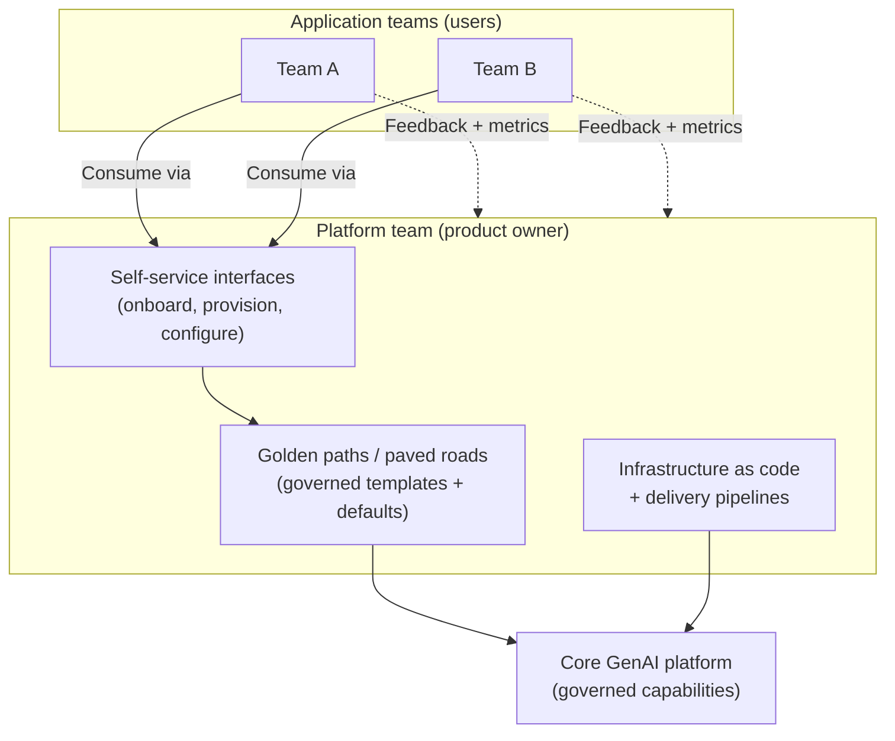
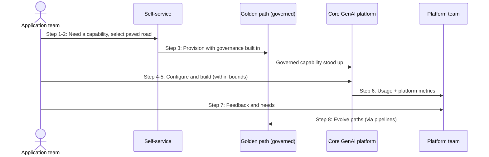

# Chapter 16: AI Platform Engineering and Self Service

Chapter 15 described Core GenAI as a composed enterprise platform, and it repeatedly made a claim it did not yet justify: that the platform must be run like a first-class internal product, with a team and an operating model behind it. A reference architecture is a diagram. A platform that teams actually depend on is an ongoing engineering and operational commitment. This chapter is about that commitment, the discipline of AI platform engineering, and the model through which teams consume the platform: self-service.

The central idea is that a platform is not something you build once and hand over; it is a product with users, an operating model and a lifecycle. Get the engineering discipline and the self-service model right, and the platform enables teams to move quickly and safely. Get them wrong, and the platform of Chapter 15 becomes the bottleneck that chapter warned against. This is where the platform either delivers on its promise or quietly fails to.

---

## 1. The Architectural Problem

An enterprise has built, or is building, the Core GenAI platform. The architecture is sound. Yet teams struggle to use it. Onboarding a new team is a bespoke, slow effort. Teams file requests and wait on the platform team for changes. The platform team, small and central, becomes a queue that everything passes through. The very platform meant to accelerate the enterprise now gates it.

The problem is not the architecture; it is the absence of an operating model. A platform without self-service forces every interaction through its central team, which makes that team a bottleneck no matter how good the architecture is. A platform without engineering discipline, versioning, testing, reliable delivery, degrades over time and cannot be trusted as a dependency. And a platform without a product mindset drifts away from what teams actually need, because no one is treating the teams as users whose needs shape the platform.

The constraint is a genuine tension. The platform exists to provide consistency, governance and safety, which pull towards central control. But it must also let many teams move autonomously and quickly, which pulls towards self-service and away from central gatekeeping. Resolving this tension, providing governed self-service, is the essence of platform engineering.

The architectural question is: how do we operate the platform so that teams can consume it autonomously and safely, at their own pace, without the platform team becoming a bottleneck and without sacrificing the governance the platform exists to provide?

---

## 2. 🧩 The Pattern at a Glance

- **Pattern name:** AI Platform Engineering and Self-Service
- **Problem solved:** A well-architected platform that is operated without a product mindset, engineering discipline or self-service becomes a central bottleneck rather than an enabler.
- **Primary objective:** Governed self-service, teams consume the platform autonomously and safely, with the platform team enabling rather than gating.
- **When to use:** An enterprise operating a shared GenAI platform (Chapter 15) that many teams must consume without central gatekeeping.
- **When not to use:** No shared platform exists, or too few teams consume it to justify a platform-engineering operating model.
- **Key AWS services:** The Core GenAI platform and federated structure of Chapters 14 and 15; infrastructure as code, delivery pipelines, and self-service interfaces atop them.
- **Primary architectural concern:** The operating model, balancing team autonomy and self-service against central governance, so the platform enables rather than bottlenecks.

Platform engineering is less about new components than about how the platform is delivered, operated and consumed. Its defining artefacts are golden paths and paved roads: pre-built, governed ways of doing common things that make the safe path the easy path.

---

## 3. The Architecture

The architecture here is an operating model layered over the platform, not a new set of runtime components.

- **The platform team** builds and operates Core GenAI as an internal product, treating the application teams as its users.
- **Golden paths (paved roads)** are pre-built, governed templates and defaults for common needs, integrate with the gateway, stand up a governed RAG capability, deploy a bounded agent, so that doing the common thing correctly requires little effort.
- **Self-service interfaces** let teams onboard, provision governed capabilities and configure their use without waiting on the platform team.
- **Governance built into the paths** means the paved road is inherently compliant: using it applies the right guardrails, identity, isolation and observability by default.
- **Infrastructure as code and delivery pipelines** underpin the platform, so it is versioned, tested and reliably delivered.
- **Feedback and metrics** flow from the teams back to the platform team, so the platform evolves as a product towards what its users need.

The paved roads are the heart of the model: governance is built into the easy path, so teams get consistency and safety by taking the path of least resistance, not by extra effort.

---

## 4. Request and Data Flow

The flow here is a team's journey to adopt and use a capability, rather than a single inference request:

> **Step 1:** A team needs a GenAI capability, say, a governed RAG-backed application.
> **Step 2:** The team uses self-service to select the relevant golden path, rather than filing a request.
> **Step 3:** The paved road provisions the capability with governance built in: gateway integration, guardrails, identity, isolation and observability applied by default.
> **Step 4:** The team configures the capability for its own needs, within the bounds the path allows, retaining autonomy over its data and application.
> **Step 5:** The team builds and runs on the provisioned capability, consuming the platform without central gatekeeping.
> **Step 6:** Usage and platform metrics flow back, contributing to both the enterprise view and the platform team's understanding of how the platform is used.
> **Step 7:** The team's feedback and observed needs inform the platform team's roadmap.
> **Step 8:** The platform team evolves the paths and capabilities, delivered reliably through pipelines, and the improvements reach all teams.

The flow shows autonomy and governance coexisting: the team moves without waiting on the platform team, yet everything it provisions is governed by construction.

---

## 5. Why This Pattern Works

The model works because it resolves the autonomy-versus-governance tension rather than choosing a side. Golden paths make the governed way the easy way, so teams get consistency and safety by taking the path of least resistance, not by discipline or oversight. Self-service removes the platform team from the critical path of everyday work, so teams move at their own pace and the platform team stops being a queue. Governance built into the paths means autonomy does not cost compliance: a team going fast on the paved road is going fast safely, because the road itself enforces the rules.

Treating the platform as a product works because it keeps the platform aligned with real needs. A platform built once and frozen drifts from what teams require and accumulates friction; a platform that takes feedback, measures its own use and evolves stays useful and adopted. And engineering discipline, infrastructure as code, versioning, tested delivery, works because it makes the platform a dependable dependency rather than a fragile one, which is the precondition for teams trusting it enough to build on.

Together these turn Chapter 15's architecture from a diagram into a living capability that genuinely enables the enterprise, which is the difference between a platform that delivers and one that bottlenecks.

---

## 6. 🏗️ Architectural Decisions

| Decision | Options | Recommended approach | Reason |
| --- | --- | --- | --- |
| Consumption | Central requests / Self-service | Self-service | Remove the platform team from the critical path |
| Governance placement | Reviews and gates / Built into paths | Built into paved roads | Safe path is the easy path |
| Platform stance | Project / Product | Product with users | Stays aligned and adopted |
| Common tasks | Bespoke each time / Golden paths | Golden paths | Consistency and speed |
| Delivery | Manual / Infrastructure as code + pipelines | IaC and pipelines | Versioned, tested, reliable |
| Team autonomy | Constrained to one path / Bounded freedom | Bounded freedom within paths | Autonomy without losing governance |

The unifying principle is to make the governed path the easy path. When compliance is the default outcome of the most convenient route, teams comply by moving quickly rather than despite it, and the platform team governs by designing the road rather than guarding a gate.

---

## 7. ⚖️ Trade-offs

**Benefits:** Teams move autonomously and quickly; the platform team stops being a bottleneck; governance and safety are the default; the platform stays aligned with real needs and improves over time; and common work is consistent and fast.

**Costs and limitations:** Building golden paths, self-service and a product operating model is real, ongoing work, on top of building the platform itself. It requires a platform team with product and engineering discipline, not just infrastructure skills. Paved roads that are too rigid frustrate teams and push them off-road; paths that are too loose fail to govern. Striking the balance is genuinely hard and never finished.

**Complexity:** Moderate to high, and organisational as much as technical, it is as much about how the platform team works as about what it builds.

**Operational overhead:** Ongoing: the platform is a product to be maintained, supported and evolved, with its users' needs continually incorporated.

**Security implications:** Strongly positive when paths embed governance: safety becomes the default outcome of self-service rather than something reviewed after the fact. The risk is that a poorly designed path bakes in a weakness that then propagates to every team that uses it, so the paths themselves must be held to a high standard.

**Performance implications:** Negligible at runtime; this pattern is about delivery and operation, not the request path.

**Cost implications:** The platform team and its product work are a real cost, offset by the efficiency of many teams not each solving platform problems, and by governed self-service preventing costly missteps.

---

## 8. 🔐 Security and Governance

Platform engineering changes how governance is achieved, from gatekeeping to design. Instead of reviewing each team's work for compliance, the platform bakes governance into the paved roads, so that a team using self-service to provision a capability inherits the right guardrails, identity propagation, isolation and observability automatically. This scales governance in a way that manual review never can: the more teams use the paths, the more consistently the enterprise is governed, without a proportional increase in oversight effort.

This shifts responsibility onto the paths themselves. Because a golden path propagates to every team that uses it, a security weakness designed into a path is a weakness replicated across the enterprise, so the paths must be built and reviewed to a higher standard than any single team's work would be. Bounded freedom is the governing principle: teams configure and build within the limits the path allows, retaining autonomy over their data and applications, while the path enforces the non-negotiable controls. Where a team needs to go off the paved road for a genuine reason, that should be a deliberate, governed exception, not an unnoticed gap, so that leaving the road is visible and controlled rather than silent. Governance by design is stronger than governance by review, but only if the designs are sound.

---

## 9. 🌐 Networking

This pattern adds little to the network at runtime; the paths provision capabilities that use the private, governed connectivity of Chapters 14 and 15. Its networking relevance is that golden paths should provision correct networking by default, private paths, proper isolation, least-privilege connectivity, so that a team taking the paved road gets the right network posture without having to design it. This is the network expression of governance-by-design: the paved road lays down not just the application but its correct, isolated connectivity, so teams cannot accidentally provision insecure network access by taking the easy path. The dedicated networking chapter details the connectivity itself; here the point is that self-service must provision it correctly.

---

## 10. ⚠️ Failure Modes and Resilience

The failure modes here are largely operational and organisational rather than runtime.

- **Bottleneck reasserts itself:** If self-service is incomplete and teams still must file requests for common needs, the platform team becomes a queue again, the core failure this pattern exists to prevent.
- **Rigid paths pushing teams off-road:** If paved roads are too constraining, teams route around them, losing the governance the paths provide, a governance failure caused by poor path design.
- **Weakness baked into a path:** A flaw in a golden path, security, cost or reliability, propagates to every team that uses it, amplifying a single mistake across the enterprise.
- **Platform drift:** Without feedback and a product mindset, the platform diverges from real needs, adoption falls, and teams build their own, fragmenting the estate the platform was meant to unify.
- **Unreliable delivery:** Without engineering discipline, platform changes break teams that depend on the platform, eroding the trust the platform requires.
- **Ungoverned exceptions:** Off-road work that is invisible rather than governed becomes an unmanaged risk.

The resilience response is engineering discipline and a product mindset: version and test the paths, deliver reliably, monitor adoption and off-road usage, and evolve the platform continuously so it stays both used and trusted.

---

## 11. 👁️ Observability and Operations

Platform engineering introduces a distinct observability need: observing the platform as a product. Beyond the runtime signals the platform already aggregates, the platform team must see how the platform is used, which paths are adopted, where teams struggle, where they go off-road, how long onboarding takes, and how satisfied its users are. These product metrics are what tell the platform team whether the platform is genuinely enabling teams or quietly bottlenecking them, and they are the signal that drives the platform's evolution.

Operationally, the platform is run as an internal product: supported, maintained, versioned and improved, with a clear platform team accountable for it and a roadmap informed by user feedback. This is a different operational posture from running a service, it includes product management, user support and continuous improvement, not just uptime. As always, this is distinct from the AI quality evaluation applied to the workloads teams build; here the object of observation is the platform and its adoption, not the models.

---

## 12. 💷 Cost and FinOps

The economics of platform engineering rest on consolidation and prevention. The platform team and its product work are a real, ongoing cost, but they replace the far larger cost of every team independently solving platform problems, building integrations, working out governance, standing up observability, badly and repeatedly. Golden paths make the efficient, cost-aware way the default, so teams inherit good cost practices, right-sized models, controlled context, caching, from the paved road rather than rediscovering them.

Self-service also prevents costly missteps: a governed path that provisions correctly avoids the expensive mistakes, security gaps, runaway agents, unbounded state, that ad hoc team efforts produce. The platform's cost is justified when it serves enough teams that this consolidation and prevention outweigh the platform team's cost, the same scale threshold as Chapter 15. Below that scale, the operating model is overhead; above it, it is what makes enterprise GenAI both safe and economical.

---

## 13. When to Use This Pattern

Use this pattern when:

- an enterprise operates a shared GenAI platform that many teams must consume;
- the platform team is becoming, or would become, a bottleneck for everyday requests;
- consistency and governance must scale across many teams without proportional oversight effort; or
- the enterprise wants teams to adopt GenAI quickly and safely without bespoke onboarding each time.

Platform engineering is the operating model that makes Chapter 15's platform actually work at scale, and it is essential wherever many teams depend on a shared platform.

---

## 14. When NOT to Use This Pattern

Do not use this pattern when:

- there is no shared platform to operate, the patterns of Part II, used directly, need no platform-engineering model;
- too few teams consume the platform to justify golden paths and self-service, direct support may suffice at small scale;
- the organisation lacks the capacity to run a platform as a product, in which case a smaller, simpler platform scope is better than an unsustained operating model; or
- the overhead of the operating model exceeds the friction it removes.

Platform engineering is justified by many teams depending on a shared platform. Applied where there is no platform or too few consumers, it is process and tooling without a problem to solve, and a lighter touch is the more mature choice.

---

## 15. Pattern Variations

- **Small organisation:** No platform-engineering model; teams use the patterns of Part II directly, with informal support.
- **Medium enterprise:** An emerging model, a few golden paths for the most common needs and basic self-service, with a small platform team, growing as adoption grows.
- **Large enterprise:** A full platform-engineering practice, comprehensive paved roads, mature self-service, a product-oriented platform team, and adoption metrics driving the roadmap.
- **Highly regulated enterprise:** Paved roads with stricter built-in controls, tightly governed exceptions for off-road needs, and rigorous review of the paths themselves given how widely they propagate.

The variations scale the operating model with the number of teams and the maturity of the platform, from informal support to a full product practice.

---

## 16. Architecture Decision Checklist

- [ ] Can teams onboard and provision common capabilities through self-service, without filing requests?
- [ ] Are golden paths defined for the most common needs, with governance built in?
- [ ] Is the governed path genuinely the easy path, so compliance is the default?
- [ ] Is the platform treated as a product, with users, feedback and a roadmap?
- [ ] Are the paved roads themselves held to a high security and quality standard, given how widely they propagate?
- [ ] Do teams retain bounded autonomy over their data and applications within the paths?
- [ ] Is off-road work a governed, visible exception rather than an unnoticed gap?
- [ ] Is the platform delivered reliably through infrastructure as code and tested pipelines?
- [ ] Are platform adoption and user-experience metrics observed, not just runtime signals?
- [ ] Does the platform team have the capacity to sustain the operating model?

---

## 17. 📐 The Architect's Verdict

> AI platform engineering is what turns the Core GenAI architecture of Chapter 15 from a diagram into a capability teams actually rely on, and it is where the platform either enables the enterprise or becomes the bottleneck it was meant to prevent. Its central move is to resolve the autonomy-versus-governance tension by design: golden paths make the governed way the easy way, self-service removes the platform team from everyday work, and governance built into the paved roads means teams go fast safely. This demands treating the platform as a product with users, engineering discipline so it is dependable, and continual evolution so it stays adopted, an ongoing organisational commitment, not a one-off build. The paths must be held to a high standard, because a flaw designed into a paved road propagates to everyone who uses it. Justified only where many teams depend on a shared platform, platform engineering is the operating model that makes governed self-service real, and governed self-service is what makes an enterprise GenAI platform succeed rather than stall.
