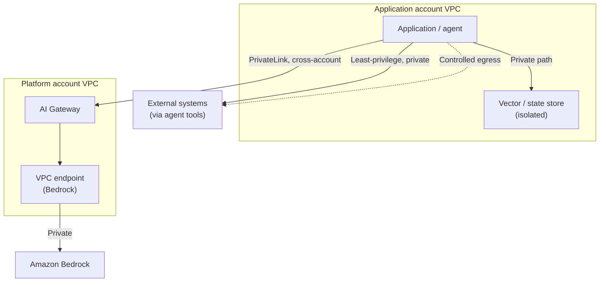
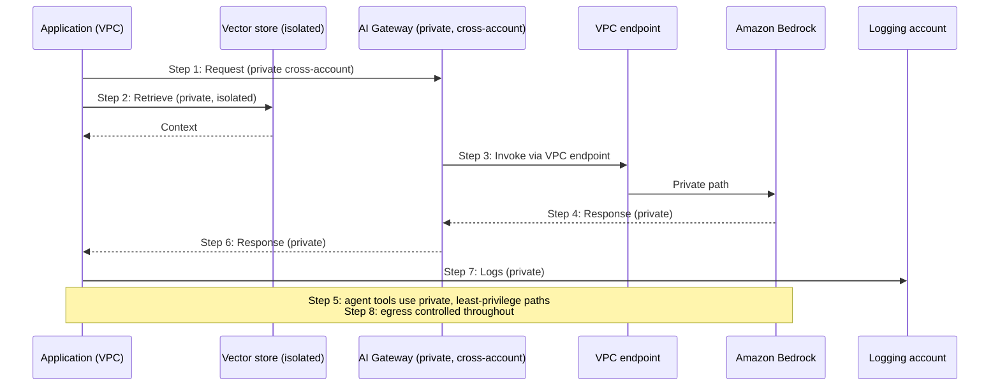

# Chapter 17: Networking for GenAI

Almost every chapter so far has deferred a concern to "the networking chapter". Private paths to Bedrock, cross-account connectivity to the gateway, isolation between team accounts, network-level least privilege for agent tools, private access to vector stores and state, each was raised and then postponed. This chapter is where those deferrals are settled. It is also where this book claims a genuine advantage over GenAI writing that treats models and prompts as the whole story: enterprise GenAI runs on a network, and the network is where a great deal of its security and reliability is actually decided.

The premise is simple. GenAI does not change the fundamentals of AWS networking; it applies them to a new kind of workload in which sensitive data flows to inference, retrieval and tools. An architect who already reasons well about VPCs, private connectivity and isolation is most of the way there. This chapter is about applying that reasoning deliberately to the GenAI patterns, so that the private paths every earlier chapter assumed are actually designed rather than hoped for.

---

## 1. The Architectural Problem

A GenAI system moves data across a network in ways that matter. Prompts, often containing sensitive enterprise information, travel to inference. Retrieval queries and their results move between applications and vector stores. Agent tools reach into external systems. In a federated enterprise, all of this crosses account boundaries. If any of these paths traverses the public internet, or is more open than it needs to be, the system exposes sensitive data and widens its attack surface, regardless of how well the application logic is written.

The problem is that networking is easy to leave implicit. A system can function perfectly while sending inference traffic over public paths or granting broad network reach, and nothing will visibly break, until the exposure is discovered or exploited. The absence of a loud failure is precisely what makes network exposure dangerous: it is a silent risk, present whether or not anyone has thought about it.

The constraints are the familiar enterprise ones, applied to new flows. Sensitive data in transit must be protected and kept off public paths. Access between components must be least-privilege at the network level, not just the identity level. Account boundaries must be preserved as isolation, not undermined by permissive connectivity. And data residency, which now includes where inference and its data occur, must be respected in the network topology.

The architectural question is: how do we design the network so that every GenAI data path, inference, retrieval, tools, cross-account, is private, isolated and least-privilege, so that sensitive data stays protected and the attack surface stays as small as the workload allows?

---

## 2. 🌐 The Pattern at a Glance

- **Pattern name:** GenAI Networking
- **Problem solved:** GenAI data paths, if left implicit, may traverse public networks or grant excessive reach, exposing sensitive data and widening the attack surface.
- **Primary objective:** Private, isolated, least-privilege connectivity for every GenAI data path, across accounts.
- **When to use:** Any enterprise GenAI workload handling sensitive data, especially federated multi-account platforms, effectively always, at enterprise scale.
- **When not to use:** There is no genuine "not to use"; the sophistication scales down for trivial or non-sensitive workloads, but private, least-privilege networking is the default.
- **Key AWS services:** VPCs, subnets and routing; VPC endpoints and PrivateLink for private service access; Transit Gateway and cross-account connectivity; DNS; combined with the Bedrock and platform patterns of earlier chapters.
- **Primary architectural concern:** Keeping every data path private and least-privilege, and preserving account boundaries as isolation.

GenAI networking is not a new discipline; it is standard AWS network architecture applied rigorously to the specific data paths GenAI introduces.

---

## 3. The Architecture

The architecture makes explicit the private paths every earlier chapter assumed, within and across the federated accounts of Chapter 14.

- **Applications** run in VPCs within their team accounts, with subnets and routing designed so that GenAI traffic uses private paths.
- **VPC endpoints** provide private access to Bedrock, so inference traffic never traverses the public internet.
- **PrivateLink and cross-account connectivity** let applications reach the platform gateway, and the gateway reach models, privately across account boundaries.
- **Vector stores and state stores** are network-isolated, reachable only by the components entitled to query them, over private paths.
- **Agent tool integrations** reach external systems over private, least-privilege paths scoped to exactly what each tool needs.
- **Transit Gateway and DNS** connect the accounts of the federated estate coherently, with private name resolution.
- **Egress control** governs what, if anything, the workload may reach outbound, minimising exfiltration paths.

Every arrow is a private, least-privilege path by design. The network topology is what makes the security intentions of the earlier chapters real.

---

## 4. Request and Data Flow

Tracing the network path of a grounded, gateway-mediated request:

> **Step 1:** An application, in its VPC, sends a request to the platform gateway over private cross-account connectivity, not the public internet.
> **Step 2:** For grounding, the application queries its vector store over a private, isolated path within its account's control.
> **Step 3:** The gateway, having applied policy, reaches Bedrock through a VPC endpoint, keeping inference traffic private.
> **Step 4:** Bedrock performs inference and returns the response over the same private path.
> **Step 5:** For agentic work, any tool reaches its external system over a private, least-privilege path scoped to that tool.
> **Step 6:** The response returns to the application over private connectivity.
> **Step 7:** Logs and usage records travel to the logging account over private paths.
> **Step 8:** Throughout, egress control ensures no data path reaches outbound destinations it should not.

The flow demonstrates the principle in motion: at no point does sensitive GenAI traffic take a public or over-broad path.

---

## 5. Why This Pattern Works

The pattern works because it applies proven network controls to the specific paths GenAI introduces. Private access via VPC endpoints and PrivateLink keeps sensitive prompts, retrieval and responses off the public internet, removing an entire class of exposure. Network-level least privilege ensures each component reaches only what it must, so a compromise or a reasoning failure cannot become access to systems it should never touch, the network reinforcing the identity-level least privilege of earlier chapters. Isolation of vector and state stores keeps the data GenAI depends on reachable only by entitled components. And egress control shrinks the paths by which data could leave, directly reducing exfiltration risk.

It works structurally because it makes account boundaries mean what Chapter 14 intended. Federation's isolation is only real if the network respects it: private, governed connectivity between accounts preserves the boundaries, while permissive connectivity would quietly dissolve them. By designing the network to enforce the federation, the pattern turns the account structure's promised isolation into an actual property of the system.

Above all, it works because it makes the implicit explicit. The private paths every earlier chapter assumed do not exist unless designed; this pattern is the deliberate design that turns those assumptions into fact.

---

## 6. 🏗️ Architectural Decisions

| Decision | Options | Recommended approach | Reason |
| --- | --- | --- | --- |
| Access to Bedrock | Public / VPC endpoint | VPC endpoint (private) | Keep inference traffic off the public internet |
| Cross-account reach | Public / PrivateLink, private | Private (PrivateLink, etc.) | Preserve isolation, protect data in transit |
| Store access | Open / Network-isolated | Network-isolated, private | Only entitled components reach data |
| Agent tool paths | Broad / Least-privilege private | Least-privilege private per tool | Contain reach at the network level |
| Inter-account topology | Ad hoc / Transit Gateway + DNS | Deliberate, with private DNS | Coherent, governed connectivity |
| Egress | Open / Controlled | Controlled | Minimise exfiltration paths |

The unifying decision is to make private, least-privilege the default for every path, and to treat any public or broad path as a deliberate, justified exception rather than an unnoticed default. Residency must also be respected in topology: where inference and its data occur is a network decision, not only a region setting.

---

## 7. ⚖️ Trade-offs

**Benefits:** Sensitive data kept off public paths; a smaller attack surface; account isolation genuinely preserved; contained reach for agents and components; reduced exfiltration risk; and residency honoured in the topology.

**Costs and limitations:** Private, cross-account networking is more complex to design and operate than open connectivity. VPC endpoints, PrivateLink, Transit Gateway and private DNS all add configuration and operational surface. In a large federated estate, the connectivity design is a substantial piece of architecture in its own right.

**Complexity:** Moderate to high, and it grows with the number of accounts and the strictness of isolation, though it uses established AWS networking rather than anything novel.

**Operational overhead:** Ongoing: private connectivity, endpoints and cross-account paths must be maintained, monitored and kept correct as the estate evolves.

**Security implications:** Strongly positive, this pattern is largely a security pattern. Its main risk is misconfiguration: a path assumed private that is not, or connectivity broader than intended, which is why the network posture must be verified, not assumed.

**Performance implications:** Private paths are generally comparable to or better than public ones for latency; the cross-account and gateway hops add modest latency, as noted in earlier chapters.

**Cost implications:** Private connectivity components (endpoints, PrivateLink, Transit Gateway, data transfer) have real cost, justified by the security and isolation they provide; data transfer patterns across accounts should be considered in the design.

---

## 8. 🔐 Security and Governance

Networking is inseparable from security in GenAI, which is why this chapter and the security chapters reinforce each other. The network is where several security intentions are actually enforced: data-in-transit protection through private paths, least privilege through network isolation, blast-radius containment through account boundaries, and exfiltration control through egress management. An architecture that gets identity and guardrails right but leaves the network open has not achieved its security goals, because the network is a control plane for access in its own right.

Two principles govern. First, **private by default**: sensitive GenAI traffic, prompts, retrieval, responses, tool calls, cross-account flows, uses private paths, and any public path is a deliberate exception with a justification. Second, **least privilege at the network level, layered with identity**: a component's network reach is scoped to what it needs, so that even if an identity control fails, the network limits the damage, and even if a reasoning failure in an agent occurs, the network prevents it reaching systems its tools do not require. This defence in depth, network and identity together, is stronger than either alone.

Governance requires that the network posture be verifiable: because misconfiguration is the principal risk, the enterprise should be able to demonstrate that paths are private and reach is least-privilege, rather than assume it. In the federated model, the network is also what enforces the isolation between accounts that the governance model depends on, so network design and governance are two views of the same boundaries.

---

## 9. 🌐 Networking

This chapter is the networking section the rest of the book points to, so rather than defer, it consolidates. The recurring network needs across the patterns are:

- **Private inference access** (Chapters 5–7): Bedrock reached through VPC endpoints so inference traffic is never public.
- **Private cross-account connectivity** (Chapters 14–15): applications reach the platform, and the platform reaches models, over PrivateLink and governed cross-account paths that preserve isolation.
- **Isolated data stores** (Chapters 8, 9, 13): vector and state stores reachable only by entitled components over private paths, so the data GenAI depends on is not network-exposed.
- **Least-privilege tool paths** (Chapters 11, 12): each agent tool reaches only its specific external system, over a private path, so network reach matches tool scope.
- **Coherent estate connectivity** (Chapter 14): Transit Gateway and private DNS tying the federated accounts together, with the account boundaries preserved.
- **Controlled egress**: outbound paths minimised to reduce exfiltration risk, especially important where agents and tools reach external systems.

Taken together, these turn the private-path assumptions scattered through the book into a single, deliberate connectivity design.

---

## 10. ⚠️ Failure Modes and Resilience

Network failure modes for GenAI are mostly about exposure and connectivity.

- **Assumed-private path that is public:** A misconfiguration leaves inference, retrieval or tool traffic on a public path, exposing sensitive data silently, the most consequential and least visible failure, guarded against by verifying the posture.
- **Over-broad network reach:** A component can reach more than it should at the network level, widening blast radius, contained by network least privilege.
- **Uncontrolled egress:** An open outbound path becomes an exfiltration route, especially with agents, mitigated by egress control.
- **Cross-account connectivity failure:** A private path between accounts fails, isolating teams from shared services, requiring the resilience of any critical connectivity.
- **DNS or endpoint failure:** Private name resolution or a VPC endpoint failing disrupts access to services; these are dependencies to be made resilient and monitored.
- **Isolation erosion:** Connectivity added over time quietly undermines account boundaries, a governance-and-security drift caught only by reviewing the topology.

The theme is that the dangerous network failures are silent exposures and eroded boundaries rather than loud outages, which is why verification and monitoring of the network posture matter as much as availability.

---

## 11. 👁️ Observability and Operations

Network observability for GenAI serves both operations and security. Operationally, the private paths, endpoints, cross-account connectivity and DNS on which the patterns depend must be monitored for health, because their failure disrupts access to models, data and tools. For security, the enterprise should be able to observe and verify that traffic takes the private paths intended and that reach is least-privilege, so that the silent exposure failures above are detected rather than assumed absent, this verification is itself a control.

Operationally, the connectivity of a federated estate is a substantial thing to run: endpoints, PrivateLink, Transit Gateway, DNS and egress controls across many accounts, maintained as the estate evolves and reviewed so that isolation does not erode. Monitoring egress is particularly important where agents and tools can reach external systems. As elsewhere, this network observability is distinct from AI quality concerns; its object is the connectivity and its correctness, which underpin everything the workloads do.

---

## 12. 💷 Cost and FinOps

GenAI networking has its own cost drivers: VPC endpoints and PrivateLink, Transit Gateway, and, notably, data transfer, which in a federated multi-account estate can be significant as prompts, retrieval results and responses move between accounts and to logging. These costs are the price of private, isolated connectivity, and they are justified by the security and residency it provides, but they should be designed for rather than discovered.

The main cost consideration is topology: where components sit relative to one another affects how much data crosses account and network boundaries and therefore how much transfer cost accrues. Placing retrieval close to the data it serves, and being deliberate about which flows cross which boundaries, controls this. As with every pattern, the network sophistication should match the workload, private, least-privilege connectivity is the default, but the extent of the topology should be proportionate to the estate's scale and sensitivity, so cost tracks genuine need rather than reflexive complexity.

---

## 13. When to Use This Pattern

Use this pattern when:

- a GenAI workload handles sensitive enterprise data, effectively always at enterprise scale;
- inference, retrieval or tool traffic would otherwise traverse public or over-broad paths;
- the workload spans accounts and account isolation must be preserved by the network;
- data residency requires control over where inference and its data occur; or
- agents reach external systems and their network reach must be contained.

Private, least-privilege GenAI networking is the default posture for enterprise workloads, not an optional enhancement.

---

## 14. When NOT to Use This Pattern

There is no genuine case for not designing GenAI networking; the question is how much sophistication a workload warrants, not whether to secure the paths at all. Scale the design down when:

- the workload is trivial and handles no sensitive data, where simpler connectivity may suffice, though private access remains a sensible default;
- an early prototype does not yet justify a full federated topology, provided the production design will; or
- the estate is small enough that elaborate cross-account connectivity would be disproportionate.

Even then, keeping inference and data on private paths is the baseline. The mistake this pattern guards against is not over-engineering the network but leaving it implicit, and treating "no networking decision" as a safe default when it is in fact a silent exposure.

---

## 15. Pattern Variations

- **Small organisation:** Private access to Bedrock and isolated data stores within one or few accounts, without elaborate cross-account topology.
- **Medium enterprise:** Private cross-account connectivity to a platform, isolated stores, and controlled egress, growing as accounts multiply.
- **Large enterprise:** A full federated connectivity design, VPC endpoints, PrivateLink, Transit Gateway, private DNS, egress control, across many accounts, enforcing the isolation of Chapters 14 and 15.
- **Highly regulated enterprise:** Strict private-only connectivity, rigorous egress control, residency enforced in topology, and verifiable, auditable network posture.

The variations scale the topology with the estate's size and sensitivity, but private, least-privilege paths for sensitive traffic remain constant across all of them.

---

## 16. Architecture Decision Checklist

- [ ] Does inference traffic reach Bedrock over a private VPC endpoint rather than the public internet?
- [ ] Is cross-account connectivity to the platform private and governed, preserving isolation?
- [ ] Are vector and state stores network-isolated, reachable only by entitled components?
- [ ] Does each agent tool reach only its specific external system, over a least-privilege private path?
- [ ] Is the federated estate connected coherently, with private DNS and account boundaries preserved?
- [ ] Is egress controlled to minimise exfiltration paths, especially for agents?
- [ ] Is data residency reflected in the network topology, not just region settings?
- [ ] Is the network posture verifiable, so assumed-private paths are confirmed private?
- [ ] Is connectivity health monitored, and is isolation reviewed so it does not erode over time?
- [ ] Is data-transfer cost across accounts considered in the topology?

---

## 17. 📐 The Architect's Verdict

> Networking is where much of a GenAI system's security and isolation is actually decided, and it is the concern every earlier chapter deferred to here. The discipline is not novel: it is standard AWS network architecture, VPC endpoints, PrivateLink, isolation, controlled egress, cross-account connectivity, applied rigorously to the specific paths GenAI introduces, in which sensitive data flows to inference, retrieval and tools across accounts. Two principles govern: private by default, so sensitive traffic never takes a public path, and least privilege at the network level layered with identity, so a component's reach is contained even if an identity control fails. Done well, the network keeps data protected, shrinks the attack surface, and makes the account isolation of the federated model real rather than nominal. Its principal risk is misconfiguration and silent exposure, so the network posture must be verified, not assumed. There is no serious argument for leaving GenAI networking implicit; the only question is how much topology the estate's scale and sensitivity warrant. Treating "no networking decision" as safe is the one clear mistake, because in networking, the default is not neutral.
