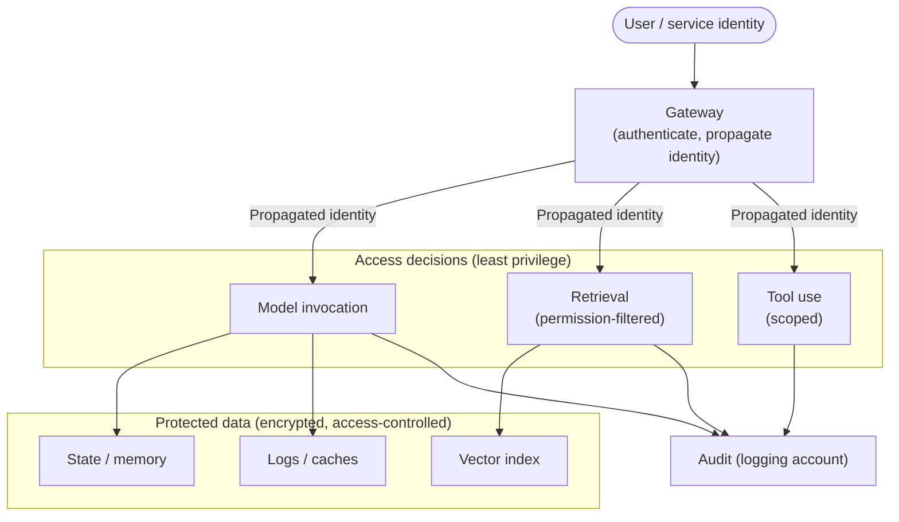
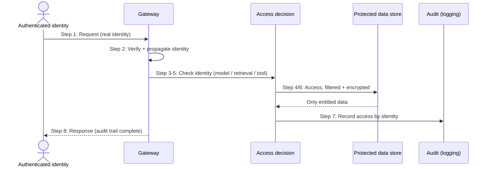

# Chapter 18: Identity, Access and Data Protection

Security has been present in every chapter of this book, deliberately, because the recurring argument is that security belongs in the architecture rather than bolted on afterwards. Least privilege appeared with direct integration, permission-filtered retrieval with RAG, bounded authority with agents, account isolation with federation, private paths with networking. Part IV now gathers these threads and treats security, governance and responsible AI as first-class subjects in their own right.

This chapter is the foundation: identity, access and data protection. These are the controls on which every other security concern rests, because in a GenAI system the questions "who is making this request", "what are they allowed to reach", and "how is the data protected as it flows" determine almost everything else. The chapter does not reintroduce IAM or encryption from first principles, the audience knows them, but shows how they apply to the specific shape of GenAI, where sensitive data flows to inference, retrieval and tools, and where the identity that reaches the model matters as much as the model itself.

---

## 1. The Architectural Problem

A GenAI system handles requests on behalf of users and services, grounds them in enterprise data, and may act through tools. Each of these involves an identity and an access decision, and each involves data that must be protected. If identity is handled carelessly, the system loses the ability to control what any request may reach; if data protection is an afterthought, sensitive information leaks through the very flows that make GenAI useful.

The characteristic mistake is to collapse identity. A system that authenticates the user at its front door but then calls the model, and retrieves data, under a single broad service identity has discarded the information it needs to enforce access. The model does not know who is really asking; retrieval cannot filter to what that person may see; and an audit cannot say who did what. The convenience of one powerful identity becomes the loss of all fine-grained control.

The data problem is equally specific. In GenAI, sensitive data does not sit still in a database; it flows, into prompts, into retrieval indexes, into logs, into caches, into memory. Each place it comes to rest is a place it must be protected and access-controlled, and each flow is a path along which it could leak. Protecting the system of record while ignoring the prompt logs or the vector index is protecting the wrong thing.

The architectural question is: how do we ensure the right identity reaches every access decision, that each identity can reach only what it is entitled to, and that sensitive data is protected everywhere it flows and rests throughout the GenAI system?

---

## 2. 🔐 The Pattern at a Glance

- **Pattern name:** Identity, Access and Data Protection for GenAI
- **Problem solved:** Collapsed identity and afterthought data protection destroy access control and leak sensitive data through GenAI's many flows.
- **Primary objective:** The right identity at every access decision, least-privilege access, and sensitive data protected everywhere it flows and rests.
- **When to use:** Every enterprise GenAI system, this is foundational, not optional.
- **When not to use:** No genuine exception; the rigour scales with sensitivity, but identity and data protection are always required.
- **Key AWS services:** IAM for identity and least privilege; KMS for encryption; the guardrails, gateway and account structure of earlier chapters; combined across all GenAI data stores and flows.
- **Primary architectural concern:** Propagating real identity to every access decision, and protecting data across every flow and resting place.

The two halves, identity and data, are inseparable: access control decides who may reach data, and data protection ensures that even reachable data is safeguarded. Together they are the base layer of GenAI security.

---

## 3. The Architecture

The architecture threads real identity through every access point and protects data at every store and flow.

- **Authenticated identity** enters at the front door, the user or service on whose behalf a request is made, with its actual entitlements.
- **Identity propagation** carries that identity, or a faithful representation of it, through the gateway to every access decision: model invocation, retrieval, tool use.
- **Least-privilege access** at each point grants only what that identity needs: which models, which data, which tools.
- **Protected data stores**, vector indexes, state, logs, caches, are encrypted and access-controlled to the standard of the data they hold.
- **Encryption in transit and at rest** protects data along every flow and in every resting place, using managed keys.
- **Audit** records who accessed what, drawn together in the logging account of Chapter 14.

The architecture's spine is identity carried faithfully to every decision; its ground is data protected wherever it lives. Neither works without the other.

---

## 4. Request and Data Flow

> **Step 1:** A request arrives with an authenticated identity, the real user or service, not a generic one.
> **Step 2:** The gateway verifies the identity and propagates it, or a faithful representation, onward.
> **Step 3:** At model invocation, access is checked against that identity: is it permitted to use this model?
> **Step 4:** At retrieval, search is filtered to what the identity is entitled to see, so unauthorised data never enters the context.
> **Step 5:** At tool use, the identity's authority scopes what the tool may do.
> **Step 6:** Data moves along encrypted paths, and any data that comes to rest, index, state, logs, is stored encrypted and access-controlled.
> **Step 7:** Each access is recorded against the identity for audit.
> **Step 8:** The response returns, and the audit trail reflects who did what with which data.

The flow shows the principle: identity is never lost, access is always checked against it, and data is always protected as it moves and rests.

---

## 5. Why This Pattern Works

The pattern works because it keeps the information needed to control access alive throughout the system. By propagating the real identity rather than collapsing it into a service account, every access decision, model, retrieval, tool, can be made against who is actually asking, which is what makes least privilege meaningful and audit truthful. Permission-filtered retrieval, in particular, only works because the requesting identity reaches the retrieval decision; without it, retrieval cannot know what to filter, and the system leaks.

Least privilege at every point works because it limits the consequences of any single failure. If an identity can reach only the models, data and tools it needs, then a compromise, a mistake or a manipulated agent is bounded to that narrow scope, the blast-radius principle applied to access. Broad access, by contrast, means any failure is a large failure.

Data protection everywhere works because it defends the data along the paths GenAI actually uses. Encrypting the system of record is not enough when the same data flows into prompts, indexes, logs and memory; protecting every resting place and every flow closes the gaps that GenAI's data movement would otherwise open. Together, faithful identity and pervasive data protection form a base layer on which the guardrails, threat modelling and governance of the following chapters can build.

---

## 6. 🏗️ Architectural Decisions

| Decision | Options | Recommended approach | Reason |
| --- | --- | --- | --- |
| Identity to model | Collapsed service identity / Propagated real identity | Propagated real identity | Enables per-identity access and audit |
| Access scope | Broad / Least privilege per point | Least privilege at every access point | Contain blast radius |
| Retrieval access | Model-enforced / Permission-filtered | Permission-filtered at retrieval | Unauthorised data never enters context |
| Data at rest | Selective / Encrypted everywhere | Encrypted, access-controlled everywhere | Protect every resting place |
| Key management | Ad hoc / Managed keys (KMS) | Managed keys, controlled | Consistent, governed encryption |
| Audit | Partial / Complete by identity | Complete, aggregated | Truthful accountability |

The defining decision is to propagate real identity rather than collapse it. Almost every other access control depends on it: filtered retrieval, per-identity policy and meaningful audit are all impossible once identity is lost at the front door.

---

## 7. ⚖️ Trade-offs

**Benefits:** Meaningful access control, permission-filtered retrieval, truthful audit, contained blast radius, and sensitive data protected across every flow and store, the security foundation the rest of Part IV builds on.

**Costs and limitations:** Propagating identity faithfully across a gateway, models, retrieval and tools, especially across accounts, is more work than a single service identity. Encrypting and access-controlling every data store and flow adds configuration and key-management overhead. Fine-grained access requires the entitlements to exist and be maintained.

**Complexity:** Moderate; it uses familiar AWS controls, but applying them consistently across all of GenAI's flows takes deliberate design.

**Operational overhead:** Ongoing: identities and entitlements must be maintained, keys managed, and access reviewed.

**Security implications:** This pattern largely is the security foundation; its benefits are the point. Its risk is inconsistency, one flow where identity is collapsed or data is unprotected undermines the whole, so consistency is essential.

**Performance implications:** Identity propagation and encryption add negligible latency in practice; permission-filtered retrieval adds a filtering step, generally minor.

**Cost implications:** Encryption and key management have modest cost; the larger cost is the discipline of maintaining identities and entitlements, justified by the control and auditability gained.

---

## 8. 🔐 Security and Governance

This chapter is itself the security foundation, so its security discussion is about getting the base layer right. The single most important principle is that real identity must reach every access decision. A GenAI system that authenticates at the edge and then acts under a broad shared identity has, in effect, no fine-grained access control, no matter what policies exist downstream, because there is no identity to apply them to. Faithful identity propagation, through the gateway to model, retrieval and tools, is what makes least privilege, permission-filtered retrieval and audit possible.

Data protection is the other half, and its governing idea is that GenAI's data flows create many resting places that must each be protected. Prompts and responses in logs, content in vector indexes, information in state and memory, entries in caches, all hold data that must be encrypted with managed keys and access-controlled to the classification of the data, with residency respected wherever the data comes to rest, the concerns of Chapter 5 applied across the whole system. A single overlooked store, an unencrypted log of prompts, an index reachable too broadly, is a leak regardless of how well the rest is protected.

Governance rests on both, plus audit. Because identity reaches every decision, the logging account can record who accessed what, producing the truthful accountability that governance and compliance require. Least privilege, encryption everywhere, and complete audit are the base controls; the guardrails, threat modelling and governance of the next chapters extend rather than replace them. The recurring failure to guard against is inconsistency: security that is rigorous in most flows but collapsed in one is only as strong as that one flow.

---

## 9. 🌐 Networking

Identity and data protection are reinforced by the networking of Chapter 17: private paths protect data in transit, and network isolation is a complementary layer of least privilege beneath the identity-level controls here. The two work together as defence in depth, network reach and identity-based access, so that even if one layer fails, the other still constrains what can be reached. Encrypted flows travel private paths; protected stores are network-isolated as well as access-controlled. The point is that data protection is enforced at both the network and the identity layers, and neither alone is sufficient: a store can be encrypted yet exposed by open connectivity, or network-isolated yet readable by an over-broad identity, so both must hold.

---

## 10. ⚠️ Failure Modes and Resilience

The failure modes here are the failures of the security foundation itself.

- **Collapsed identity:** The system acts under a broad shared identity, losing all fine-grained access control and truthful audit, the foundational failure that disables everything downstream.
- **Over-broad access:** An identity can reach more than it needs, so any compromise or mistake has a large blast radius.
- **Unfiltered retrieval:** Retrieval is not scoped to the requesting identity, so users receive data they should not, a direct leak through the grounding path.
- **Unprotected resting place:** A store, index, log or cache holding sensitive data is unencrypted or too broadly reachable, leaking data regardless of other controls.
- **Key mismanagement:** Poor key handling undermines the encryption meant to protect data.
- **Inconsistent enforcement:** Controls are strong in most flows but collapsed in one, and the system is only as secure as its weakest flow.
- **Broken audit:** Access is not recorded against identity, so accountability and compliance evidence are lost.

The theme is that these are quiet failures, no error is raised when identity is collapsed or a log is unencrypted, so resilience here means consistency and verification: confirming that identity reaches every decision and that every store is protected, rather than assuming it.

---

## 11. 👁️ Observability and Operations

Observability for this layer is largely security observability: the enterprise must be able to see and verify that real identity reaches every access decision, that access is least-privilege, and that every data store is protected, because the failures above are silent. Audit records, aggregated in the logging account, are both an operational signal and the accountability record, showing who accessed what data through the GenAI system. Being able to demonstrate this, rather than assume it, is itself a control and a governance requirement.

Operationally, the base layer must be maintained: identities and entitlements kept current as people and services change, keys managed and rotated, access reviewed, and encryption and access controls verified across every store and flow as the system evolves. This is ongoing security operations applied to the GenAI estate, and it underpins everything the workloads do. As throughout, it is distinct from AI quality evaluation; its object is access and data protection, the correctness of which is a precondition for trusting the system at all.

---

## 12. 💷 Cost and FinOps

The direct costs here are modest, encryption and key management have real but small cost, and access controls are largely configuration. The more significant cost is the ongoing discipline of maintaining identities, entitlements and keys, and of verifying protection across every store and flow, which is operational effort rather than infrastructure spend.

That cost is easily justified, because the cost of getting this layer wrong is severe: a data leak through an unprotected store or a collapsed identity carries regulatory, reputational and remediation costs far exceeding the modest expense of doing it properly. The main efficiency lever is consistency through the platform: when identity propagation, encryption and access control are built into the Core GenAI platform and its paved roads (Chapters 15 and 16), teams inherit the base security layer by default rather than each implementing, and paying to implement, it themselves. Security built into the platform is cheaper and more reliable than security rebuilt per team.

---

## 13. When to Use This Pattern

Use this pattern when:

- any enterprise GenAI system handles requests on behalf of users or services, essentially always;
- access must be controlled by who is actually asking, requiring real identity at every decision;
- retrieval must be scoped to what each user may see; or
- sensitive data flows through the system and must be protected everywhere it rests.

This is foundational security for enterprise GenAI, not an optional pattern; the question is how rigorously to apply it, not whether.

---

## 14. When NOT to Use This Pattern

There is no genuine case for omitting identity and data protection; the rigour scales with sensitivity, but the controls are always required. Scale the sophistication when:

- a workload handles no sensitive data and involves no meaningful access distinctions, where lighter controls may suffice, though authenticated access and encryption remain sensible defaults; or
- an early prototype does not yet need fine-grained entitlements, provided the production design does.

Even then, propagating real identity and protecting data in transit and at rest are baseline expectations. The mistake this pattern guards against is treating identity and data protection as features to add later rather than the foundation to build on, because retrofitting them after a system is in use is far harder and riskier than designing them in.

---

## 15. Pattern Variations

- **Small organisation:** Real identity to access decisions and encrypted, access-controlled stores, using managed capabilities, without elaborate entitlement schemes.
- **Medium enterprise:** Consistent identity propagation through a gateway, permission-filtered retrieval, encryption everywhere, and aggregated audit.
- **Large enterprise:** Identity propagated across the federated estate, least privilege at every access point, protected stores throughout, and complete audit in the logging account, built into the platform.
- **Highly regulated enterprise:** Fine-grained entitlements, strict encryption and key management, rigorous residency, comprehensive and auditable access records, and verifiable enforcement.

Across all variations, the constants are real identity at every access decision and data protected wherever it flows and rests; what scales is the granularity, rigour and auditability.

---

## 16. Architecture Decision Checklist

- [ ] Does the real user or service identity reach every access decision, rather than a collapsed service identity?
- [ ] Is access least-privilege at every point, model, retrieval, tools?
- [ ] Is retrieval permission-filtered so users receive only data they are entitled to?
- [ ] Is every data store, index, state, logs, caches, encrypted and access-controlled to the data's classification?
- [ ] Is data encrypted in transit and at rest, with managed, controlled keys?
- [ ] Is residency respected wherever data comes to rest, including logs and indexes?
- [ ] Is every access recorded against identity for truthful audit?
- [ ] Is enforcement consistent across all flows, with no collapsed identity or unprotected store?
- [ ] Can the enterprise verify, not just assume, that identity and data protection hold everywhere?
- [ ] Is the base security layer built into the platform so teams inherit it by default?

---

## 17. 📐 The Architect's Verdict

> Identity, access and data protection are the foundation of GenAI security, and the rest of Part IV builds on them. The defining principle is that real identity must reach every access decision: collapse it into a broad service account and you lose fine-grained access, permission-filtered retrieval and truthful audit, no matter what policies sit downstream. The second principle is that GenAI's data flows create many resting places, prompts in logs, content in indexes, information in state and caches, each of which must be encrypted and access-controlled to the data's classification, because protecting only the system of record protects the wrong thing. Apply least privilege at every access point so any failure is contained, and make enforcement consistent, since the system is only as secure as its weakest flow. These failures are silent, so verify rather than assume. Build the foundation into the platform so teams inherit it by default, and never treat identity and data protection as features to retrofit, because they are the ground everything else stands on.
