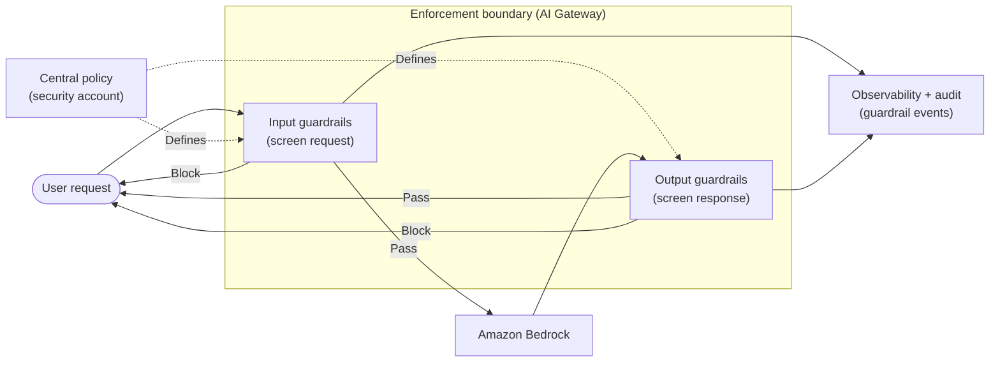
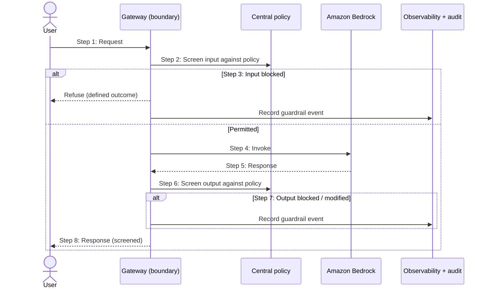

# Chapter 19: Guardrails and Policy Enforcement

Chapter 18 established who may reach what, and how data is protected. But controlling access does not, by itself, control behaviour. A permitted identity can still submit input that should be refused, and a model can still produce output that should not be returned, harmful content, disallowed topics, leaked sensitive data, responses outside the system's intended scope. Guardrails are the architectural control for that behavioural layer: they screen what goes into a model and what comes out, and they enforce policy on the interaction itself, rather than on who is making it.

The central architectural argument of this chapter is one the book has made before in other forms: a control is only as good as its placement. Guardrails scattered through individual applications are inconsistent and bypassable; guardrails placed at a boundary that every request must pass through are consistent and non-bypassable. Where you enforce policy matters as much as what the policy says.

---

## 1. The Architectural Problem

A GenAI system interacts with users and produces output, and not all input or output is acceptable. Users may submit content that is harmful, that attempts to manipulate the model, or that falls outside what the system is meant to handle. The model may generate content that is toxic, that strays into disallowed topics, that reveals sensitive information, or that simply exceeds the boundaries of the system's purpose. Access control does not address any of this, because the problem is not who is asking but what is being asked and answered.

Left to individual applications, this behavioural control fragments. Each team implements its own screening, differently, with varying rigour, and some forget entirely. Policy that should be uniform, what content is disallowed, what topics are off-limits, what must never be revealed, ends up inconsistent across the estate, and an application that omits a control becomes a gap. Worse, controls embedded only in application logic can be bypassed if the application is misused or if a request reaches the model by another path.

The constraint is that behavioural policy is a cross-cutting concern, like the access and observability concerns of earlier chapters. It applies to every interaction with a model, and cross-cutting concerns are poorly served by being reimplemented per application. It needs a consistent, non-bypassable enforcement point.

The architectural question is: how do we enforce behavioural policy, on both input and output, consistently across every interaction, in a way that cannot be bypassed and does not depend on each application implementing it correctly?

---

## 2. 🧩 The Pattern at a Glance

- **Pattern name:** Guardrails and Policy Enforcement
- **Problem solved:** Behavioural policy on input and output, if left to applications, is inconsistent and bypassable.
- **Primary objective:** Consistent, non-bypassable enforcement of behavioural policy on every model interaction, at a boundary.
- **When to use:** Any GenAI system where input or output must be screened against policy, essentially all enterprise systems.
- **When not to use:** No genuine exception at enterprise scale; the strictness scales with risk, but some behavioural control is nearly always warranted.
- **Key AWS services:** Guardrails for Amazon Bedrock as the screening capability; the AI Gateway of Chapter 7 as the enforcement boundary; central policy from the security account of Chapter 14.
- **Primary architectural concern:** Placement, enforcing policy at a boundary every request passes through, so it is consistent and cannot be bypassed.

Guardrails screen input before it reaches the model and output before it reaches the user, and enforce topic, content and data policies on the interaction. Their architectural value comes from where they are placed as much as from what they do.

---

## 3. The Architecture

The architecture places guardrails at the boundary, so every interaction is screened consistently.

- **Input guardrails** screen requests before inference: filtering harmful content, detecting manipulation attempts, and rejecting requests outside the system's intended scope.
- **Output guardrails** screen responses before they return: blocking harmful or disallowed content, preventing disclosure of sensitive information, and keeping responses within scope.
- **The enforcement boundary** is the AI Gateway (Chapter 7), through which every request passes, making guardrails non-bypassable.
- **Central policy** defines what is screened, sourced from the security account (Chapter 14) so it is uniform across the estate.
- **Amazon Bedrock guardrails** provide the screening capability the boundary applies.
- **Guardrail events** are recorded, what was screened, blocked or flagged, and flow to observability and audit.

The guardrails sit on both sides of the model, at a boundary every request crosses. That placement is what makes them consistent and non-bypassable.

---

## 4. Request and Data Flow

> **Step 1:** A request arrives at the gateway, the enforcement boundary.
> **Step 2:** Input guardrails screen the request against central policy: is the content acceptable, is it a manipulation attempt, is it in scope?
> **Step 3:** If the request is blocked, it is refused as a defined outcome, and the event is recorded.
> **Step 4:** A permitted request proceeds to inference on Bedrock.
> **Step 5:** The model returns a response to the gateway.
> **Step 6:** Output guardrails screen the response: harmful or disallowed content, sensitive-data disclosure, scope.
> **Step 7:** If the response is blocked or must be modified, that happens before anything reaches the user, and the event is recorded.
> **Step 8:** A permitted response returns to the user, and all guardrail events flow to observability and audit.

The flow shows screening on both sides of inference, at one boundary, against one policy, so no interaction escapes it.

---

## 5. Why This Pattern Works

The pattern works because placement solves the consistency and bypassability problems that per-application controls cannot. By enforcing guardrails at a boundary every request must cross, the same policy applies to every interaction regardless of which application originates it, and no application can forget, weaken or route around the control. This is the same structural insight as the AI Gateway itself: a cross-cutting concern belongs at a single, non-bypassable point, not scattered through consumers.

Central policy works because it makes behavioural rules uniform and changeable. Defining what is screened once, in the security account, means the enterprise's behavioural standards are applied everywhere consistently, and a change, tightening a topic restriction, adding a content rule, takes effect across the estate at once rather than requiring edits in every application. This is governance by design rather than by hope.

Screening both input and output works because the two address different risks. Input screening defends the model against harmful or manipulative requests before they reach it; output screening defends users and the enterprise against harmful, disallowed or leaky responses before they escape. Neither alone is sufficient, a system that screens input but not output can still return something it should not, so guardrails guard both directions.

---

## 6. 🏗️ Architectural Decisions

| Decision | Options | Recommended approach | Reason |
| --- | --- | --- | --- |
| Placement | Per application / At the boundary | At the boundary (gateway) | Consistent, non-bypassable |
| Policy source | Per team / Central | Central (security account) | Uniform, changeable in one place |
| Screening scope | Input only / Output only / Both | Both input and output | Different risks on each side |
| Blocked outcome | Error / Defined refusal | Defined refusal | A block is a normal outcome, not a fault |
| Events | Silent / Recorded | Recorded to audit | Visibility and accountability |
| Strictness | Uniform / Risk-based | Risk-based within central framework | Match rigour to workload risk |

The defining decision is placement. Guardrails at the boundary are consistent and cannot be bypassed; guardrails in applications are neither. Everything else, what to screen, how strictly, is policy applied at that boundary.

---

## 7. ⚖️ Trade-offs

**Benefits:** Consistent behavioural policy across the estate; non-bypassable enforcement; uniform, centrally changeable rules; protection on both input and output; and guardrail events feeding audit and visibility.

**Costs and limitations:** Guardrails add a screening step, and therefore some latency, to each interaction. Screening is not perfect: it can over-block, refusing legitimate requests, or under-block, missing something it should have caught, so it must be tuned and cannot be treated as absolute. Central policy must be designed and maintained, and a poorly designed policy applied everywhere is a poor outcome applied everywhere.

**Complexity:** Modest when built on an existing gateway; the policy itself is where the real design effort lies.

**Operational overhead:** Ongoing: policy must be maintained, tuned against over- and under-blocking, and reviewed as risks and usage change.

**Security implications:** Strongly positive: guardrails are a core security and safety control, and placing them at the boundary makes them dependable. But they are one layer, not the whole defence, and must not be relied on to catch everything, they complement, not replace, the other controls in Part IV.

**Performance implications:** A screening step on each side of inference adds latency; usually modest and acceptable, to be measured for sensitive paths.

**Cost implications:** Screening has a per-interaction cost, offset by the risk it mitigates; the larger cost is designing and maintaining sound policy.

---

## 8. 🔐 Security and Governance

Guardrails are a security and safety control, and their effectiveness depends on placement and honesty about their limits. Placed at the gateway boundary, they become a consistent, non-bypassable enforcement point for behavioural policy, which is exactly what per-application screening cannot provide. Sourced from central policy in the security account, they apply the enterprise's behavioural standards uniformly and can be updated estate-wide in one place, governance by design rather than per-team discretion.

Their honest limitation is that screening is probabilistic and imperfect: guardrails reduce the likelihood and impact of unacceptable behaviour, but they do not eliminate it, and they must not be the only control. This is why they sit within the layered defence of Part IV, access control (Chapter 18) decides who may interact, guardrails screen the interaction, threat modelling (Chapter 20) addresses the attacks that guardrails alone may not stop, and governance (Chapter 21) provides oversight. Treating guardrails as a complete solution is a mistake; treating them as an essential layer is correct.

Governance also depends on guardrail events being recorded. What was screened, blocked or flagged is both an operational signal and evidence that policy is being enforced, feeding the audit trail of Chapter 14. This visibility is what lets the enterprise demonstrate, not merely assert, that behavioural controls are in place and working.

---

## 9. 🌐 Networking

Guardrails add little to the network design; they operate at the gateway boundary that the networking of Chapter 17 already makes the private, non-bypassable path to inference. Their networking relevance is precisely that the boundary must be unavoidable: the network must ensure that the only path to the model runs through the gateway where guardrails are enforced, so that no request can reach inference by an alternative route that skips screening. This is the network reinforcing the enforcement point, the same principle by which Chapter 7's gateway must be the only path to Bedrock. If the network allowed a bypass, the guardrails' non-bypassability would be an illusion.

---

## 10. ⚠️ Failure Modes and Resilience

Guardrail failure modes are about the limits and placement of screening.

- **Bypass through misplacement:** If guardrails live in applications rather than at the boundary, or if a network path skips the boundary, requests reach the model unscreened, the failure the pattern's placement exists to prevent.
- **Under-blocking:** Screening misses content it should have caught, allowing harmful input in or disallowed output out. Mitigated by tuning and by not relying on guardrails alone.
- **Over-blocking:** Screening refuses legitimate requests, harming usability. Mitigated by tuning and by treating false refusals as a quality signal to address.
- **Stale policy:** Central policy that is not updated as risks and usage evolve becomes less effective over time.
- **Guardrail dependency failure:** The screening capability itself failing must be handled deliberately, failing safe (refusing) rather than failing open (passing unscreened) for sensitive workloads.
- **Over-reliance:** Treating guardrails as the whole defence, so other controls are neglected, leaving gaps guardrails were never meant to cover alone.

The theme is that guardrails are a valuable but imperfect layer whose effectiveness rests on unavoidable placement and on being part of a defence in depth rather than a single line of defence.

---

## 11. 👁️ Observability and Operations

Guardrails produce a distinct and valuable observability signal: what is being screened, blocked or flagged, on both input and output. This tells the enterprise both how the system is being used, including manipulation attempts and out-of-scope requests, and whether the guardrails are behaving well, revealing over-blocking (too many legitimate refusals) and prompting investigation of under-blocking. These guardrail events flow to the observability and audit of Chapters 14 and 18, serving operations, security and governance at once.

Operationally, guardrails are a policy that must be tuned and maintained: watching the balance between over- and under-blocking, updating central policy as risks and usage change, and verifying that the boundary remains the only path to inference so screening cannot be bypassed. This tuning is continuous, because both threats and legitimate usage evolve. As always, guardrail observability, a security and policy signal, is distinct from AI quality evaluation, though the two inform each other, since excessive false refusals are both a policy and a quality concern.

---

## 12. 💷 Cost and FinOps

Guardrails carry a per-interaction screening cost, small individually but accumulating with volume, and the design effort of building and maintaining sound central policy. These are modest against what they mitigate: the cost of harmful, disallowed or leaky output, regulatory, reputational and remediation, far exceeds the cost of screening for it.

The main efficiency lever is central policy through the platform: defining and tuning guardrails once, in the security account, and enforcing them through the shared boundary, so teams inherit consistent behavioural control by default rather than each building and paying for their own, the platform economy of Chapters 15 and 16 applied to guardrails. As with other controls, the cheapest and most reliable guardrails are those built into the platform every team consumes, rather than reimplemented, inconsistently and at repeated cost, per application.

---

## 13. When to Use This Pattern

Use this pattern when:

- input or output must be screened against behavioural policy, harmful content, disallowed topics, sensitive-data disclosure, scope;
- behavioural policy should be uniform across many applications rather than reinvented per team;
- enforcement must be non-bypassable and not dependent on each application implementing it; or
- the enterprise must demonstrate that behavioural controls are in place and working.

Guardrails at the boundary are standard for enterprise GenAI, and they are most valuable precisely where consistency and non-bypassability matter.

---

## 14. When NOT to Use This Pattern

There is no genuine case for having no behavioural controls in an enterprise system; the question is strictness and placement, not existence. Scale the approach when:

- a workload genuinely has no behavioural risk, no sensitive output, no scope concerns, where lighter screening may suffice; or
- an early prototype does not yet warrant full policy, provided the production design does.

Even then, some input and output screening is usually prudent. The mistake this pattern guards against is scattering guardrails through applications, inconsistently and bypassably, rather than enforcing them at the boundary, and the related mistake of either omitting behavioural control or, conversely, relying on guardrails as the entire defence. Placement and layering are the point.

---

## 15. Pattern Variations

- **Small organisation:** Guardrails applied at whatever access point exists, using managed capabilities, with straightforward policy.
- **Medium enterprise:** Guardrails enforced at a gateway with central policy, screening input and output, events recorded.
- **Large enterprise:** Central guardrail policy from the security account enforced non-bypassably across the federated platform, with events aggregated in the logging account and tuned continuously.
- **Highly regulated enterprise:** Strict guardrails, fail-safe on guardrail failure, comprehensive event auditing, and conservative policy reflecting tighter obligations.

The variations scale the strictness, centralisation and auditability of guardrails with the enterprise's size and risk, but boundary placement and both-sided screening remain constant.

---

## 16. Architecture Decision Checklist

- [ ] Are guardrails enforced at a boundary every request must cross, rather than in individual applications?
- [ ] Does the network ensure the boundary is the only path to inference, so screening cannot be bypassed?
- [ ] Is behavioural policy defined centrally so it is uniform and changeable in one place?
- [ ] Are both input and output screened, addressing the different risks on each side?
- [ ] Is a block a defined refusal rather than an unhandled error?
- [ ] Are guardrail events recorded and fed to observability and audit?
- [ ] Is the balance between over-blocking and under-blocking tuned and monitored?
- [ ] On guardrail-capability failure, does the system fail safe rather than pass unscreened, for sensitive workloads?
- [ ] Are guardrails treated as one layer of defence, not the whole of it?
- [ ] Are guardrails built into the platform so teams inherit consistent behavioural control?

---

## 17. 📐 The Architect's Verdict

> Guardrails are the architectural control for behaviour, screening what enters a model and what leaves it, and their effectiveness rests on placement as much as on policy. Enforced at a boundary every request must cross, sourced from central policy, they apply behavioural standards consistently and non-bypassably across the estate, which per-application screening can never achieve; scattered through applications, they are inconsistent and easy to circumvent. Screen both input and output, because each side carries different risks, and make a block a defined outcome, not a fault. Be honest about their limits: screening is probabilistic and imperfect, so guardrails are an essential layer of defence in depth, alongside access control, threat modelling and governance, never the whole defence. Record guardrail events so enforcement is visible and demonstrable, tune continuously against over- and under-blocking, and fail safe when the screening capability itself fails. Build them into the platform so consistent behavioural control is the default. Where you enforce policy matters as much as what the policy says.
