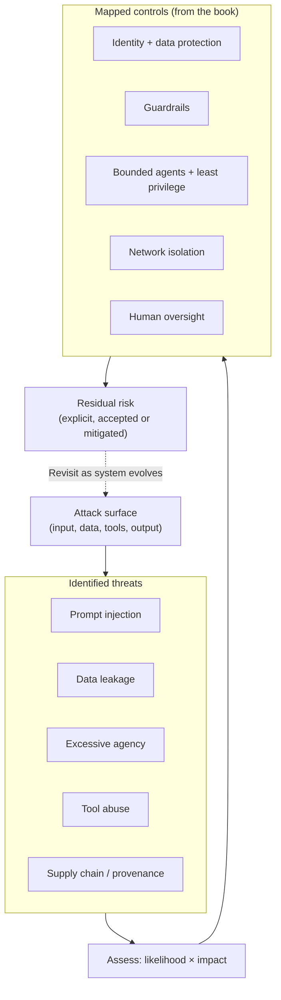
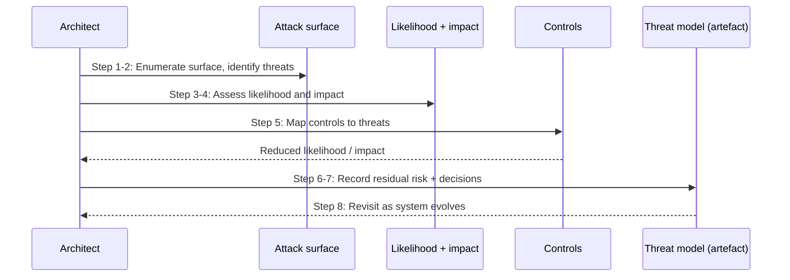

# Chapter 20: Threat Modelling for GenAI Systems

The previous two chapters built controls: identity and data protection, then guardrails. This chapter steps back to ask the question those controls exist to answer: what are we actually defending against? Threat modelling is the discipline of identifying what could go wrong, how likely it is, how much it would matter, and what architectural controls address it. For GenAI, it draws together threat threads that appeared throughout the book, prompt injection, data leakage, excessive agency, tool abuse, and treats them systematically.

This chapter deliberately avoids alarm. GenAI security is sometimes discussed in sensational terms, as if every system were moments from catastrophe. That framing is unhelpful for an architect, who needs to reason clearly about attack surface, likelihood, impact and control, not to be frightened. A threat understood in those terms is a threat that can be designed against. The goal here is calm, structured reasoning about GenAI's genuine threats, so that the controls of Part IV are applied where they matter and in proportion to the risk.

---

## 1. The Architectural Problem

A GenAI system has an attack surface that traditional applications do not. It accepts natural-language input that can attempt to manipulate the model. It grounds responses in data that may itself carry malicious content. It may act through tools that reach real systems. And it produces output that could disclose more than intended. Each of these is a genuine avenue of attack or failure, and none is addressed simply by securing the application in the conventional sense.

The problem is that these threats are easy to either dismiss or catastrophise, and both errors are costly. Dismiss them, and the system is exposed to real attacks, prompt injection, data exfiltration, an agent induced to misuse a tool. Catastrophise them, and effort is spent on lurid scenarios while ordinary, likely risks go unaddressed, or the technology is avoided out of undue fear. Neither serves the enterprise.

The constraint is that threats must be reasoned about in a way that leads to proportionate action. An architect needs to know, for each threat: where is the attack surface, how likely is exploitation, what would the impact be, and what control reduces the likelihood or the impact. Without that structure, security becomes either negligence or theatre.

The architectural question is: how do we systematically identify GenAI's genuine threats, assess each by attack surface, likelihood and impact, and apply proportionate architectural controls, without either dismissing real risks or succumbing to sensationalism?

---

## 2. 🧩 The Pattern at a Glance

- **Pattern name:** GenAI Threat Modelling
- **Problem solved:** GenAI's distinct threats go either unaddressed or over-dramatised, without structured, proportionate reasoning.
- **Primary objective:** Systematic identification and assessment of threats by attack surface, likelihood and impact, mapped to architectural controls.
- **When to use:** The design and ongoing review of any enterprise GenAI system; threat modelling is a practice, not a one-off.
- **When not to use:** No genuine exception; the depth scales with risk, but some threat reasoning is always warranted.
- **Key AWS services:** The controls of the whole book, identity and data protection (Chapter 18), guardrails (Chapter 19), bounded agents (Chapters 11-12), networking (Chapter 17), applied as mitigations.
- **Primary architectural concern:** Structured, proportionate reasoning, matching controls to threats by likelihood and impact rather than by fear.

Threat modelling is not a control itself; it is the reasoning that decides which controls to apply and where. Its output is a proportionate defence, not a longer list of fears.

---

## 3. The Architecture

Threat modelling structures the analysis of a GenAI system's threats, and maps each to controls already developed in this book.

- **The attack surface** is enumerated: input to the model, grounding data, tool actions, output, and the flows between them.
- **Each threat** is identified against that surface, prompt injection, data leakage, excessive agency, tool abuse, supply-chain and provenance risks, and others specific to the system.
- **Each threat is assessed** by likelihood (how readily it could be exploited) and impact (how much harm it would do).
- **Controls are mapped** to threats: identity and data protection, guardrails, bounded agents, network isolation, human oversight, each reducing likelihood, impact, or both.
- **Residual risk** is what remains after controls, reasoned about explicitly and accepted or further mitigated deliberately.
- **The model is revisited** as the system and the threat landscape evolve, because threat modelling is continuous.

The structure is the point: threats identified against the surface, assessed by likelihood and impact, matched to controls, with residual risk made explicit. This is how reasoning replaces both negligence and alarm.

---

## 4. Request and Data Flow

Threat modelling is a reasoning process rather than a runtime path; its "flow" is the analysis:

> **Step 1:** Enumerate the attack surface of the system, every point where input, data, tools or output could be exploited.
> **Step 2:** Identify the threats against each part of the surface, drawing on known GenAI threats and the system's specifics.
> **Step 3:** Assess each threat by likelihood, how readily it could be exploited given the design.
> **Step 4:** Assess each threat by impact, how much harm exploitation would cause.
> **Step 5:** Map controls to each threat, identifying which existing or additional controls reduce its likelihood or impact.
> **Step 6:** Determine the residual risk after controls, and decide explicitly whether it is acceptable or needs further mitigation.
> **Step 7:** Record the threat model as a living artefact informing the design.
> **Step 8:** Revisit as the system, its usage and the threat landscape change.

The flow is disciplined analysis: surface, threats, likelihood, impact, controls, residual risk, all recorded and revisited, so that defence is reasoned and proportionate.

---

## 5. Why This Pattern Works

Threat modelling works because it converts vague unease into structured decisions. By enumerating the attack surface and assessing each threat by likelihood and impact, it turns "GenAI is risky" into specific, actionable statements: this threat is likely and high-impact, so it demands strong controls; that one is unlikely and low-impact, so it warrants little. This is what makes defence proportionate, effort concentrated where risk is greatest, rather than spread evenly or driven by whichever threat sounds most dramatic.

It works because it connects threats to the controls the book has already built. Every major GenAI threat has architectural mitigations, and threat modelling is what maps them: prompt injection to guardrails and treating input as data; data leakage to identity, data protection and permission-filtered retrieval; excessive agency to bounded, least-privilege agents; tool abuse to scoped tools and network isolation. The controls are not new; the discipline of applying the right ones to the right threats is.

And it works because it makes residual risk explicit. No system eliminates all risk, and pretending otherwise is its own failure. By stating what risk remains after controls and deciding deliberately whether to accept or further mitigate it, threat modelling replaces false certainty with honest, accountable judgement, which is what good security governance requires.

---

## 6. 🏗️ Architectural Decisions

| Decision | Options | Recommended approach | Reason |
| --- | --- | --- | --- |
| Threat reasoning | Ad hoc / Structured model | Structured threat model | Proportionate, not driven by fear |
| Assessment basis | Severity alone / Likelihood × impact | Likelihood and impact together | Effort where risk is genuinely greatest |
| Control mapping | Generic hardening / Threat-specific | Controls mapped to threats | Right control for the right threat |
| Untrusted content | Trusted / Treated as data | Treated as data everywhere | Defends against injection and poisoning |
| Residual risk | Ignored / Explicit | Explicit, accepted or mitigated | Honest, accountable judgement |
| Cadence | One-off / Continuous | Continuous, revisited | Threats and systems evolve |

The unifying principle is proportion: assess by likelihood and impact, and match controls to threats accordingly. A threat model that treats every threat as catastrophic is as unhelpful as one that treats none as real; the value is in the calibration.

---

## 7. ⚖️ Trade-offs

**Benefits:** Proportionate, well-targeted defence; genuine threats addressed and trivial ones not over-resourced; controls connected explicitly to the threats they mitigate; residual risk made honest and accountable; and a shared, calm basis for security decisions.

**Costs and limitations:** Threat modelling takes effort and expertise, and it is never finished, it must be revisited as the system and landscape evolve. Done superficially, it produces a document that reassures without protecting. And it depends on identifying the threats in the first place; a threat not imagined is not modelled, so it benefits from drawing on known GenAI threats and diverse review.

**Complexity:** Moderate as a practice; the reasoning is structured but requires judgement and security knowledge.

**Operational overhead:** Ongoing but modest: periodic review and updating of the threat model as things change.

**Security implications:** This is the practice that directs the security effort; done well it makes every other control more effective by ensuring it is applied where it matters. Its risk is being treated as a box-ticking exercise rather than genuine reasoning.

**Performance implications:** None at runtime; threat modelling is a design and review activity.

**Cost implications:** The cost is analysis effort, small against the cost of an unaddressed threat being exploited; its main economic value is directing security spend to where risk is greatest rather than wasting it uniformly.

---

## 8. 🔐 Security and Governance

Threat modelling is the reasoning at the centre of GenAI security governance, and its defining discipline is the one the steering of this book insists on: threats are assessed by attack surface, likelihood and impact, and addressed with architectural controls, not framed as alarm. Considered this way, GenAI's genuine threats are tractable:

- **Prompt injection** is untrusted input attempting to subvert the model's instruction. Its surface is any input the model sees, including retrieved content and tool results. It is mitigated by treating all such content as data rather than instruction, by guardrails, and by bounding what the model can do so a subverted instruction has limited effect.
- **Data leakage** is sensitive information escaping through output, logs, retrieval or caches. Its surface is every data flow and resting place. It is mitigated by identity and data protection (Chapter 18), permission-filtered retrieval (Chapter 8), output guardrails (Chapter 19), and controlled egress (Chapter 17).
- **Excessive agency** is an autonomous component doing more than intended. Its surface is an agent's tools and authority. It is mitigated by bounded, least-privilege agents, step limits, and human oversight (Chapters 11-12).
- **Tool abuse** is an agent's tools misused, whether through manipulation or error, to reach or affect systems improperly. Its surface is the tool integrations. It is mitigated by least-privilege tools, network isolation, and treating tool results as data.
- **Supply-chain and provenance risks** concern the trustworthiness of models, data and components. They are mitigated by controlling provenance, validating what is ingested, and governing what is used.

Governance rests on making this reasoning explicit and continuous: recording the threat model, stating residual risk, deciding deliberately what to accept, and revisiting as things change. This is what lets an enterprise demonstrate that it understands and manages its GenAI risks, which is a governance obligation, not merely good practice. Fear-based security, by contrast, neither reasons nor demonstrates; it merely alarms.

---

## 9. 🌐 Networking

Threat modelling treats the network as both an attack surface and a set of controls. As surface, network paths, especially egress and any over-broad connectivity, are where data could leak or a compromised component could reach further than intended, so they are part of what the model enumerates. As control, the network isolation and least-privilege connectivity of Chapter 17 are among the most effective mitigations for several threats: contained egress limits data exfiltration, least-privilege network reach limits tool abuse and the spread of a compromise, and private paths reduce exposure. Threat modelling is what makes the case for specific network controls, by showing which threats they reduce, so the network design is driven by the threats it defends against rather than applied generically.

---

## 10. ⚠️ Failure Modes and Resilience

The failure modes of threat modelling are failures of the practice itself, which then allow the underlying threats to go unmet.

- **Unmodelled threat:** A genuine threat is never identified, so no control addresses it, a silent gap. Mitigated by drawing on known GenAI threats and diverse review.
- **Miscalibrated assessment:** Likelihood or impact is misjudged, so effort goes to the wrong threats, either over-defending trivial risks or under-defending serious ones.
- **Fear-driven distortion:** Sensational framing drives disproportionate effort toward dramatic but unlikely scenarios while ordinary, likely threats are neglected.
- **Box-ticking:** Threat modelling is performed superficially to satisfy a process, producing a document that reassures without protecting.
- **Stale model:** The threat model is not revisited as the system and landscape evolve, so it drifts out of alignment with the real risks.
- **Ignored residual risk:** Residual risk is not made explicit or is quietly ignored, so accepted risk is neither decided nor owned.

The theme is that threat modelling fails when it stops being genuine, structured reasoning, whether through omission, miscalibration, fear or ritual, so its resilience lies in keeping it honest, proportionate and continuous.

---

## 11. 👁️ Observability and Operations

Threat modelling connects to observability in both directions. It informs what to watch: the threats it identifies indicate the signals that matter, guardrail events for injection attempts, access and retrieval patterns for leakage, agent and tool activity for excessive agency and abuse, egress for exfiltration. And observability informs the threat model: what is actually seen in operation, attempted attacks, near-misses, unexpected behaviour, feeds back into revising likelihood assessments and identifying threats not previously modelled. The two are a loop, not separate activities.

Operationally, threat modelling is a continuous practice, not a one-off deliverable. The model is revisited as the system changes, as usage reveals new patterns, and as the external threat landscape evolves, and its findings drive both the controls in place and the monitoring around them. This ongoing reasoning is part of security operations for the GenAI estate, and it is what keeps the defence aligned with the actual risks rather than a snapshot from design time. As throughout, it is distinct from AI quality evaluation, though behavioural signals inform both.

---

## 12. 💷 Cost and FinOps

Threat modelling's economic value is that it directs security effort and spend to where risk is genuinely greatest, rather than spreading it uniformly or, worse, concentrating it on dramatic but unlikely scenarios. By assessing threats by likelihood and impact, it ensures that expensive controls are applied to serious threats and that trivial ones are not over-resourced, which is simply efficient allocation of a finite security budget.

The practice itself costs analysis effort, modest and periodic, against the potentially severe cost of an unaddressed threat being exploited, which carries regulatory, reputational and remediation consequences. The main efficiency consideration is that the controls threat modelling calls for are largely those already built into the platform, identity, guardrails, bounded agents, network isolation, so a mature platform lets threat modelling map threats to controls that teams already inherit, rather than requiring bespoke mitigation per system. Reasoning about threats is cheap; the controls it selects are shared; the cost it avoids is large.

---

## 13. When to Use This Pattern

Use this pattern when:

- designing any enterprise GenAI system, threat modelling should inform the design, not follow it;
- reviewing an existing system, especially as it changes or its usage grows;
- introducing higher-risk capabilities such as agents, tools or new data sources; or
- demonstrating to governance or risk functions that GenAI risks are understood and managed.

Threat modelling is a continuous practice for any serious enterprise GenAI system, and its depth should scale with the system's risk.

---

## 14. When NOT to Use This Pattern

There is no genuine case for not reasoning about threats in an enterprise GenAI system; the question is depth, not existence. Scale the effort when:

- a workload is trivial, low-risk and handles nothing sensitive, where lightweight reasoning may suffice; or
- an early prototype does not yet warrant a full model, provided the production system is properly modelled before real use.

Even then, at least basic threat reasoning is prudent. The mistake this pattern guards against is either skipping threat reasoning altogether, leaving genuine risks unaddressed, or performing it as fear-driven theatre that neither calibrates nor protects. Structured, proportionate reasoning is the point; both negligence and alarm are failures.

---

## 15. Pattern Variations

- **Small organisation:** Lightweight but genuine threat reasoning covering the main GenAI threats, mapped to the controls in use.
- **Medium enterprise:** A structured threat model per significant system, revisited periodically, mapping threats to platform controls.
- **Large enterprise:** Threat modelling as an established practice across the estate, integrated with security governance, feeding and fed by observability, and revisited continuously.
- **Highly regulated enterprise:** Rigorous, documented, auditable threat modelling with explicit residual-risk decisions, integrated with formal risk management.

The variations scale the rigour, formality and integration of the practice with the enterprise's size and regulatory obligations, but structured, proportionate, continuous reasoning is constant.

---

## 16. Architecture Decision Checklist

- [ ] Is the attack surface, input, grounding data, tools, output, flows, enumerated?
- [ ] Are the genuine GenAI threats identified: injection, leakage, excessive agency, tool abuse, supply chain?
- [ ] Is each threat assessed by likelihood and impact, not by how dramatic it sounds?
- [ ] Is each threat mapped to specific architectural controls that reduce its likelihood or impact?
- [ ] Is untrusted content, including retrieved data and tool results, treated as data rather than instruction?
- [ ] Is residual risk after controls made explicit and deliberately accepted or mitigated?
- [ ] Is the threat model recorded as a living artefact and revisited as the system evolves?
- [ ] Does observability watch the signals the threat model identifies as important?
- [ ] Is the reasoning proportionate, neither negligent nor fear-driven?
- [ ] Do the controls the model calls for largely come from the platform teams already inherit?

---

## 17. 📐 The Architect's Verdict

> Threat modelling is the reasoning that decides where and how hard to defend, and for GenAI it must be conducted calmly and structurally: enumerate the attack surface, assess each threat by likelihood and impact, and map it to architectural controls, rather than reacting to whichever threat sounds most frightening. GenAI's genuine threats, prompt injection, data leakage, excessive agency, tool abuse, supply-chain risk, are all tractable this way, and their mitigations are largely controls this book has already built: treat untrusted content as data, protect identity and data, bound agents, isolate networks, screen with guardrails, oversee consequential actions. The discipline's value is proportion, effort concentrated where risk is genuinely greatest, and honesty, residual risk made explicit and owned rather than pretended away. It fails when it becomes negligence, miscalibration, fear-driven theatre or a stale document, so keep it genuine, proportionate and continuous. A threat understood in terms of surface, likelihood, impact and control is not a source of alarm; it is a design problem, and design problems are what architects solve.
