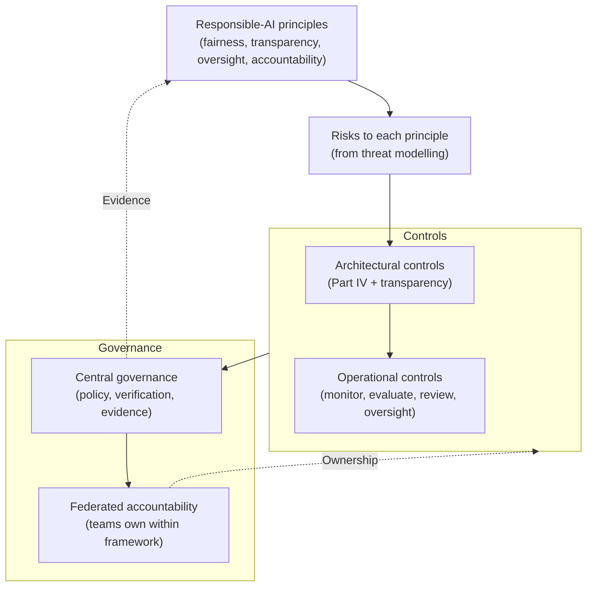
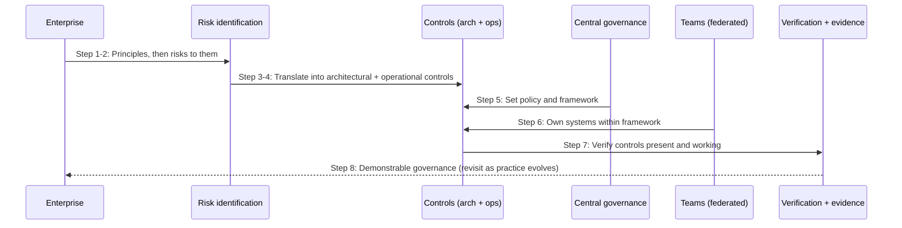

# Chapter 21: Governance and Responsible AI

Part IV has built controls, identity and data protection, guardrails, and the threat reasoning that directs them. This closing chapter addresses the layer above the controls: governance, the accountability, oversight and management that ensure the controls exist, work, and keep working, and responsible AI, the principles those controls serve. Governance is what turns a collection of good controls into a system an enterprise can stand behind.

This chapter treats responsible AI as an architect must: as a set of principles that translate into architectural and operational controls, not as a philosophical debate. The steering discipline throughout is Principle → Risk → Architectural Control → Operational Control. A responsible-AI principle that does not translate into a control is, for the architect, an aspiration; the value is in the translation. The chapter also draws a line the book has drawn before, between durable governance principles that will outlast the current technology and emerging practices that are still settling, because confusing the two leads either to rigidity or to chasing fashion.

---

## 1. The Architectural Problem

An enterprise has built capable, well-controlled GenAI systems. Yet capability and controls are not the same as accountability. Who is responsible when a system behaves badly? How does the enterprise know its controls are actually working, across many teams and systems? How does it demonstrate, to auditors, regulators, or its own leadership, that its GenAI is governed? And how does it ensure that systems behave in line with the enterprise's responsibilities, fairness, transparency, appropriate human oversight, rather than merely functioning?

The problem is that without governance, controls are unowned and unverified. A control that no one is accountable for drifts; a control whose effectiveness is never checked may have quietly failed; a responsible-AI principle that is stated but not translated into a control changes nothing. And in a federated estate of many teams and systems, these gaps multiply, because there is no single system to inspect, only a landscape to govern.

The constraint is that governance must scale across that landscape without either becoming a central bottleneck, the failure Part III warned against, or fragmenting into per-team inconsistency. It must also distinguish what is durable from what is emerging, so that governance rests on stable principles while remaining adaptable to a fast-moving field.

The architectural question is: how do we govern GenAI across the enterprise so that controls are owned, verified and demonstrable, responsible-AI principles are translated into actual controls, and the whole scales across a federated estate, resting on durable principles while adapting to emerging practice?

---

## 2. 🧩 The Pattern at a Glance

- **Pattern name:** GenAI Governance and Responsible AI
- **Problem solved:** Controls without governance are unowned, unverified and undemonstrable; responsible-AI principles without translation are inert.
- **Primary objective:** Owned, verified, demonstrable governance that translates responsible-AI principles into controls and scales across a federated estate.
- **When to use:** Any enterprise operating GenAI, especially at scale across many teams; governance is not optional.
- **When not to use:** No genuine exception; the formality scales with risk and regulation, but governance is always required.
- **Key AWS services:** The controls of Part IV and the platform of Part III as the substance being governed; the security and logging accounts of Chapter 14 as the seat of central governance and evidence.
- **Primary architectural concern:** Accountability and verification, ensuring controls are owned and working, and translating principles into controls, at estate scale.

Governance is not a control among controls; it is the management layer that ensures the controls are present, effective and accountable, and that they serve the enterprise's responsibilities.

---

## 3. The Architecture

Governance is an architecture of accountability and verification layered over the technical estate, following the Principle → Risk → Control chain.

- **Responsible-AI principles**, fairness, transparency, appropriate human oversight, accountability, define what the enterprise expects of its GenAI.
- **Risk identification** connects each principle to the risks that threaten it, drawing on the threat modelling of Chapter 20.
- **Architectural controls** translate principles into design: the identity, data, guardrail, bounding and oversight controls of Part IV, plus transparency mechanisms such as citation and provenance.
- **Operational controls** keep the architectural controls working: monitoring, evaluation, review, and human oversight where autonomy should not act alone.
- **Central governance**, seated in the security account and evidenced in the logging account (Chapter 14), sets policy, and verifies and demonstrates that controls are in place across the estate.
- **Federated accountability** assigns ownership: central governance sets and verifies; teams own their systems within the framework, mirroring the federation of Part III.

The architecture is a chain from principle to control to verification, owned in a federated way. Each principle must reach a control, or it governs nothing.

---

## 4. Request and Data Flow

Governance is a management process, and its "flow" is the chain from principle to demonstrable control:

> **Step 1:** The enterprise establishes its responsible-AI principles, what its GenAI must uphold.
> **Step 2:** For each principle, the risks that threaten it are identified, drawing on threat modelling.
> **Step 3:** Each risk is addressed by architectural controls, so the principle is designed into the systems, not merely stated.
> **Step 4:** Operational controls, monitoring, evaluation, review, human oversight, keep those controls effective over time.
> **Step 5:** Central governance sets the policy and framework, seated in the security account.
> **Step 6:** Teams own their systems within the framework, accountable for their own compliance.
> **Step 7:** Verification confirms controls are present and working, drawing on the aggregated evidence in the logging account.
> **Step 8:** The enterprise can demonstrate its governance, to auditors, regulators and leadership, and revisits principles and controls as practice evolves.

The flow shows the essential translation: principles become risks, risks become controls, controls are owned, verified and demonstrated. A principle that does not complete this chain is not governed.

---

## 5. Why This Pattern Works

The pattern works because it makes principles actionable. Responsible-AI commitments, fairness, transparency, oversight, are meaningful to an architect only when they translate into controls, and the Principle → Risk → Control chain is that translation: it takes an abstract commitment, identifies what threatens it, and designs a control that addresses the threat. This is why the book treats responsible AI as an architecture concern rather than a philosophical one, the architect's contribution is the translation, and a principle that reaches a control changes the system while a principle that does not is merely words.

It works because it separates setting policy from owning systems, which is what lets governance scale. Central governance defines the framework and verifies compliance, but teams own their own systems within it, exactly the federation of Part III applied to governance. This avoids both the central bottleneck, where governance inspects everything and slows everyone, and the fragmentation, where each team governs itself inconsistently. Governance sets and verifies; teams own and comply.

And it works because it insists on verification and demonstrability. A control that is never checked may have failed silently; governance that cannot be demonstrated cannot satisfy an auditor or reassure leadership. By verifying that controls are present and working, using the aggregated evidence the federated logging account already provides, governance turns "we have controls" into "we can show our controls work", which is the difference between asserting responsibility and discharging it.

---

## 6. 🏗️ Architectural Decisions

| Decision | Options | Recommended approach | Reason |
| --- | --- | --- | --- |
| Responsible AI | Stated / Translated to controls | Translated via Principle → Risk → Control | Principles that reach controls change systems |
| Governance model | Central bottleneck / Federated | Federated: central sets, teams own | Scales without bottleneck or fragmentation |
| Verification | Assumed / Verified and evidenced | Verified, using aggregated evidence | Controls may fail silently; demonstrate them |
| Human oversight | None / Where autonomy shouldn't act alone | Oversight for consequential decisions | Appropriate human control |
| Transparency | Opaque / Citation and provenance | Provide provenance where it matters | Trust and accountability |
| Durable vs emerging | Conflated / Distinguished | Distinguish; anchor on durable principles | Stable governance, adaptable practice |

The defining decision is to translate principles into controls. Responsible AI that stops at statements governs nothing; responsible AI expressed as identity controls, guardrails, bounded agents, human oversight and transparency mechanisms is real. The second defining decision is federated accountability, which is what lets governance scale across the estate.

---

## 7. ⚖️ Trade-offs

**Benefits:** Controls that are owned, verified and demonstrable; responsible-AI principles made real through translation; governance that scales across a federated estate; the ability to satisfy auditors, regulators and leadership; and a stable foundation that adapts to emerging practice.

**Costs and limitations:** Governance is ongoing effort, setting policy, verifying controls, maintaining accountability, and it can, done badly, become bureaucratic overhead or a central bottleneck. Translating every principle into controls takes work, and some principles are genuinely hard to operationalise. Distinguishing durable from emerging requires judgement that not everyone shares.

**Complexity:** Moderate as an architecture, but significant as an organisational practice; governance is as much about people and accountability as about design.

**Operational overhead:** Ongoing: policy maintenance, verification, review and oversight are continuous responsibilities.

**Security implications:** Governance is what ensures the security controls of Part IV are owned, working and demonstrable; without it, they are unverified. Its risk is becoming ritual rather than genuine assurance.

**Performance implications:** None at runtime; governance is a management and design concern, though human oversight introduces deliberate checkpoints where appropriate.

**Cost implications:** The cost is governance effort, justified by the far greater cost of ungoverned failure, regulatory, reputational, and the cost of controls that quietly stopped working; efficient governance leans on the platform's aggregated evidence rather than bespoke effort per system.

---

## 8. 🔐 Security and Governance

This chapter is itself the governance layer, so its discussion is about governing well. The central discipline is translation: responsible-AI principles are governed only when they become controls. Following Principle → Risk → Architectural Control → Operational Control, the enterprise's commitments map onto the concrete mechanisms of this book, transparency onto citation and provenance; appropriate oversight onto human-in-the-loop for consequential actions; fairness and safety onto guardrails and evaluation; accountability onto identity, audit and clear ownership. Stated differently, responsible AI is not a separate system but a set of requirements that the architecture of Parts II-IV already has the means to satisfy, once governance directs those means toward the principles.

Two governance principles are worth stating plainly. First, **verification over assertion**: because controls can fail silently, governance must verify that they are present and working and be able to demonstrate it, using the aggregated audit and evidence of Chapter 14, rather than assume compliance. Demonstrability is not bureaucracy; it is how an enterprise discharges accountability to auditors, regulators and its own leadership. Second, **durable versus emerging**: some governance principles, accountability, oversight, data protection, transparency, are durable and will outlast today's models and services, while specific techniques and tools are still settling. Anchoring governance on the durable principles keeps it stable, while treating emerging practices as adaptable keeps it current, and confusing the two produces either rigidity or fashion-chasing. The architect's role is to distinguish them.

Governance at estate scale is federated, matching Part III: central governance sets policy and verifies; teams own their systems and their compliance within the framework. This is what lets responsibility be both consistent and owned, rather than centrally bottlenecked or locally fragmented.

---

## 9. 🌐 Networking

Networking is not a primary concern of governance, but governance depends on the network controls being in place and verifiable. The private paths and isolation of Chapter 17 are among the controls governance must confirm are present and working, and the aggregated evidence that flows privately to the logging account is what governance draws on to verify and demonstrate compliance. The relevant point is that governance treats network controls, like all controls, as things to be owned, verified and evidenced rather than assumed, so the network's contribution here is as one more part of the estate that governance must be able to confirm is correctly configured.

---

## 10. ⚠️ Failure Modes and Resilience

Governance failure modes are the ways governance becomes ineffective while appearing to exist.

- **Untranslated principle:** A responsible-AI commitment is stated but never becomes a control, so it governs nothing, the core failure this chapter guards against.
- **Unowned control:** A control belongs to no one, so it drifts and degrades without anyone accountable, especially in a federated estate.
- **Unverified control:** A control is assumed to work but never checked, and may have failed silently, leaving governance resting on a false assumption.
- **Governance as bottleneck:** Central governance inspects everything, slowing teams and recreating the bottleneck federation was meant to avoid.
- **Governance as ritual:** Governance is performed to satisfy process, producing documents and sign-offs without genuine assurance.
- **Rigidity or fashion-chasing:** Failing to distinguish durable principles from emerging practice, so governance is either frozen against a moving field or driven by whatever is currently fashionable.
- **Undemonstrable governance:** Controls may work, but the enterprise cannot show it, failing audit and accountability even where the substance is sound.

The theme is that governance fails quietly, by becoming ritual, unowned or unverified, rather than loudly, so its resilience lies in keeping it genuine: principles translated, controls owned and verified, and the whole demonstrable.

---

## 11. 👁️ Observability and Operations

Governance depends on observability more than any other chapter, because verification is its core activity. The aggregated evidence of Chapter 14, usage, access, guardrail events, agent activity, audit records, is precisely what governance uses to confirm that controls are present and working across the estate, and to demonstrate it to auditors and leadership. Without this observability, governance can assert but not verify, and unverifiable governance is little more than intention. Governance also defines what should be observed, since the principles and risks it identifies indicate the signals that evidence compliance.

Operationally, governance is a continuous practice: setting and maintaining policy, verifying controls, reviewing systems, exercising human oversight where required, and revisiting principles and controls as the field evolves. It is federated in operation as in design, central governance verifies and evidences; teams operate their systems accountably within the framework. This includes the ongoing distinction between durable and emerging: governance is periodically revisited so that stable principles remain anchored while practices adapt. As throughout Part IV, governance draws on both technical observability and AI quality evaluation, because responsible behaviour depends on both the controls and the quality of what the systems produce.

---

## 12. 💷 Cost and FinOps

Governance costs ongoing effort, policy, verification, oversight, review, but its economics are dominated by what it prevents. Ungoverned GenAI risks regulatory penalties, reputational harm, and the compounding cost of controls that failed silently and were exploited or produced bad outcomes; governance is the practice that catches these before they become expensive. The cost of demonstrating compliance is trivial against the cost of failing an audit or a regulatory examination for want of evidence.

The main efficiency lever, again, is the platform and its aggregated evidence. Because the federated platform of Parts III and IV already centralises audit, usage and control evidence in the logging account, governance can verify and demonstrate compliance by drawing on what the platform produces, rather than mounting bespoke evidence-gathering for each system. Governance built on a well-instrumented platform is far cheaper and more reliable than governance bolted onto ungoverned, uninstrumented systems, which is a further reason the platform investment of Part III pays off. Efficient governance is federated, evidence-based, and anchored on durable principles, so it neither bottlenecks the enterprise nor chases every passing practice.

---

## 13. When to Use This Pattern

Use this pattern when:

- an enterprise operates GenAI and must ensure its controls are owned, working and demonstrable;
- responsible-AI principles must be made real rather than merely stated;
- governance must scale across many teams and systems without becoming a bottleneck; or
- the enterprise must satisfy auditors, regulators or leadership that its GenAI is governed.

Governance is required for any serious enterprise GenAI, and it is the layer that lets an enterprise stand behind its systems.

---

## 14. When NOT to Use This Pattern

There is no genuine case for ungoverned enterprise GenAI; the question is how formal and rigorous governance must be, not whether to have it. Scale the formality when:

- a small organisation with low-risk workloads needs lightweight governance rather than a formal apparatus, though ownership and basic verification still apply; or
- an early prototype does not yet warrant full governance, provided production systems are properly governed before real use.

Even then, someone must own the controls and be able to confirm they work. The mistakes this pattern guards against are ungoverned systems whose controls are unowned and unverified, and, at the opposite extreme, governance so heavy it bottlenecks the enterprise or so ritualistic it assures nothing. Proportionate, genuine, federated governance is the goal.

---

## 15. Pattern Variations

- **Small organisation:** Lightweight governance, clear ownership of controls, basic verification, and responsible-AI principles translated into the controls in use.
- **Medium enterprise:** A governance framework with central policy, federated ownership, verification drawing on aggregated evidence, and human oversight where warranted.
- **Large enterprise:** Mature, federated governance integrated with risk management, comprehensive verification and demonstrable compliance across the estate, anchored on durable principles.
- **Highly regulated enterprise:** Rigorous, formal, auditable governance with explicit accountability, extensive human oversight, and documented translation of principles into controls to satisfy regulators.

The variations scale the formality, rigour and integration of governance with the enterprise's size and regulatory obligations, but ownership, verification, translation of principles, and federated accountability are constant.

---

## 16. Architecture Decision Checklist

- [ ] Is each responsible-AI principle translated into actual architectural and operational controls?
- [ ] Is every control owned by someone accountable, especially across a federated estate?
- [ ] Are controls verified as present and working, not merely assumed?
- [ ] Can the enterprise demonstrate its governance, drawing on aggregated evidence?
- [ ] Does governance set policy centrally while teams own their systems within the framework?
- [ ] Is human oversight applied where autonomy should not act alone?
- [ ] Are transparency mechanisms, provenance and citation, provided where they matter?
- [ ] Are durable governance principles distinguished from emerging practice, with governance anchored on the durable?
- [ ] Does governance avoid becoming a bottleneck or a ritual?
- [ ] Is governance efficient, leaning on the platform's evidence rather than bespoke effort per system?

---

## 17. 📐 The Architect's Verdict

> Governance is the layer that ensures the controls of Part IV are owned, working and demonstrable, and that turns a collection of good controls into a system an enterprise can stand behind. For the architect, responsible AI is not a philosophical debate but a translation problem: principles become governed only when Principle → Risk → Architectural Control → Operational Control turns them into the identity, guardrail, bounding, oversight and transparency mechanisms this book has already built, and a principle that never reaches a control changes nothing. Govern by verification rather than assertion, because controls fail silently, and by demonstrability, because accountability must be shown, not claimed, leaning on the federated estate's aggregated evidence. Scale governance the way Part III scaled the platform: central policy and verification, federated ownership, so it neither bottlenecks nor fragments. And distinguish the durable principles, accountability, oversight, transparency, data protection, from the emerging practices around them, anchoring governance on the former while adapting the latter. Done genuinely, governance is what lets an enterprise deploy GenAI responsibly and prove that it has; done as ritual, it assures nothing. The difference is whether the principles reach the controls.
