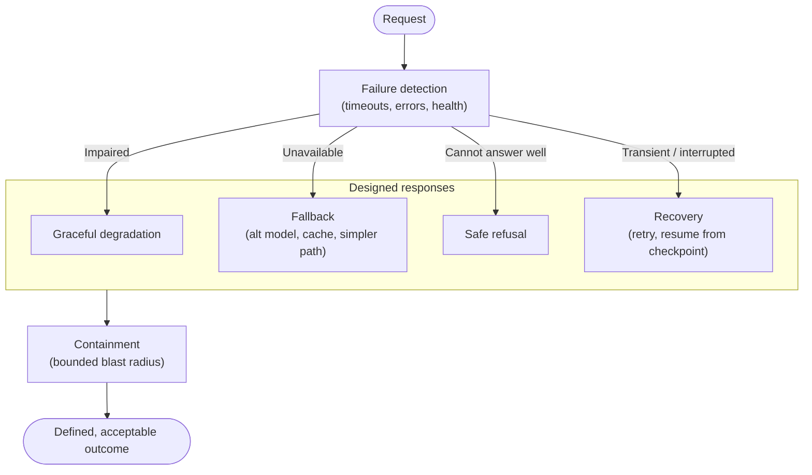
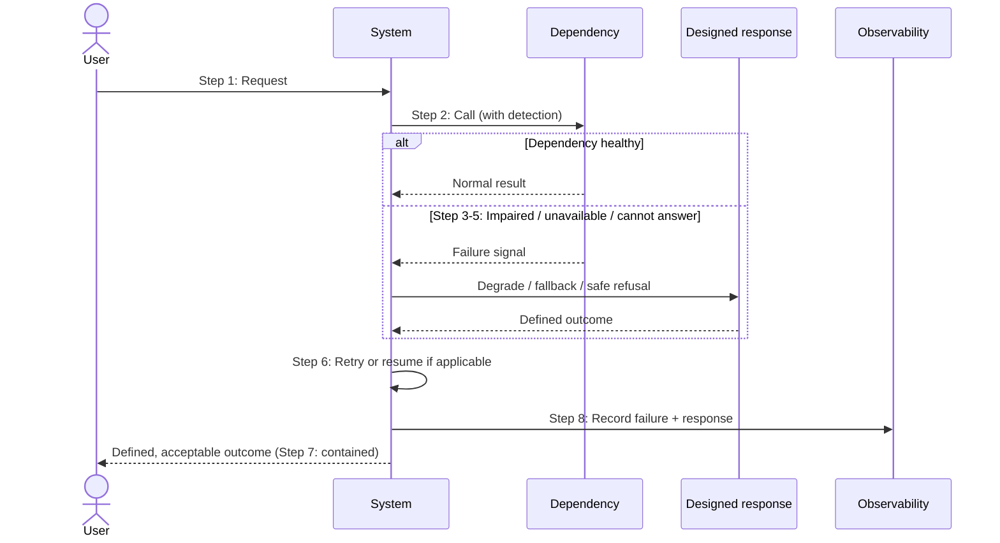

# Chapter 22: Resilience and Failure Modes

Every pattern chapter in this book has included a failure-modes section, because a design that has not been examined for how it fails is a design that is not finished. Part V now gathers that thinking into a discipline. Production-grade GenAI is not defined by how it behaves when everything works; it is defined by how it behaves when things go wrong, and things always go wrong. Models become unavailable, retrieval returns nothing useful, tools fail, regions degrade, and the system must respond to all of it in ways that are defined rather than accidental.

This chapter opens the operations part of the book by treating resilience as a first-class architectural concern. It asks the question the pattern chapters raised repeatedly, what happens when this fails?, and answers it systematically: identify the failure modes, decide how the system should degrade, provide fallbacks where they help, and design recovery. The recurring theme is that resilience is not the absence of failure but the presence of a designed response to it.

---

## 1. The Architectural Problem

A GenAI system depends on many things that can fail. It calls a foundation model that may be unavailable or throttled. It retrieves from stores that may be slow or empty. It may invoke tools that error, or run agents that loop. It spans accounts and regions, any of which can degrade. And underneath, it produces probabilistic output that may itself be wrong. Each dependency and each behaviour is a potential failure, and in aggregate the system has many ways to break.

The problem is that failure, if not designed for, produces undefined behaviour. A system that assumes its model is always available will fail unpredictably when it is not. A system that assumes retrieval always returns something useful will answer from nothing when it does not. A system with no fallback fails hard where it could have degraded gracefully; a system with no recovery loses work it could have resumed. The absence of a designed response is itself the failure, because it turns a manageable dependency problem into an unmanageable outage or, worse, a silently wrong result.

The constraint is that resilience must be proportionate. Not every failure warrants elaborate handling; the effort should match how likely the failure is and how much its consequences matter, the same likelihood-and-impact reasoning as threat modelling. Over-engineering resilience for improbable, low-impact failures wastes effort; ignoring likely, high-impact ones invites outage.

The architectural question is: for each way a GenAI system can fail, how should it respond, degrade, fall back, recover, refuse, so that failure produces defined, acceptable behaviour rather than undefined, unacceptable behaviour, in proportion to the failure's likelihood and impact?

---

## 2. ⚠️ The Pattern at a Glance

- **Pattern name:** GenAI Resilience
- **Problem solved:** GenAI's many dependencies and probabilistic behaviour fail in ways that, if not designed for, produce undefined or silently wrong behaviour.
- **Primary objective:** A designed, proportionate response to every significant failure mode, degradation, fallback, recovery or safe refusal.
- **When to use:** Any production GenAI system; resilience is intrinsic to production-grade operation.
- **When not to use:** No genuine exception; the depth scales with how critical the system is, but some resilience design is always required.
- **Key AWS services:** The full stack, Bedrock, gateway, retrieval, agents, state, across regions and accounts, with resilience designed into each layer.
- **Primary architectural concern:** Designed response to failure, proportionate to likelihood and impact, rather than accidental behaviour.

Resilience is not a component to add; it is a property designed into every layer, expressed as the system's defined behaviour when each of its dependencies or behaviours fails.

---

## 3. The Architecture

Resilience is architected as a set of responses layered across the system's dependencies.

- **Failure detection** at each dependency, model, retrieval, tools, state, cross-account paths, recognises when something has gone wrong, through timeouts, errors and health signals.
- **Graceful degradation** defines reduced but acceptable behaviour when a dependency is impaired, rather than hard failure.
- **Fallbacks** provide alternatives where they help: an alternative model (Chapter 10), a simpler retrieval, a cached result.
- **Safe refusal** is the deliberate choice to decline rather than answer when answering would be wrong, empty retrieval, guardrail rejection, unavailable dependency.
- **Recovery** restores operation after failure: retries with backoff for transient issues, checkpoint-based resumption for long-running work (Chapter 13).
- **Containment** limits how far a failure spreads, using the boundaries and blast-radius controls established throughout.

The architecture's essence is that every detected failure routes to a designed response, and every response yields a defined, acceptable outcome rather than an undefined one.

---

## 4. Request and Data Flow

Tracing how a request meets and survives failure:

> **Step 1:** A request enters and proceeds through the system's dependencies as normal.
> **Step 2:** At each dependency, failure detection watches for timeouts, errors or unhealthy signals.
> **Step 3:** If a dependency is merely impaired, the system degrades gracefully, delivering a reduced but acceptable result.
> **Step 4:** If a dependency is unavailable, the system applies a fallback, an alternative model, a cached result, a simpler path, where one helps.
> **Step 5:** If the system cannot produce a good answer, empty retrieval, guardrail rejection, no viable fallback, it refuses safely rather than answering badly.
> **Step 6:** For transient failures, the system retries with backoff; for interrupted long-running work, it resumes from a checkpoint.
> **Step 7:** Throughout, containment ensures the failure does not spread beyond its bounded scope.
> **Step 8:** The request concludes with a defined, acceptable outcome, success, degraded success, or an honest refusal, and the failure is recorded.

The flow shows the principle in motion: failure is detected, routed to a designed response, contained, and recorded, so the user receives a defined outcome no matter which dependency faltered.

---

## 5. Why This Pattern Works

Resilience works because it replaces undefined behaviour with defined behaviour. A dependency that can fail will eventually fail; the difference between a resilient and a fragile system is not whether failure occurs but whether the system's response to it was designed. By deciding in advance how to degrade, when to fall back, when to refuse and how to recover, the architect ensures that failure produces an acceptable outcome rather than an unpredictable one. This is the whole of resilience: not preventing failure, which is impossible, but designing its consequences.

It works because it treats the specific ways GenAI fails. Fallback to an alternative model addresses model unavailability, exactly what routing (Chapter 10) is well placed to provide. Safe refusal addresses the silent-quality failures that recur through the book, empty retrieval, a subverted instruction, a case the system cannot handle, where answering would be worse than declining. Checkpoint-based recovery addresses long-running work (Chapter 13). Each response is matched to the failure it handles, which is why generic hardening is less effective than failure-specific design.

And it works because it is proportionate. By reasoning about likelihood and impact, as in threat modelling, resilience effort concentrates where failures are likely or consequential, and stays light where they are neither. This keeps resilience from becoming either negligence or gold-plating, and it is why the pattern chapters asked "what happens when this fails?" for each pattern specifically rather than prescribing uniform redundancy everywhere.

---

## 6. 🏗️ Architectural Decisions

| Decision | Options | Recommended approach | Reason |
| --- | --- | --- | --- |
| Failure response | Undefined / Designed | Designed for each significant failure | Acceptable, predictable outcomes |
| On impairment | Hard fail / Degrade gracefully | Degrade where a reduced result is acceptable | Better than nothing |
| On unavailability | Fail / Fallback | Fallback where one genuinely helps | Continuity |
| On cannot-answer | Invent / Refuse safely | Safe refusal | An honest refusal beats a wrong answer |
| On transient/interrupted | Give up / Retry or resume | Retry with backoff; resume from checkpoint | Recover without repeating harm |
| Resilience depth | Uniform / Proportionate | Proportionate to likelihood and impact | Effort where it matters |

The defining principle is to design the response to each significant failure, and to size that design by likelihood and impact. A safe refusal is often the most important and most overlooked response: for a system that grounds answers in data, declining to answer when it cannot answer well is a feature, not a defect.

---

## 7. ⚖️ Trade-offs

**Benefits:** Defined, acceptable behaviour under failure; continuity through degradation and fallback; honesty through safe refusal; recovery of interrupted work; contained blast radius; and a system that can be trusted in production because its failure behaviour is known.

**Costs and limitations:** Resilience is design and implementation effort, detection, degradation paths, fallbacks, recovery, and it adds complexity. Fallbacks introduce alternative paths that must themselves be correct and tested. Over-engineered resilience for improbable failures wastes effort, while too little invites outage, so the proportionality judgement is genuinely hard.

**Complexity:** Moderate to high, distributed across every layer rather than concentrated; each dependency's failure response is a small design in itself.

**Operational overhead:** Ongoing: fallbacks and recovery must be maintained and tested, and failure behaviour verified, because untested resilience is unproven resilience.

**Security implications:** Mostly positive, containment limits blast radius, and safe refusal prevents bad output, but resilience must fail safe, not open: a fallback or degraded path must not bypass security controls such as guardrails or access checks.

**Performance implications:** Detection, retries and fallbacks add some latency, especially on the failure path; degraded modes may be slower or simpler, which is the accepted cost of continuity.

**Cost implications:** Fallbacks and redundancy have cost, alternative capacity, retries, and should be sized to the criticality of the system; resilience for a critical system is worth its cost, for a trivial one it may not be.

---

## 8. 🔐 Security and Governance

Resilience and security intersect at one crucial rule: systems must fail safe, not fail open. When a dependency fails and the system degrades or falls back, the failure path must preserve the security controls of Part IV, a fallback model is still reached under the same access and guardrail controls; a degraded retrieval still respects permission filtering; a recovered workflow still enforces its bounds. A resilience design that, under stress, drops guardrails, broadens access or bypasses the boundary trades a reliability problem for a security incident, which is a bad trade. This connects directly to guardrail failure handling in Chapter 19, on failure of the screening capability, fail safe by refusing rather than passing unscreened.

Safe refusal is itself a governance-aligned behaviour: declining to answer when the system cannot answer well, rather than producing a confident, unsupported or unscreened response, is both a resilience response and a responsible one. Containment, using the account, network and agent boundaries established throughout, limits how far any failure spreads, which is a security property as much as a reliability one. Governance requires that failure behaviour be known and demonstrable: an enterprise should be able to state how its systems behave under failure and confirm they fail safe, rather than discover it during an incident.

---

## 9. 🌐 Networking

Networking is both a source of failure and a means of containment. Cross-account paths, VPC endpoints and DNS (Chapter 17) are dependencies that can fail, isolating components from models, data or each other, so their resilience, redundancy, monitoring, is part of the system's overall resilience. Regional degradation is a network-and-infrastructure failure whose handling, whether to design for multi-region operation, is a proportionality decision based on how critical availability is. Containment, meanwhile, relies on the network boundaries: network isolation limits how far a failure or compromise spreads, so the same connectivity that enforces security also bounds blast radius under failure. The point is that the network is part of the resilience design, not separate from it.

---

## 10. ⚠️ Failure Modes and Resilience

This chapter is about failure modes, so this section consolidates the recurring ones from across the book and their designed responses:

- **Model unavailable or throttled:** Fall back to an alternative model (Chapter 10); retry transient throttling with backoff; degrade or refuse if no fallback.
- **Retrieval empty or poor:** Refuse safely rather than answer ungrounded; degrade to a general response only if acceptable; this is the silent-quality failure of Chapters 8-9.
- **Tool or agent failure:** Handle the tool error rather than proceed on a false result; bound and contain agent failures (Chapters 11-12); stop runaway loops via limits.
- **State loss or interruption:** Resume from checkpoint; ensure idempotency so recovery does not act twice (Chapter 13).
- **Dependency latency:** Apply timeouts; stream where possible; degrade rather than hang.
- **Regional or account degradation:** Contain to the affected scope; design multi-region only where criticality justifies it.
- **Guardrail or security-control failure:** Fail safe, refuse rather than pass unscreened (Chapter 19).
- **Cascading failure:** Contain with boundaries and blast-radius limits so one failure does not become many.

The theme, drawn from the whole book, is that GenAI's failures are diverse and include silent quality failures, so resilience is a designed, failure-specific response, and the most valuable and overlooked response is often the honest refusal.

---

## 11. 👁️ Observability and Operations

Resilience depends on observability, because a system cannot respond to a failure it cannot detect, and cannot be trusted to fail well if its failure behaviour is not visible. Operations must see failures as they occur, dependency errors, throttling, timeouts, empty retrievals, tool failures, fallback invocations, refusals, and, importantly, watch fallback frequency, since constant fallback masks an underlying problem while appearing to work. These signals, feeding the observability of the next chapter, are what confirm resilience is functioning and reveal where it is being exercised.

Operationally, resilience must be tested, not assumed: fallbacks, degradation paths and recovery should be exercised deliberately, because a fallback that has never been tried is a fallback that may not work when needed. This is the operational discipline that turns designed resilience into proven resilience. Failure behaviour should be understood and rehearsed so that, in a real incident, the system behaves as designed and the operators know it will. As throughout, this technical resilience observability is distinct from AI quality evaluation, though safe refusal sits at their intersection.

---

## 12. 💷 Cost and FinOps

Resilience has a cost, redundant capacity, fallback models, retries, multi-region designs, and the discipline is to size that cost to the system's criticality. A business-critical system justifies significant resilience spend; a trivial or experimental one does not, and applying uniform redundancy everywhere is a common way to overspend. This is the proportionality principle expressed economically: pay for resilience where failure is likely or costly, and stay light where it is neither.

Some resilience mechanisms interact with cost in subtle ways. Retries and fallbacks consume additional inference, so a system failing repeatedly and retrying can quietly multiply cost, another reason to monitor fallback and retry frequency. Conversely, safe refusal is essentially free and prevents the cost of acting on wrong output. The largest economic point is that the cost of designed resilience is almost always small against the cost of an undefined failure in production, an outage, a silently wrong result acted upon, a lost long-running workflow, so resilience is generally a sound investment, sized to criticality.

---

## 13. When to Use This Pattern

Use this pattern when:

- operating any production GenAI system, resilience is intrinsic to production-grade operation;
- the system has dependencies, models, retrieval, tools, state, cross-account or cross-region paths, that can fail;
- silent quality failures such as empty or poor retrieval must be handled by safe refusal; or
- the consequences of undefined failure behaviour are unacceptable.

Resilience is not optional for production; the question is how much, guided by the system's criticality and its failures' likelihood and impact.

---

## 14. When NOT to Use This Pattern

There is no genuine case for undefined failure behaviour in production; the question is depth, not existence. Scale the effort when:

- an experimental or throwaway system genuinely does not need production resilience, though even then safe refusal is prudent; or
- a failure is so improbable and low-impact that designing for it would be disproportionate, a deliberate, reasoned decision, not an omission.

Even minimal systems benefit from timeouts and safe refusal. The mistake this pattern guards against is leaving failure behaviour undefined, treating "it usually works" as sufficient, and the opposite mistake of gold-plating resilience for failures that do not warrant it. Proportionate, designed failure behaviour is the goal.

---

## 15. Pattern Variations

- **Small organisation:** Basic resilience, timeouts, retries, safe refusal, and simple fallback where cheap, without multi-region complexity.
- **Medium enterprise:** Designed responses across dependencies, model fallback via the gateway, checkpointed recovery for long-running work, and tested failure paths.
- **Large enterprise:** Comprehensive, proportionate resilience across the federated estate, with containment via account and network boundaries, and resilience for critical shared services.
- **Highly regulated or critical enterprise:** Rigorous resilience with multi-region designs where justified, exhaustively tested failure behaviour, and demonstrable fail-safe guarantees.

The variations scale resilience depth with criticality and scale, but designed, proportionate failure behaviour, especially safe refusal, is constant.

---

## 16. Architecture Decision Checklist

- [ ] For each dependency, is there a designed response to its failure, rather than undefined behaviour?
- [ ] Does the system degrade gracefully where a reduced result is acceptable?
- [ ] Are fallbacks provided where they genuinely help, and are they tested?
- [ ] Does the system refuse safely when it cannot answer well, rather than inventing an answer?
- [ ] Are transient failures retried with backoff, and interrupted work resumed idempotently from checkpoints?
- [ ] Does the system fail safe, preserving security controls on failure and fallback paths, never failing open?
- [ ] Is failure contained by account, network and agent boundaries so it does not cascade?
- [ ] Is resilience proportionate to each failure's likelihood and impact, neither negligent nor gold-plated?
- [ ] Are failures and fallback frequency observed, so resilience is verified and masking is detected?
- [ ] Is failure behaviour tested and rehearsed, not merely assumed?

---

## 17. 📐 The Architect's Verdict

> Resilience is what makes a GenAI system production-grade, and it is defined not by the absence of failure but by the presence of a designed response to it. Every dependency, model, retrieval, tools, state, network, and every probabilistic behaviour can fail, and the architect's job is to decide in advance how the system responds: degrade gracefully, fall back where it helps, recover transient and interrupted work, and, crucially, refuse safely when answering well is impossible, since for a grounded system an honest refusal beats a confident wrong answer. Fail safe, never open: failure and fallback paths must preserve the security controls of Part IV. Contain failures with the boundaries established throughout, and size resilience to each failure's likelihood and impact, avoiding both negligence and gold-plating. Above all, test failure behaviour rather than assume it, because an untested fallback is an unproven one. A system whose failure behaviour is designed, contained, safe and verified is one an enterprise can run in production; one whose failures are undefined is not, however well it performs when nothing goes wrong.
