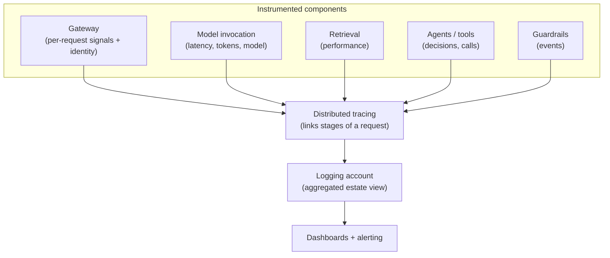
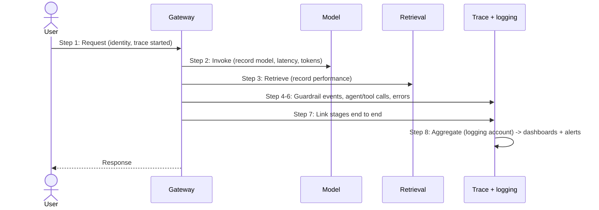

# Chapter 23: Observability for GenAI Systems

Resilience, the subject of the previous chapter, depends on knowing that something has failed. More broadly, everything in operations, cost control, security assurance, performance management, governance verification, depends on being able to see what the system is doing. This chapter is about that seeing: observability for GenAI systems. Nearly every earlier chapter noted that some signal should be recorded, latency, tokens, model usage, guardrail events, agent decisions, and consistently distinguished technical observability from AI quality evaluation. Here the technical half is treated in full; the quality half is the subject of the next chapter.

The distinction matters and is worth stating at the outset. Technical observability tells you whether the machinery is working: how fast, how much, how many errors, which models, what cost. AI quality evaluation tells you whether the output is any good. A GenAI system can be perfectly healthy technically while answering badly, which is why the two are separate disciplines. This chapter covers the first: the signals, traces and metrics that reveal the operational state of a GenAI system.

---

## 1. The Architectural Problem

A GenAI system in production is doing many things across many components: requests pass through a gateway, are routed to models, grounded by retrieval, perhaps handled by agents invoking tools, screened by guardrails, and drawing on state, often spread across accounts. If the system is not observable, all of this is opaque. When it is slow, no one can say where the latency is. When it errors, the cause is a guess. When cost rises, the driver is unknown. When a guardrail fires or an agent misbehaves, it passes unseen. The system works until it does not, and then no one can tell why.

The problem is that GenAI adds signals and structures that ordinary application observability does not capture. Token consumption is a first-class operational and cost signal with no equivalent in traditional systems. Which model served a request matters. Guardrail events, retrieval performance and agent tool calls are all significant. And requests fan out across gateway, models, retrieval and agents in ways that must be traced end to end to be understood. Observing a GenAI system as if it were an ordinary application misses precisely the signals that make it a GenAI system.

The constraint is that observability must span the whole path, across components and accounts, and capture GenAI-specific signals, while remaining something an enterprise can actually operate. In a federated estate this points strongly towards aggregation, so the enterprise has one coherent picture rather than fragments.

The architectural question is: how do we make a GenAI system observable across its whole request path and all its components, capturing the GenAI-specific signals, so that its operational state, performance, errors, usage, cost, security events, is visible and actionable across the estate?

---

## 2. 👁️ The Pattern at a Glance

- **Pattern name:** GenAI Observability
- **Problem solved:** GenAI systems are opaque without observability, and ordinary application monitoring misses GenAI-specific signals and the fan-out across components.
- **Primary objective:** End-to-end visibility of the operational state, latency, tokens, model usage, errors, guardrail and agent activity, cost, across the whole system and estate.
- **When to use:** Any production GenAI system; observability is foundational to operating one.
- **When not to use:** No genuine exception; the depth scales with the system, but operational visibility is always required.
- **Key AWS services:** Monitoring, logging and tracing services; the AI Gateway (Chapter 7) as a natural collection point; the logging account (Chapter 14) for aggregation.
- **Primary architectural concern:** Capturing GenAI-specific signals and tracing end to end across components and accounts.

Observability here is the technical, operational view. It is deliberately distinct from evaluation of output quality, which the next chapter treats, though the two together form the complete picture of a system's health.

---

## 3. The Architecture

Observability is architected to capture signals at every component and aggregate them into a coherent view.

- **Instrumentation at each component**, gateway, model invocation, retrieval, agents and tools, state, emits the relevant signals: latency, tokens, model used, errors, throttling, guardrail events, retrieval performance, tool calls.
- **The AI Gateway** (Chapter 7) is a natural collection point, since every request passes through it, capturing per-request signals and identity.
- **Distributed tracing** links the stages of a request, gateway to model to retrieval to agent, so a single request can be followed end to end across components.
- **Aggregation in the logging account** (Chapter 14) draws signals from across the federated estate into one place, giving an enterprise-wide operational view.
- **Dashboards and alerting** turn the aggregated signals into visibility and timely notification of problems.
- **Retention and audit** preserve records for operational analysis, security and governance, respecting the data-protection rules of Chapter 18.

The architecture captures GenAI-specific signals at each component, links them by tracing, and aggregates them for a coherent, estate-wide operational picture.

---

## 4. Request and Data Flow

Tracing observability alongside a request:

> **Step 1:** A request enters the gateway, which records it with its identity and starts a trace.
> **Step 2:** Routing and model invocation record which model served the request, its latency and token consumption.
> **Step 3:** Retrieval, if used, records its performance, latency and whether relevant content was found.
> **Step 4:** Guardrails record their events, what was screened, blocked or flagged, on input and output.
> **Step 5:** Agents and tools, if involved, record their decisions, tool calls and results.
> **Step 6:** Errors, throttling and failures at any stage are recorded with context.
> **Step 7:** The trace links all stages, so the whole request can be followed end to end.
> **Step 8:** Signals aggregate in the logging account, feeding dashboards and alerts for the estate-wide view.

The flow shows observability as a parallel concern to the request itself: at every stage, the relevant signal is captured and linked, so the request's operational story is complete.

---

## 5. Why This Pattern Works

Observability works because it makes the opaque visible, and visibility is the precondition for every other operational activity. Resilience needs to detect failure; cost control needs to see token consumption; security assurance needs guardrail and access events; performance management needs latency; governance needs evidence. All of these draw on the same observability substrate, which is why it is foundational rather than optional: without it, operations is guesswork.

It works because it captures the signals that are specific to GenAI. Tokens as an operational and cost signal, which model served a request, guardrail events, retrieval performance, agent tool calls, these have no equivalent in ordinary application monitoring, and capturing them is what makes a GenAI system genuinely observable rather than superficially monitored. Tracing across the fan-out, gateway to model to retrieval to agent, is what turns a scatter of component signals into an understandable end-to-end story, which is essential when a single request touches many components across accounts.

And it works because aggregation gives coherence. The gateway is a natural collection point because every request passes through it, and the logging account aggregates across the federated estate, so the enterprise gets one operational picture rather than fragments per team, exactly the visibility benefit that motivated federation in Chapter 14. Coherent, aggregated, GenAI-aware observability is what lets an enterprise actually operate its GenAI at scale.

---

## 6. 🏗️ Architectural Decisions

| Decision | Options | Recommended approach | Reason |
| --- | --- | --- | --- |
| Signals captured | Generic app metrics / GenAI-specific | GenAI-specific: tokens, model, guardrails, retrieval, tools | Capture what makes it GenAI |
| Collection point | Per component only / Gateway + components | Gateway as natural collection point, plus components | Every request passes through it |
| Tracing | None / End-to-end | End-to-end across components | Follow request through the fan-out |
| Aggregation | Per team / Estate-wide (logging account) | Aggregated in logging account | Coherent enterprise picture |
| Alerting | None / On meaningful signals | Alert on meaningful thresholds | Timely response |
| Retention | Minimal / Sufficient for ops, security, governance | Sufficient, protected | Analysis, audit, accountability |

The defining decision is to capture GenAI-specific signals and trace end to end. Monitoring a GenAI system with only generic application metrics misses tokens, model usage, guardrail events and the request fan-out, precisely the signals that reveal how a GenAI system is behaving.

---

## 7. ⚖️ Trade-offs

**Benefits:** Visibility of the whole operational state; the substrate for resilience, cost control, security assurance, performance management and governance; GenAI-specific signals captured; end-to-end tracing across components; and a coherent, estate-wide picture.

**Costs and limitations:** Comprehensive observability is effort to instrument and infrastructure to run, storage, tracing, dashboards. Too much observability produces noise that obscures the signal; too little leaves blind spots. The data captured, prompts, responses, usage, is itself sensitive and must be protected, so observability creates data-protection obligations of its own.

**Complexity:** Moderate: instrumentation across components and tracing across accounts take deliberate design, though the gateway and logging account provide natural structure.

**Operational overhead:** Ongoing: the observability system is itself a system to operate, and dashboards and alerts must be tuned to stay useful.

**Security implications:** Observability data is sensitive, prompts and responses in logs contain the very data Chapter 18 protects, so it must be encrypted, access-controlled and residency-respecting like any store; a careless log is a leak. Conversely, observability is essential for security assurance, so it must be done, and done safely.

**Performance implications:** Instrumentation adds negligible overhead when designed well; the value far exceeds the cost.

**Cost implications:** Logging, tracing and retention have real cost that grows with volume and retention, to be sized deliberately; the cost is justified by the operational control observability provides.

---

## 8. 🔐 Security and Governance

Observability has a dual relationship with security. On one hand, it is essential for security assurance: guardrail events, access records and agent activity are what let the enterprise see and verify its security posture, feeding the threat modelling of Chapter 20 and the governance verification of Chapter 21. Without observability, security controls cannot be confirmed to work, and unverifiable security is little better than none.

On the other hand, observability data is itself sensitive and must be protected. Logs of prompts and responses contain exactly the data Chapter 18 requires to be encrypted, access-controlled, residency-respecting and retention-governed; an observability store is one more resting place for sensitive data, and a common one to overlook. The discipline is to treat observability data as the sensitive asset it is, so that the system built to give visibility does not itself become a leak. Aggregation in the logging account concentrates this data, which makes the logging account a high-value store to secure accordingly.

Governance draws directly on observability: the aggregated, protected records are the evidence that controls are present and working, which Chapter 21 requires to be demonstrable. Observability is thus both an operational necessity and a governance instrument, and it must be secured as carefully as it is relied upon.

---

## 9. 🌐 Networking

Observability signals flow across the estate to aggregation, and those flows should travel private paths and land in a protected, isolated logging store, consistent with Chapters 17 and 18. Network-level signals, connectivity health, endpoint and DNS status, are themselves part of what observability captures, since the network is a dependency whose failure the resilience of Chapter 22 must detect. The point is that observability both traverses the network, and so must be secured in transit, and observes the network, contributing to the visibility of the connectivity the whole system depends on.

---

## 10. ⚠️ Failure Modes and Resilience

Observability has its own failure modes, and its failure is especially insidious because it blinds the operators.

- **Blind spots:** A component or signal is not instrumented, so part of the system is invisible, and problems there go undetected, the core failure observability exists to prevent.
- **Signal lost in noise:** Too much low-value data buries the signals that matter, so problems are present in the data but unseen; mitigated by tuning what is captured and alerted.
- **Observability system failure:** The monitoring, tracing or logging pipeline itself fails, leaving the system unobserved; it is a dependency to be made resilient and monitored in its own right.
- **Trace breaks:** A gap in tracing across components or accounts means a request cannot be followed end to end, defeating the purpose of tracing.
- **Sensitive-data exposure in logs:** Observability data captured without protection becomes a leak, a security failure created by the very system meant to give assurance.
- **Stale dashboards and alerts:** Dashboards and thresholds not maintained as the system evolves become misleading or noisy, eroding trust in the observability.

The theme is that observability failures are quiet, they remove visibility rather than raise an alarm, so the observability system must itself be observed and maintained, and its data protected.

---

## 11. 👁️ Observability and Operations

This chapter is observability, so this section addresses operating the observability itself. The observability system is a production system with its own operational needs: it must be kept running, its pipelines monitored, its dashboards and alerts tuned so they surface real problems without drowning operators in noise, and its retention managed against cost and governance needs. Observability that is set up once and left untended degrades, blind spots open as new components are added, dashboards drift out of relevance, alerts become noise, so it must be maintained as the system evolves.

Operationally, observability is the foundation the rest of operations stands on: resilience, cost management, security assurance and governance all consume its signals. This is precisely why it is treated first among the operational chapters after resilience. The one boundary to keep clear, as throughout the book, is that this technical observability is distinct from AI quality evaluation: it tells you the machinery is working, not that the output is good. The next chapter takes up the second question, and together they give the complete operational picture.

---

## 12. 💷 Cost and FinOps

Observability is both a cost and a key enabler of cost control. It has real cost, logging, tracing, storage and retention grow with volume, and this must be sized deliberately: capturing everything forever is expensive and noisy, while capturing too little blinds the enterprise. The balance is to capture the signals that matter, at a retention that serves operations, security and governance, and no more.

Against its cost, observability is what makes GenAI cost controllable at all. Token consumption, the currency of GenAI, is an observability signal, and without it cost cannot be attributed, understood or optimised. The next chapters on economics depend entirely on the usage data observability provides. Aggregated in the logging account, this data enables the cost attribution and chargeback of the federated model (Chapter 14). So while observability costs, it is the precondition for the far larger savings that cost management delivers, and skimping on the observability of usage is a false economy that forfeits control over the largest GenAI cost drivers.

---

## 13. When to Use This Pattern

Use this pattern when:

- operating any production GenAI system, observability is foundational to operation;
- the system spans multiple components, gateway, models, retrieval, agents, and requests must be traced across them;
- GenAI-specific signals, tokens, model usage, guardrail events, are needed for operations, cost and security; or
- the enterprise needs an aggregated, coherent view of GenAI across a federated estate.

Observability is required for production GenAI; the question is depth and breadth, not whether.

---

## 14. When NOT to Use This Pattern

There is no genuine case for operating production GenAI without observability; the question is how much, not whether. Scale the effort when:

- an experimental or throwaway system does not need full production observability, though basic signals remain prudent; or
- a very simple, single-component system needs less elaborate tracing than a complex, multi-component one.

Even minimal systems benefit from capturing errors, latency and token usage. The mistake this pattern guards against is operating GenAI blind, treating it as observable enough with generic monitoring that misses the GenAI-specific signals and the request fan-out, and the opposite mistake of capturing so much that the signal is lost and the cost unjustified. Purposeful, GenAI-aware observability, protected as sensitive data, is the goal.

---

## 15. Pattern Variations

- **Small organisation:** Core signals, latency, tokens, errors, model usage, captured simply, using managed monitoring, with basic dashboards.
- **Medium enterprise:** GenAI-specific signals across components, gateway-centred collection, end-to-end tracing, and aggregated logging with tuned alerts.
- **Large enterprise:** Comprehensive, estate-wide observability aggregated in the logging account, full tracing across the federated platform, and mature dashboards and alerting, protected as sensitive data.
- **Highly regulated enterprise:** Rigorous, auditable observability with strict protection and retention of observability data, comprehensive tracing, and evidence suitable for governance and audit.

The variations scale the breadth, tracing and aggregation of observability with the enterprise's size and complexity, but GenAI-specific signals and protection of observability data are constant.

---

## 16. Architecture Decision Checklist

- [ ] Are GenAI-specific signals, tokens, model used, guardrail events, retrieval performance, tool calls, captured, not just generic metrics?
- [ ] Is the gateway used as a natural collection point for per-request signals and identity?
- [ ] Can a single request be traced end to end across gateway, model, retrieval and agents?
- [ ] Are signals aggregated in the logging account for a coherent, estate-wide view?
- [ ] Are dashboards and alerts tuned to surface real problems without noise?
- [ ] Is observability data, prompts and responses in logs, protected as sensitive data per Chapter 18?
- [ ] Do observability signals flow over private paths into a protected, isolated store?
- [ ] Is the observability system itself monitored and maintained, avoiding blind spots and stale dashboards?
- [ ] Is retention sized deliberately against operational, security, governance and cost needs?
- [ ] Is technical observability kept distinct from, and complementary to, AI quality evaluation?

---

## 17. 📐 The Architect's Verdict

> Observability is the foundation the rest of operations stands on: resilience, cost control, security assurance and governance all depend on being able to see what a GenAI system is doing. Ordinary application monitoring is not enough, because it misses the signals that make a system GenAI, token consumption, which model served each request, guardrail events, retrieval performance, agent tool calls, and it misses the fan-out of a single request across gateway, models, retrieval and agents, which only end-to-end tracing reveals. Capture the GenAI-specific signals, trace across components, and aggregate in the logging account for one coherent, estate-wide picture, using the gateway as the natural collection point. Treat observability data as the sensitive asset it is, protected exactly as Chapter 18 requires, so the system built for visibility does not become a leak. Keep this technical observability distinct from the quality evaluation of the next chapter: it tells you the machinery works, not that the output is good. A GenAI system you cannot see is a system you cannot operate, secure, cost or govern, and observability is how you see it.
