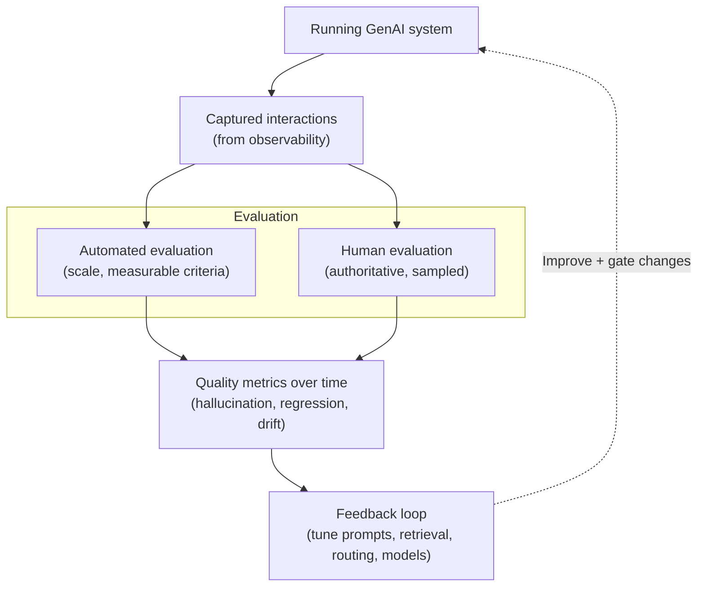
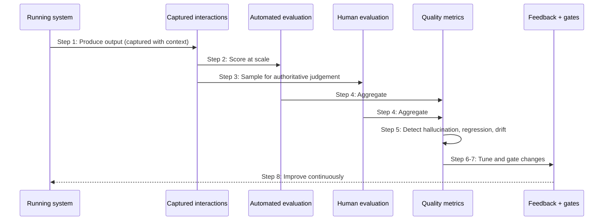

# Chapter 24: Evaluation and AI Quality

The previous chapter drew a line it promised this chapter would cross. Technical observability tells you the machinery is working, fast responses, few errors, healthy dependencies, but it says nothing about whether the output is any good. A GenAI system can be flawless technically and still answer wrongly, and no latency metric or error rate will reveal it. This is the defining property of GenAI that the book has returned to again and again: its failures are often silent quality failures, confident, fluent, plausible and wrong, raising no error at all.

Evaluation is the discipline that addresses this. It asks not "is the system running?" but "is the system good?", and it treats the answer as something to be measured rather than assumed. This chapter makes AI quality a first-class operational concern, distinct from technical observability, with its own methods, automated and human, and its own targets, hallucination, regression and drift. If resilience and observability are how a system stays up, evaluation is how it stays good.

---

## 1. The Architectural Problem

A GenAI system produces output that varies in quality, and that quality is not visible in technical signals. An answer can be delivered quickly, without error, grounded in retrieved content, and still be wrong: a hallucination presented confidently, a subtly incorrect fact, an answer to a question the user did not ask, a response that has quietly degraded since last month. The system reports success; the user receives something misleading. Nothing in the operational dashboards flags it, because technically nothing failed.

The problem is that without evaluation, quality is invisible and therefore unmanaged. A team may believe its system works well because it is fast and error-free, while its answers are steadily deteriorating. A change to a prompt, a model, or the retrieval configuration may improve or degrade quality, and without measurement no one can tell which. Quality problems accumulate silently until users lose trust, and by then the damage is done. What cannot be measured cannot be improved, and quality, uniquely among the system's properties, is easy to leave unmeasured.

The constraint is that evaluating GenAI quality is genuinely hard. Output is open-ended and often has no single correct answer, so quality cannot always be checked mechanically. Evaluation combines automated methods, which scale but are imperfect, with human judgement, which is authoritative but expensive, and must do so continuously, because quality drifts over time.

The architectural question is: how do we measure the quality of a GenAI system's output, systematically and continuously, so that quality is visible and manageable, silent failures are surfaced, and changes can be judged by their effect on quality rather than assumed?

---

## 2. 🧩 The Pattern at a Glance

- **Pattern name:** Evaluation and AI Quality
- **Problem solved:** Output quality is invisible to technical observability, so silent quality failures go undetected and changes cannot be judged.
- **Primary objective:** Systematic, continuous measurement of output quality, distinct from technical health, surfacing hallucination, regression and drift.
- **When to use:** Any GenAI system where output quality matters, essentially all of them; the rigour scales with how much quality matters.
- **When not to use:** No genuine exception where output quality has consequences; effort scales with stakes.
- **Key AWS services:** Evaluation tooling and pipelines; the observability substrate (Chapter 23) that captures interactions to evaluate; Bedrock for automated evaluation where a model assesses output.
- **Primary architectural concern:** Measuring quality as a distinct, continuous discipline, combining automated and human evaluation.

Evaluation is deliberately separate from the technical observability of Chapter 23. The two are complementary halves of a system's health: one measures whether it runs, the other whether it is good.

---

## 3. The Architecture

Evaluation is architected as a continuous loop around the running system, drawing on the observability substrate.

- **Captured interactions**, from the observability of Chapter 23, provide the material to evaluate: real requests, retrieved context and responses.
- **Automated evaluation** scores output at scale against measurable criteria, relevance, groundedness, adherence to expected structure, sometimes using a model to assess output.
- **Human evaluation** provides authoritative judgement on a sample, assessing quality that automation cannot reliably capture.
- **Quality metrics** track the results over time, making quality visible and its trend apparent.
- **Detection of hallucination, regression and drift** watches for confident-but-wrong output, quality dropping after a change, and gradual deterioration.
- **A feedback loop** feeds evaluation results back into the system: tuning prompts, retrieval, routing or models, and gating changes on quality.

The architecture is a loop: the system produces output, evaluation measures its quality, and the results feed back to improve the system and to gate changes, so quality is continuously managed rather than assumed.

---

## 4. Request and Data Flow

Evaluation runs as a continuous process alongside and after operation:

> **Step 1:** The running system produces responses, which the observability substrate captures with their context.
> **Step 2:** Automated evaluation scores captured output at scale against measurable criteria such as groundedness and relevance.
> **Step 3:** A sample is routed to human evaluation for authoritative judgement on quality automation cannot reliably assess.
> **Step 4:** Results are aggregated into quality metrics tracked over time.
> **Step 5:** The metrics are examined for hallucination, for regression after a change, and for gradual drift.
> **Step 6:** Findings feed back: prompts, retrieval, routing or model choices are tuned to improve quality.
> **Step 7:** Proposed changes are evaluated before release, so quality gates them rather than being discovered after.
> **Step 8:** The loop continues, so quality is measured and managed continuously, not once.

The flow shows evaluation as an ongoing loop, not a one-off test: the system is continuously measured, and the measurements continuously improve it and guard its changes.

---

## 5. Why This Pattern Works

Evaluation works because it makes the invisible measurable. Quality is the one property of a GenAI system that technical observability cannot see, and evaluation is the discipline that surfaces it, converting "the answers seem fine" into measured groundedness, relevance and correctness that can be tracked, compared and acted upon. Once quality is measured, it can be managed: improved deliberately, defended against regression, and watched for drift, none of which is possible while quality is assumed.

It works because it combines methods suited to different needs. Automated evaluation scales to volume and catches measurable problems cheaply and continuously, while human evaluation provides the authoritative judgement that open-ended quality ultimately requires. Neither alone is sufficient, automation is imperfect and misses nuance, humans do not scale, so using both, automation broadly and humans on a sample, gives coverage that is both scalable and grounded in real judgement.

And it works because it closes a loop. Evaluation is not merely measurement; it feeds back into the system, tuning prompts, retrieval, routing and models toward better quality, and gating changes so that a change is judged by its measured effect on quality rather than by hope. This is what turns evaluation from a report into a control: it both reveals quality and drives its improvement, and it prevents the silent regressions that undermine trust. Measuring quality, and acting on the measurement, is how a GenAI system stays good over time.

---

## 6. 🏗️ Architectural Decisions

| Decision | Options | Recommended approach | Reason |
| --- | --- | --- | --- |
| Quality | Assumed / Measured | Measured, continuously | What cannot be measured cannot be managed |
| Method | Automated only / Human only / Both | Both: automated at scale, human on sample | Scalable coverage with authoritative judgement |
| Cadence | One-off / Continuous | Continuous | Quality drifts; measure over time |
| Change management | Deploy and hope / Gate on evaluation | Gate changes on quality | Catch regression before release |
| Detection focus | Errors only / Hallucination, regression, drift | All three | The characteristic quality failures |
| Feedback | Report only / Loop into system | Closed loop | Evaluation must improve, not just describe |

The defining decision is to measure quality rather than assume it, and to do so continuously. The second is to close the loop: evaluation that only describes quality is far less valuable than evaluation that feeds back to improve it and to gate the changes that could degrade it.

---

## 7. ⚖️ Trade-offs

**Benefits:** Quality made visible and manageable; silent failures surfaced; changes judged by measured effect rather than assumption; hallucination, regression and drift detected; and a loop that continuously improves quality and guards against degradation.

**Costs and limitations:** Evaluation is genuinely hard and takes real effort. Automated evaluation is imperfect and can itself be wrong; human evaluation is authoritative but expensive and does not scale. Defining good quality criteria for open-ended output is difficult, and poor criteria produce misleading measures. Evaluation is never finished, because quality drifts.

**Complexity:** Moderate to high as a discipline; the tooling is one part, but designing meaningful criteria and sustaining the loop are the harder parts.

**Operational overhead:** Ongoing and significant: automated evaluation to run, human evaluation to organise, metrics to maintain, and the loop to sustain.

**Security implications:** Evaluation processes real interactions, which contain sensitive data, so evaluation data must be protected like any other resting place (Chapter 18). Otherwise mostly neutral, though evaluation is what catches quality-related safety issues that guardrails may miss.

**Performance implications:** Little runtime impact when evaluation runs on captured interactions asynchronously; inline evaluation, if used to gate live responses, adds latency and must be justified.

**Cost implications:** Automated evaluation, especially model-based, consumes inference and so tokens; human evaluation costs effort. Both are justified by the cost of undetected quality failure, lost trust and bad decisions, which usually dwarfs the evaluation cost.

---

## 8. 🔐 Security and Governance

Evaluation intersects security and governance in two ways. First, evaluation data is sensitive: it consists of real requests, retrieved context and responses, exactly the data Chapter 18 protects, so the evaluation pipeline is another resting place that must be encrypted, access-controlled, residency-respecting and retention-governed. An evaluation store of real interactions is a valuable target and must be secured accordingly.

Second, evaluation is a governance instrument for responsible AI. Several responsible-AI principles from Chapter 21, quality, fairness, safety of output, are only verifiable through evaluation: guardrails screen for disallowed content, but whether the system is actually accurate, unbiased and useful is an evaluation question. Evaluation therefore provides the evidence that these principles are being met, or reveals where they are not, which is what governance requires to be demonstrable rather than asserted. Detecting hallucination and drift is not only a quality concern but a governance one, because a system that has silently degraded may be failing its responsible-AI commitments without anyone knowing.

Governance thus depends on evaluation being genuine and continuous, not a one-off benchmark at launch. A quality claim made at deployment and never re-measured is a claim that decays, and governance that rests on it rests on a decaying foundation. Continuous evaluation is what keeps quality claims true.

---

## 9. 🌐 Networking

Networking is a minor concern for evaluation, but the same principles apply: evaluation draws on captured interactions that flow, over private paths, from the observability substrate, and lands them in a protected, isolated evaluation store consistent with Chapters 17 and 18. Where automated evaluation uses a model to assess output, that inference travels the same governed path to Bedrock as any other. The point is simply that evaluation, handling sensitive interaction data, respects the same private, protected connectivity as the rest of the estate.

---

## 10. ⚠️ Failure Modes and Resilience

Evaluation's failure modes are the ways quality goes unmeasured or mismeasured, allowing silent quality failures to persist.

- **Unmeasured quality:** Quality is assumed rather than evaluated, so silent failures, hallucination, subtle errors, drift, go undetected, the core failure evaluation exists to prevent.
- **Poor criteria:** Evaluation measures the wrong things or defines quality badly, producing reassuring numbers that do not reflect real quality.
- **Over-trusting automation:** Automated evaluation, itself imperfect, is treated as authoritative, so its blind spots become the system's blind spots; mitigated by human evaluation on a sample.
- **Undetected regression:** A change degrades quality but is not evaluated before release, so regression reaches users silently; mitigated by gating changes on evaluation.
- **Undetected drift:** Quality deteriorates gradually and, without continuous evaluation, is noticed only when trust is already lost.
- **Evaluation-data exposure:** Sensitive interaction data in the evaluation pipeline is not protected, a security failure created by the evaluation process.
- **One-off evaluation:** Quality is measured at launch and never again, so the measurement decays into irrelevance.

The theme is that evaluation fails quietly by not happening, or by happening badly, and its resilience lies in being genuine, continuous, well-designed, and combining automated scale with human judgement.

---

## 11. 👁️ Observability and Operations

Evaluation and observability are complementary, and this chapter completes the pair the previous one began. Observability provides the captured interactions evaluation needs and reports the technical state; evaluation adds the quality dimension that observability cannot see. Together they answer the two questions a production GenAI system must answer, is it running, and is it good, and neither alone is sufficient: a system can be technically healthy and qualitatively poor, or producing good answers slowly and erroring. Operations must watch both.

Operationally, evaluation is a continuous practice with its own responsibilities: running automated evaluation, organising human evaluation, maintaining quality metrics and their criteria, and sustaining the feedback loop so findings actually improve the system and gate its changes. Quality metrics belong alongside technical dashboards as first-class operational signals, and quality regression should raise concern as readily as an error spike. The discipline is to treat quality as something operated and improved continuously, not certified once, because the defining risk, silent drift, is precisely the failure that a one-off check cannot catch.

---

## 12. 💷 Cost and FinOps

Evaluation costs real resources: automated evaluation, especially when a model scores output, consumes inference and tokens, and human evaluation costs skilled effort. These costs scale with how much and how often evaluation runs, so the design balances coverage against cost, automated evaluation broadly, human evaluation on a meaningful sample rather than everything.

Against these costs stands the cost of undetected quality failure, which is usually far larger: a system quietly producing wrong answers erodes trust, drives bad decisions, and can cause real harm, none of which appears on a technical dashboard. Evaluation is the mechanism that catches this before it compounds, so its cost is generally a sound investment sized to the stakes of the workload, high-stakes systems warrant rigorous evaluation, low-stakes ones proportionally less. Evaluation also improves cost indirectly: by measuring the quality effect of changes, it lets the enterprise route to cheaper models or trim context where quality permits (Chapters 10 and 26), confident that the saving does not degrade output, which turns evaluation into an enabler of cost optimisation rather than merely a cost.

---

## 13. When to Use This Pattern

Use this pattern when:

- output quality matters and its failure has consequences, essentially all real systems;
- silent quality failures, hallucination, subtle errors, drift, must be surfaced rather than left invisible;
- changes to prompts, models, retrieval or routing must be judged by their effect on quality; or
- responsible-AI commitments to quality, fairness or safety must be verified, not assumed.

Evaluation is required wherever quality matters; the rigour scales with the stakes, but the discipline is essentially always warranted.

---

## 14. When NOT to Use This Pattern

There is no genuine case for leaving quality unmeasured where output has consequences; the question is rigour, not existence. Scale the effort when:

- a workload is genuinely low-stakes and occasional imperfect output is acceptable, where lightweight evaluation may suffice; or
- an early prototype is being explored, provided production quality is evaluated before real use and continuously thereafter.

Even then, some quality measurement is prudent. The mistake this pattern guards against is assuming quality from technical health, treating a fast, error-free system as a good one, and the related mistake of evaluating once at launch and never again. Continuous, proportionate, genuine evaluation is the goal, because the characteristic GenAI failure is the silent one that only evaluation reveals.

---

## 15. Pattern Variations

- **Small organisation:** Lightweight evaluation, some automated checks plus periodic human review, focused on the quality that matters most.
- **Medium enterprise:** Automated evaluation at scale with sampled human evaluation, quality metrics tracked, and changes gated on quality.
- **Large enterprise:** A mature evaluation practice across the platform, continuous automated and human evaluation, drift and regression detection, and a closed loop feeding improvement, integrated with governance.
- **Highly regulated or high-stakes enterprise:** Rigorous, documented, auditable evaluation with strong human oversight, comprehensive drift detection, and quality evidence suitable for governance and audit.

The variations scale the rigour, coverage and formality of evaluation with the stakes and regulatory obligations, but measuring quality continuously and combining automated with human methods are constant.

---

## 16. Architecture Decision Checklist

- [ ] Is output quality measured rather than assumed from technical health?
- [ ] Does evaluation combine automated methods at scale with human judgement on a sample?
- [ ] Is evaluation continuous, catching drift over time, not a one-off at launch?
- [ ] Are hallucination, regression and drift specifically detected?
- [ ] Are changes gated on their measured effect on quality before release?
- [ ] Does a feedback loop turn evaluation results into actual improvement, not just reports?
- [ ] Are quality criteria well designed, measuring real quality rather than convenient proxies?
- [ ] Is evaluation data, real interactions, protected as sensitive per Chapter 18?
- [ ] Are quality metrics treated as first-class operational signals alongside technical ones?
- [ ] Is evaluation rigour proportionate to the stakes of the workload?

---

## 17. 📐 The Architect's Verdict

> Evaluation is how a GenAI system stays good, as resilience and observability are how it stays up, and it addresses the failure this book has returned to throughout: the silent quality failure that is confident, fluent and wrong, and that no technical metric will ever reveal. Quality is the one property technical observability cannot see, so it must be measured deliberately, combining automated evaluation for scale with human judgement for authority, and it must be measured continuously, because quality drifts and a one-off benchmark decays. Close the loop: evaluation that only describes quality is far weaker than evaluation that feeds back to improve the system and gates the changes that could degrade it, catching regression before it reaches users. Protect evaluation data as the sensitive interaction record it is, and treat quality metrics as first-class operational signals beside the technical ones. Above all, do not mistake a fast, error-free system for a good one. The characteristic GenAI failure is the silent one, and evaluation is the only discipline that hears it.
