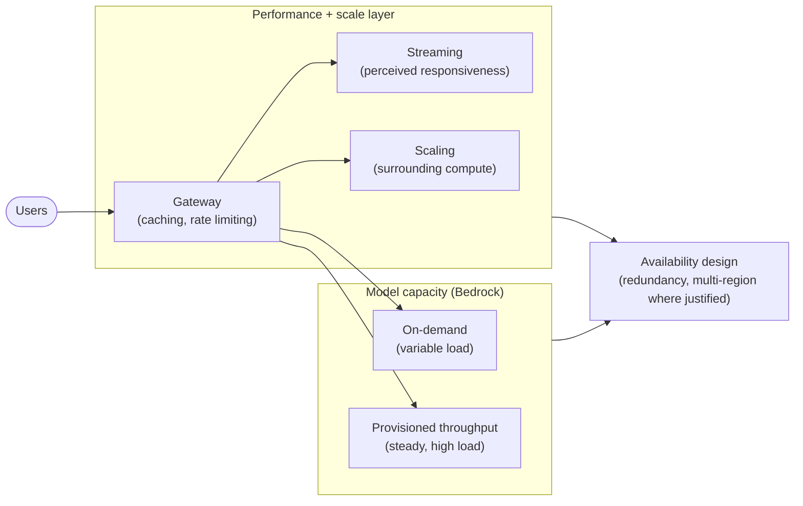
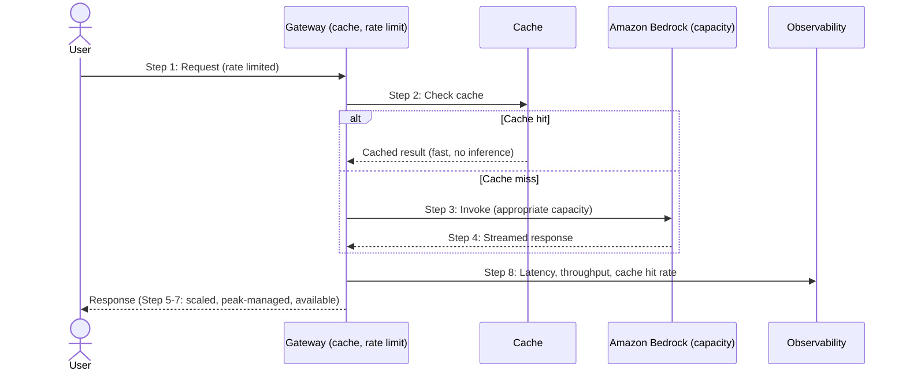

# Chapter 25: Performance, Scalability and Availability

A GenAI system that is resilient, observable and producing good output must also be fast enough, handle enough load, and be available when needed. Performance, scalability and availability are the operational qualities that determine whether a system is pleasant and dependable to use, or slow, overwhelmed and unreliable. They have appeared in passing throughout the book, latency as a model-selection input, streaming for responsiveness, caching at the gateway, throughput planning, and this chapter treats them together as an operational discipline.

GenAI puts a particular spin on these familiar concerns. Inference latency is often higher and more variable than a database query, and it scales with output length. Throughput is constrained by model capacity in ways ordinary compute is not. And availability now depends on the availability of models and their capacity, not only of your own infrastructure. The fundamentals of performance and scale engineering carry over, but they must be applied to a workload whose expensive, variable-latency, capacity-constrained core is the model.

---

## 1. The Architectural Problem

A GenAI system must meet expectations for speed, load and uptime that its raw components do not automatically satisfy. Inference can be slow, and users waiting on a long, silent response perceive the system as unresponsive even when it is working. Demand is uneven and can spike, and a system sized for the average will throttle or fail at the peak. Model capacity is finite, whether on-demand limits or provisioned throughput, and a system that ignores this will hit walls it did not anticipate. And availability depends on dependencies, models, gateway, retrieval, across regions and accounts, any of which can degrade.

The problem is that these qualities, if not designed for, default to poor. Latency that is not managed is latency the user suffers. Load that is not planned for overwhelms the system at exactly the moment it matters most. Availability that is not engineered is whatever the weakest dependency happens to provide. And because these qualities trade against cost, a system can also over-provide them, paying for performance, capacity and redundancy far beyond what the workload needs, which is waste rather than excellence.

The constraint is that performance, scalability and availability all trade against cost and against each other, and the right level of each is set by the workload's genuine requirements, not by a reflex to maximise. A high-availability, low-latency, high-throughput design is expensive, and appropriate only where the workload justifies it.

The architectural question is: how do we deliver the latency, throughput and availability the workload genuinely requires, given a model core that is slow, variable and capacity-constrained, at a cost proportionate to those requirements rather than maximised by default?

---

## 2. 🧩 The Pattern at a Glance

- **Pattern name:** GenAI Performance, Scalability and Availability
- **Problem solved:** Left undesigned, GenAI systems are slow, overwhelmed at peak and only as available as their weakest dependency; over-designed, they waste cost.
- **Primary objective:** Meet the workload's genuine latency, throughput and availability requirements at proportionate cost.
- **When to use:** Any production GenAI system with real performance, load or availability expectations, essentially all of them.
- **When not to use:** No genuine exception; the targets scale with the workload, but these qualities are always designed, not left to chance.
- **Key AWS services:** Amazon Bedrock on-demand and provisioned throughput (Chapter 5); streaming; caching at the gateway (Chapter 7); scaling of the surrounding compute; multi-region where justified.
- **Primary architectural concern:** Meeting requirements proportionately, given a slow, variable, capacity-constrained model core, without over-provisioning.

Performance, scalability and availability are engineered qualities, set to the workload's needs. The recurring theme is proportion: enough to meet the requirement, not maximised for its own sake.

---

## 3. The Architecture

The architecture applies performance, scale and availability techniques around the model core.

- **Streaming** returns output progressively, so users perceive responsiveness even when total generation takes time, addressing the latency of long responses.
- **Caching**, naturally placed at the gateway (Chapter 7), avoids repeated inference for repeated or similar requests, improving latency and reducing load and cost.
- **Capacity planning** matches inference capacity to demand: on-demand for variable load, provisioned throughput for high, steady load (Chapter 5), with awareness of limits.
- **Scaling** of the surrounding compute, gateway, application, retrieval, handles concurrency and load, using the familiar AWS scaling primitives.
- **Availability design** provides redundancy and, where justified, multi-region operation, so the system survives dependency and regional failures (connecting to resilience, Chapter 22).
- **Load management**, rate limiting and graceful handling of peaks, keeps the system stable under demand rather than overwhelmed.

The architecture surrounds the capacity-constrained model core with the techniques, streaming, caching, scaling, capacity planning, availability design, that turn its raw behaviour into the performance and dependability the workload requires.

---

## 4. Request and Data Flow

Tracing performance-relevant handling of a request:

> **Step 1:** A request arrives at the gateway, which applies rate limiting to protect the system under load.
> **Step 2:** The gateway checks the cache; a hit returns a result without inference, fast and cheap.
> **Step 3:** On a miss, the request proceeds to inference, drawing on capacity appropriate to the workload, on-demand or provisioned.
> **Step 4:** For a lengthy response, the model streams output, so the user sees progress immediately rather than waiting for completion.
> **Step 5:** Surrounding compute scales with concurrency, so many simultaneous requests are handled without degradation.
> **Step 6:** If capacity is constrained, the system manages the peak, queuing, shedding or degrading, rather than failing outright.
> **Step 7:** Availability design ensures a dependency or regional failure is survived where the workload's target requires it.
> **Step 8:** The response returns, and performance signals, latency, throughput, cache hit rate, feed observability.

The flow shows the techniques in sequence, rate limiting, caching, appropriate capacity, streaming, scaling, so that a request is served quickly and the system stays stable under load.

---

## 5. Why This Pattern Works

The techniques work because each addresses a specific characteristic of the GenAI workload. Streaming works because inference latency scales with output length and users perceive a streamed response as responsive long before it completes, converting a genuine latency into an acceptable experience. Caching works because many requests repeat or resemble earlier ones, and returning a cached result avoids the expensive, slow inference entirely, improving latency, load and cost at once, which is why the gateway is its natural home. Capacity planning works because model capacity is finite and distinct from ordinary compute, so matching capacity to demand, on-demand for variable, provisioned for steady, avoids both throttling and waste.

Scaling and load management work because demand is uneven, and a system that scales its surrounding compute with concurrency and manages peaks gracefully stays stable when a fixed-size system would be overwhelmed. Availability design works because the system depends on many components across regions, and redundancy plus, where justified, multi-region operation lets it survive failures that would otherwise take it down, connecting directly to the resilience of Chapter 22.

Above all, the pattern works because it is proportionate. Each quality is engineered to the workload's genuine requirement rather than maximised, so effort and cost concentrate where they matter. A design that meets its real targets at appropriate cost is better engineering than one that maximises performance everywhere and pays for capability the workload never needed.

---

## 6. 🏗️ Architectural Decisions

| Decision | Options | Recommended approach | Reason |
| --- | --- | --- | --- |
| Response delivery | Wait for full / Stream | Stream for lengthy responses | Perceived responsiveness |
| Repeated requests | Always infer / Cache | Cache at the gateway where applicable | Latency, load and cost at once |
| Capacity | On-demand / Provisioned | Match to load pattern (Chapter 5) | Avoid throttling and waste |
| Scaling | Fixed / Elastic | Elastic for surrounding compute | Handle uneven demand |
| Under peak | Fail / Manage gracefully | Rate limit, queue, shed or degrade | Stability over collapse |
| Availability | Best-effort / Targeted | Design to the workload's target | Proportionate uptime |

The defining principle is proportion: set latency, throughput and availability targets from the workload's genuine requirements, and engineer to those targets rather than maximising. Streaming and caching are frequently the highest-leverage moves, improving experience and cost together, and are worth reaching for early.

---

## 7. ⚖️ Trade-offs

**Benefits:** Responsiveness through streaming; lower latency, load and cost through caching; capacity matched to demand; stability under load; and availability appropriate to the workload, all at proportionate cost.

**Costs and limitations:** Each technique adds design and operational work. Caching introduces correctness concerns, a stale or wrongly-shared cached result is a bug or a leak, so caching must respect identity and freshness. Provisioned capacity costs whether used or not. Multi-region availability is expensive and complex. Over-provisioning any of these wastes money, which is as much a failure as under-providing.

**Complexity:** Moderate; the techniques are established, but applying them to a capacity-constrained model core and balancing them against cost takes judgement.

**Operational overhead:** Ongoing: capacity must be tuned to demand, caches maintained, scaling monitored, and availability verified.

**Security implications:** Mostly the caching concern, cached results must respect identity and permissions, or a cache becomes a cross-user leak, echoing the tenancy discipline of Chapter 3. Availability itself is a security property where uptime matters.

**Performance implications:** These are the performance concerns; the trade-offs are internal, streaming aids perceived latency, caching aids repeated requests, provisioned capacity aids steady load, each with its own applicability.

**Cost implications:** Central to this chapter. Performance, capacity and availability all cost, and the discipline is proportion: caching often reduces cost, provisioned capacity and multi-region increase it, and the right level is set by requirements, developed further in the next chapter.

---

## 8. 🔐 Security and Governance

Performance techniques mostly leave security unchanged, with one important exception: caching. A cache stores results to serve them again, and if a cached result is served to a user who should not see it, the cache has become a cross-user or cross-tenant leak, precisely the tenancy failure of Chapter 3. Caching must therefore respect identity and permissions: a result is reused only for a request genuinely entitled to it, and cached data is protected and residency-respecting like any store (Chapter 18). Freshness is the related concern, a stale cached result may be wrong, so caching must account for how long a result remains valid. Done carelessly, caching trades a performance gain for a correctness or security problem; done carefully, it is safe and highly effective.

Availability has a governance dimension where uptime is a genuine requirement, a business-critical system's availability target is a commitment that must be designed for and, ideally, demonstrable. Rate limiting, meanwhile, is both a stability and a security control, protecting the system against overload whether from legitimate demand or abuse. Otherwise, these qualities are engineering concerns whose security footprint is small, provided caching is handled with the tenancy and freshness discipline it requires.

---

## 9. 🌐 Networking

Networking bears on performance chiefly through latency and placement. Region choice affects latency, proximity of the model, the data and the users matters, so the residency-and-latency decisions of Chapter 5 are also performance decisions. Private paths (Chapter 17) are generally comparable to or better than public ones for latency, so security and performance align here. Multi-region availability, where justified, is a network-and-infrastructure design with its own connectivity and data-consistency implications. The point is that network topology and region placement are performance inputs as well as security ones, and the two considerations should be weighed together rather than separately.

---

## 10. ⚠️ Failure Modes and Resilience

Performance and availability failures connect directly to the resilience discipline of Chapter 22.

- **Latency degradation:** Responses become slow, harming experience; mitigated by streaming, caching, appropriate capacity, and timeouts that fail rather than hang.
- **Capacity exhaustion:** Demand exceeds model capacity, causing throttling; mitigated by capacity planning, provisioned throughput for steady load, and graceful peak management.
- **Overwhelm at peak:** Load exceeds what the system can handle, degrading or collapsing; mitigated by rate limiting, elastic scaling and load shedding.
- **Stale or leaked cache:** A cached result is out of date or served to the wrong user, a correctness or security failure; mitigated by freshness and identity-aware caching.
- **Dependency or regional failure:** A model, gateway or region degrades, affecting availability; mitigated by redundancy and, where justified, multi-region design, per Chapter 22.
- **Over-provisioning:** Excess capacity or redundancy that the workload does not need, a cost failure rather than an outage; mitigated by proportionate design.

The theme is that performance and availability failures are handled by the same designed-response discipline as all failures: engineer the response, size it to the requirement, and avoid both under- and over-provision.

---

## 11. 👁️ Observability and Operations

Performance and availability are managed through the observability of Chapter 23. The relevant signals, latency (including its distribution, not just the average), throughput, cache hit rate, capacity utilisation and throttling, availability and error rates, are what reveal whether the system is meeting its targets and where it is strained. Latency in particular should be watched as a distribution, because average latency can hide a poor experience for the slowest requests. Cache hit rate reveals both a performance and a cost lever. These signals turn performance and availability from assumptions into measured, managed properties.

Operationally, these qualities require ongoing tuning: capacity adjusted as demand patterns change, caches maintained, scaling thresholds and rate limits tuned, and availability verified, including testing failover where multi-region designs exist, which ties back to the "test resilience, don't assume it" discipline of Chapter 22. Performance and availability targets should be explicit, so operations knows what it is managing to, and monitored against, so drift away from target is caught. As throughout, these technical signals are distinct from AI quality: a fast, highly available system can still answer badly, which is why this chapter and the evaluation chapter are separate.

---

## 12. 💷 Cost and FinOps

Performance, scalability and availability are where operational quality meets cost most directly, and proportion is the governing principle. Each quality costs: provisioned throughput costs whether fully used or not, elastic scaling costs with load, redundancy and multi-region cost for the resilience they buy. Maximising all of them everywhere is a common and expensive mistake; the discipline is to set targets from the workload's genuine requirements and engineer to those, so a business-critical, low-latency, high-availability system is resourced accordingly while a routine internal tool is not.

Caching is the standout lever that improves both performance and cost: a cache hit avoids inference entirely, saving both latency and tokens, so a good cache hit rate directly reduces the largest GenAI cost driver. Capacity choice is a genuine cost-performance trade-off, provisioned throughput is economical only at high, steady utilisation, and using it below that is waste, while on-demand suits variable load. These interactions are developed in the next chapter on economics; here the point is that performance and availability decisions are cost decisions, and the right engineering is proportionate engineering, not maximal.

---

## 13. When to Use This Pattern

Use this pattern when:

- a production GenAI system has real expectations for latency, load or availability, essentially all of them;
- responses are lengthy enough that streaming improves experience;
- requests repeat or resemble one another enough that caching helps;
- demand is uneven or high enough to require capacity planning and scaling; or
- availability is a genuine requirement the system must meet.

These qualities must be engineered for any production system; the targets, and therefore the effort and cost, scale with the workload's requirements.

---

## 14. When NOT to Use This Pattern

There is no genuine case for leaving performance, scale and availability to chance in production; the question is the level, not whether to engineer them. Scale the effort when:

- an experimental or low-traffic system does not warrant elaborate scaling or multi-region availability, though streaming and basic capacity awareness still help; or
- a workload genuinely tolerates higher latency or lower availability, in which case designing for aggressive targets is over-provision.

Even minimal systems benefit from streaming and sensible capacity choices. The mistake this pattern guards against is both leaving these qualities undesigned, so they default to poor, and over-provisioning them beyond the workload's needs, so cost is wasted. Proportionate engineering to genuine targets is the goal.

---

## 15. Pattern Variations

- **Small organisation:** Streaming, basic caching and on-demand capacity, with straightforward scaling and single-region operation.
- **Medium enterprise:** Gateway caching, capacity matched to load patterns, elastic scaling, rate limiting, and availability designed to defined targets.
- **Large enterprise:** Comprehensive performance and availability engineering across the platform, provisioned throughput for steady high load, mature caching and scaling, and multi-region where criticality justifies it.
- **Highly critical enterprise:** Aggressive latency and availability targets with the redundancy, multi-region design and tested failover to match, resourced to the criticality.

The variations scale the targets and their supporting techniques with the workload's requirements and criticality, but streaming, sensible capacity and proportion are constant.

---

## 16. Architecture Decision Checklist

- [ ] Are latency, throughput and availability targets set from the workload's genuine requirements?
- [ ] Is streaming used for lengthy responses to improve perceived responsiveness?
- [ ] Is caching used where requests repeat, at the gateway, and does it respect identity and freshness?
- [ ] Is model capacity matched to the load pattern, on-demand or provisioned, with limits understood?
- [ ] Does surrounding compute scale elastically with concurrency?
- [ ] Are peaks managed gracefully, rate limiting, queuing, shedding, rather than met with collapse?
- [ ] Is availability designed to the workload's target, with redundancy and multi-region only where justified?
- [ ] Is latency watched as a distribution, not just an average?
- [ ] Are cache hit rate and capacity utilisation monitored as performance and cost levers?
- [ ] Is the design proportionate, meeting targets without over-provisioning?

---

## 17. 📐 The Architect's Verdict

> Performance, scalability and availability are engineered qualities, and for GenAI they must be engineered around a model core that is slow, variable in latency and constrained in capacity. The fundamentals carry over from cloud architecture; what changes is the workload they apply to. Streaming turns genuine latency into acceptable experience, caching improves responsiveness, load and cost together and is often the highest-leverage move, capacity planning matches finite model capacity to demand, and availability design lets the system survive the failures resilience anticipates. The governing principle is proportion: set targets from the workload's real requirements and engineer to them, because both under-designing, leaving these qualities to default to poor, and over-designing, paying for performance and redundancy the workload never needed, are failures. Watch latency as a distribution and cache hit rate as a lever, handle caching with tenancy and freshness discipline so a performance gain does not become a leak, and test availability rather than assume it. Meet the requirement well and no more: that is the difference between engineering and gold-plating.
