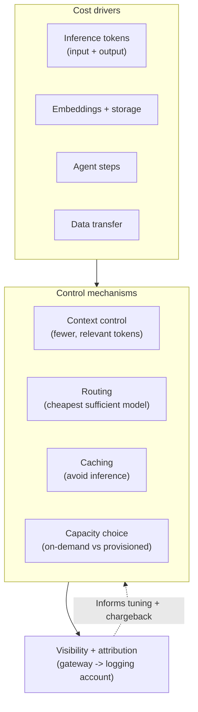
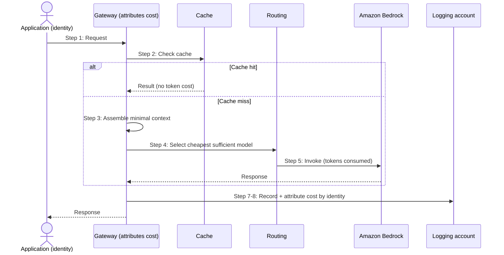

# Chapter 26: The Economics of GenAI and FinOps

Cost has appeared in every chapter of this book, deliberately, because a GenAI system that is not economically sustainable will not survive contact with a budget, however well it is architected. Tokens as the currency of GenAI, routing to cheaper models, caching to avoid inference, controlled context, bounded agents, provisioned throughput economics, each chapter noted the cost dimension of its pattern. This chapter gathers those threads into a coherent economic discipline: understanding what drives GenAI cost, and applying the architectural mechanisms that control it.

The framing matters. GenAI cost is not a bill to be received and lamented; it is a property of the architecture, shaped by design decisions the architect makes. A system can be architected to be cheap or expensive for the same functionality, and the difference lies in choices this book has already introduced. FinOps for GenAI is the practice of making those choices deliberately, seeing the cost they produce, and attributing it to those who incur it, so that GenAI is commercially sustainable rather than a runaway expense. This chapter avoids invented figures; the economics here are structural, and the specific numbers depend on models, usage and pricing that change.

---

## 1. The Architectural Problem

A GenAI system consumes cost in ways that are easy to lose control of. Every inference costs, priced in tokens, and both the input and the output count. Retrieval adds embedding and storage cost and, more significantly, adds context tokens to every request. Agents multiply inference across their steps. State accumulates storage over time. Networking, especially cross-account data transfer, adds its own cost. And all of this scales with usage, so a system that is affordable in pilot can become expensive at production volume.

The problem is that, without deliberate design and visibility, GenAI cost is both higher than it needs to be and invisible. Higher, because a system that sends large contexts to powerful models for every request, including trivial ones, pays far more than a well-designed one for the same outcomes. Invisible, because in a fragmented estate cost is scattered across accounts and services with no aggregated view, so no one can say what GenAI costs in total, which team drives it, or which decisions would reduce it. Cost that is neither controlled nor seen becomes a surprise, and surprises erode confidence in the whole endeavour.

The constraint is that cost trades against capability, latency and quality, and the goal is not minimum cost but sustainable cost: the outcomes the enterprise needs, at a cost it can justify and sustain. Cutting cost by degrading quality below what the workload requires is a false economy, just as paying for capability the workload does not need is waste.

The architectural question is: how do we understand and control the drivers of GenAI cost through architectural mechanisms, and make cost visible and attributable, so that GenAI delivers the outcomes the enterprise needs at a cost it can sustain?

---

## 2. 💷 The Pattern at a Glance

- **Pattern name:** GenAI Economics and FinOps
- **Problem solved:** GenAI cost is easily higher than needed and invisible, becoming unsustainable and unmanageable.
- **Primary objective:** Sustainable cost through architectural control of the drivers, plus visibility and attribution of spend.
- **When to use:** Any GenAI system at meaningful scale; cost management is intrinsic to production operation.
- **When not to use:** No genuine exception at scale; the rigour scales with spend, but cost awareness is always warranted.
- **Key AWS services:** The cost-bearing components, Bedrock inference, retrieval stores, agents, state, data transfer, with the levers of routing (Chapter 10), caching (Chapter 25), context control, and the aggregated cost visibility of the logging account (Chapter 14).
- **Primary architectural concern:** Cost as an architectural property, controlled by design and made visible and attributable.

FinOps for GenAI is the discipline of treating cost as something designed, seen and owned, rather than received and lamented. Its levers are the patterns of this book, applied with cost in mind.

---

## 3. The Architecture

The economic architecture combines cost drivers, control mechanisms and visibility.

- **Cost drivers** are understood: inference tokens (input and output), embedding generation, vector and state storage, agent steps, data transfer, and the running cost of platform components.
- **Token control** manages the largest driver: sending only the context a request needs, retrieving fewer and more relevant chunks, and avoiding needlessly verbose prompts and outputs.
- **Routing** (Chapter 10) directs requests to the cheapest model that serves them well, reserving expensive models for requests that need them.
- **Caching** (Chapter 25) avoids inference entirely for repeated or similar requests, removing cost as well as latency.
- **Capacity choice** (Chapter 5) matches on-demand or provisioned throughput to the load pattern, avoiding both throttling cost and idle-reservation waste.
- **Visibility and attribution**, through the gateway and aggregated in the logging account (Chapter 14), show total cost, attribute it per team, and enable allocation and chargeback.

The architecture connects drivers to levers to visibility: understand what costs, apply the mechanisms that control it, and see and attribute the result so control is informed and owned.

---

## 4. Request and Data Flow

Tracing the cost dimension of a request:

> **Step 1:** A request arrives at the gateway, which will attribute its cost to the calling identity.
> **Step 2:** Caching is checked; a hit serves the result without inference, incurring no token cost.
> **Step 3:** On a miss, context is assembled with only what the request needs, controlling input tokens, the largest lever.
> **Step 4:** Routing selects the cheapest model that serves the request well, avoiding paying for unneeded capability.
> **Step 5:** Inference runs on capacity matched to the load pattern, and consumes input and output tokens, the core cost.
> **Step 6:** Any retrieval, agent steps or state access add their own costs, minimised by the same discipline.
> **Step 7:** The cost of the request, tokens, model, components, is recorded and attributed to the identity.
> **Step 8:** Costs aggregate in the logging account, giving total spend, per-team attribution, and the basis for allocation, chargeback and optimisation.

The flow shows cost being controlled at each step, caching, context, routing, appropriate capacity, and attributed at the end, so spend is both minimised and visible.

---

## 5. Why This Pattern Works

The economics work because cost is genuinely a function of architecture, and the levers this book has built directly reduce the drivers. Token control works because tokens are the largest and most direct cost, and every unnecessary token, in a bloated prompt, an over-large retrieved context, a verbose output, is money spent for nothing; sending only what is needed cuts cost proportionally. Routing works because most traffic is simple and does not need an expensive model, so directing the many simple requests to cheaper models while reserving powerful ones for the few that need them reduces total spend substantially, since the simple requests dominate by volume. Caching works because a cached result avoids inference entirely, removing the token cost of a repeated request rather than merely reducing it.

Capacity choice works because model capacity is priced differently by commitment, and matching on-demand to variable load and provisioned throughput to high, steady load avoids both throttling and paying for idle reservation. Each lever attacks a specific driver, which is why deliberate cost design achieves what hoping for a lower bill cannot.

Visibility and attribution work because control requires seeing what you spend and who spends it. Aggregating cost through the gateway into the logging account turns fragmented, invisible spend into a total the enterprise can see, attribute per team, and act on, enabling the allocation, chargeback and informed decisions that the federated model (Chapter 14) makes possible. Cost that is seen and owned is cost that gets managed; cost that is invisible grows unchecked.

---

## 6. 🏗️ Architectural Decisions

| Decision | Options | Recommended approach | Reason |
| --- | --- | --- | --- |
| Context | Generous / Minimal necessary | Only what the request needs | Tokens are the largest driver |
| Model choice | Powerful for all / Routed | Cheapest sufficient per request (Chapter 10) | Do not pay for unneeded capability |
| Repeated requests | Always infer / Cache | Cache where applicable (Chapter 25) | Avoid inference cost entirely |
| Capacity | Fixed choice / Matched to load | On-demand or provisioned to fit (Chapter 5) | Avoid throttling and idle waste |
| Agent use | Agent by default / Only when needed | Reserve agents for genuine need | Agents multiply inference cost |
| Visibility | Fragmented / Aggregated + attributed | Aggregated in logging account | See, attribute and control spend |

The defining principle is that cost is designed, not received. The largest levers are context control and routing, because tokens and model choice dominate cost, and caching where requests repeat. And spend must be made visible and attributable, because unseen cost is uncontrolled cost.

---

## 7. ⚖️ Trade-offs

**Benefits:** Sustainable cost for the outcomes needed; the largest drivers controlled by design; spend made visible and attributable; allocation and chargeback enabled; and cost optimisation grounded in data rather than guesswork.

**Costs and limitations:** Cost optimisation is effort, and it trades against other qualities: aggressive token trimming or cheaper routing can degrade quality if pushed too far, so optimisation must be validated against quality (Chapter 24). Cost visibility requires the observability of Chapter 23, which itself costs. And chasing marginal savings can consume more effort than it returns.

**Complexity:** Moderate; the levers are largely patterns already built, applied with cost in mind, plus the visibility infrastructure.

**Operational overhead:** Ongoing: cost must be monitored, attributed, and optimisation tuned as usage, models and prices change.

**Security implications:** Largely neutral. The main caution is that cost optimisation must not weaken controls, a cheaper path must still enforce security and guardrails, echoing the fail-safe principle of Chapter 22.

**Performance implications:** Several cost levers also improve performance, caching and context control help both, while some trade off, an aggressively cheap model may be lower quality, so cost and the other qualities must be balanced, not optimised in isolation.

**Cost implications:** This is the cost chapter; the trade-off is sustainable cost against the risk of degrading quality or over-investing in optimisation. The goal is the needed outcomes at a justifiable cost, not minimum cost.

---

## 8. 🔐 Security and Governance

Cost management intersects governance more than security. The main security caution is that cost optimisation must not compromise controls: a cheaper model, a cached result or a trimmed context must still be reached under the same access, guardrail and identity controls as any other path, and caching in particular must respect identity and freshness (Chapter 25) so that a cost saving does not become a leak. Cost pressure should never be an excuse to weaken security, the fail-safe discipline applies to economics as to resilience.

Governance, by contrast, depends heavily on cost visibility. Attributing spend per team, enabled by identity reaching the gateway and aggregated in the logging account, is what makes cost a governed, owned concern rather than an unattributed enterprise expense. This is the federated cost governance of Chapter 14: central visibility and policy, with teams accountable for their own consumption. It lets the enterprise allocate cost, charge it back, set budgets, and make informed investment decisions, and it lets leadership see whether GenAI is delivering value for its cost. Cost governance also guards against runaway spend, an unbounded agent or an uncached high-volume workload is a cost risk as well as an operational one, and visibility is what surfaces it before it becomes a shock.

The steering discipline of this book applies here too: this chapter deliberately avoids invented figures, because fabricated cost savings or ROI claims would be dishonest. The economics are structural, tokens dominate, routing and caching reduce spend, provisioned capacity pays off at high utilisation, and the actual numbers depend on models, usage and pricing that each enterprise must measure for itself.

---

## 9. 🌐 Networking

Networking is a genuine and often overlooked cost driver, chiefly through data transfer. In a federated multi-account estate, prompts, retrieved context and responses move between accounts and to the logging account, and cross-account and cross-region data transfer accrues cost that grows with volume. The main lever is topology: placing components so that less data crosses boundaries, keeping retrieval close to the data it serves, and being deliberate about which flows cross which accounts, controls transfer cost, connecting to the placement discussion of Chapter 17. Private connectivity components have their own cost, justified by security, but the transfer volume they carry is the larger economic variable and should be considered in the network design rather than discovered on the bill.

---

## 10. ⚠️ Failure Modes and Resilience

The failure modes here are the ways cost runs away or optimisation backfires.

- **Runaway cost:** An unbounded agent, an uncached high-volume workload, or unmanaged context drives spend up rapidly; mitigated by bounds, caching, context control and monitoring.
- **Invisible cost:** Fragmented, unattributed spend that no one sees until the bill arrives; mitigated by aggregated visibility and attribution.
- **Over-optimisation degrading quality:** Trimming tokens or routing to cheaper models too aggressively degrades output below what the workload needs, a false economy; mitigated by validating optimisation against evaluation (Chapter 24).
- **Idle reservation waste:** Provisioned capacity paid for but under-used; mitigated by matching capacity to genuine, sustained load.
- **Optimisation weakening controls:** A cheaper path that bypasses security or guardrails; mitigated by the fail-safe discipline, cost never overrides control.
- **Marginal-saving effort:** Effort spent chasing small savings that exceeds their value; mitigated by focusing on the large levers, tokens, routing, caching.

The theme is that cost fails either by running away unseen or by being cut in ways that damage quality or security, so the discipline is to control the large drivers, keep spend visible, and validate that savings do not degrade what matters.

---

## 11. 👁️ Observability and Operations

Cost management depends entirely on the observability of Chapter 23, because cost is measured in the signals observability captures, above all tokens, but also model usage, cache hit rate, agent steps, storage and data transfer. Without this data, cost cannot be understood, attributed or optimised; with it, aggregated in the logging account, cost becomes a managed, per-team, per-workload property. Cost signals belong on operational dashboards alongside performance and quality, and cost anomalies, a sudden rise, a workload with an unexpectedly high cost per request, should raise attention as readily as an error spike.

Operationally, FinOps for GenAI is a continuous practice: monitoring spend and its drivers, attributing cost, tuning the levers as usage patterns shift and as models and prices change, and validating that optimisations preserve quality. It is federated in the same way as governance, central visibility and policy, team accountability for consumption, so teams see and own their own cost. This ongoing practice is what keeps GenAI economically sustainable as it scales, catching runaway cost early and ensuring the enterprise continues to get value for its spend. As throughout, cost signals are distinct from quality, and the two must be balanced, since the cheapest option is not always good enough.

---

## 12. 💷 Cost and FinOps

This chapter is the cost chapter, so this section states the economic principles plainly. GenAI cost is dominated by tokens, so context control and routing are the largest levers, and caching, by avoiding inference, is the most complete saving where it applies. Provisioned capacity is economical only at high, sustained utilisation; below that, on-demand is cheaper. Agents and multi-step work multiply cost and should be reserved for genuine need. Storage and data transfer accumulate and should be controlled through retention and topology.

The governing goal is sustainable cost, not minimum cost: the enterprise needs the outcomes at a cost it can justify, and cutting below the quality the workload requires is a false economy, just as paying for unneeded capability is waste. The most reliable way to achieve sustainable cost at scale is through the platform: when routing, caching, context discipline and cost attribution are built into the Core GenAI platform and its paved roads (Chapters 15 and 16), teams inherit cost-efficient patterns and visible, attributed spend by default, rather than each rediscovering, or failing to rediscover, good cost practice. Cost management, like security and governance, is cheaper and more reliable as a platform property than as a per-team effort. And, as noted, the specific numbers are for each enterprise to measure; this book asserts the structure of GenAI cost, not invented figures for it.

---

## 13. When to Use This Pattern

Use this pattern when:

- a GenAI system operates at meaningful scale, where cost matters and can run away;
- the largest drivers, tokens and model choice, can be controlled through context discipline and routing;
- repeated requests make caching worthwhile;
- spend must be visible and attributable for allocation, chargeback or investment decisions; or
- the enterprise must ensure GenAI is commercially sustainable.

Cost management is intrinsic to operating GenAI at scale; the rigour scales with spend, but cost awareness is warranted from the start.

---

## 14. When NOT to Use This Pattern

There is no genuine case for ignoring cost in a system at scale; the question is rigour, not existence. Scale the effort when:

- a small, low-volume or experimental system has trivial cost, where heavy FinOps machinery is disproportionate, though basic awareness still helps; or
- the effort of chasing a marginal saving would exceed its value, in which case focus on the large levers and leave the small ones.

Even small systems benefit from sensible defaults, controlled context, appropriate models, caching where easy. The mistake this pattern guards against is both letting cost run away unseen and unmanaged, and the opposite, optimising cost so aggressively that quality or security suffers, or spending more effort on optimisation than it returns. Sustainable, proportionate cost management is the goal.

---

## 15. Pattern Variations

- **Small organisation:** Sensible cost defaults, controlled context, appropriate model choice, easy caching, with basic spend awareness.
- **Medium enterprise:** Routing and caching at the gateway, context discipline, capacity matched to load, and cost attributed per team through aggregated visibility.
- **Large enterprise:** Comprehensive FinOps across the platform, all levers applied and tuned, full cost attribution and chargeback, and cost optimisation validated against quality, integrated with governance.
- **Highly cost-sensitive enterprise:** Rigorous, continuous optimisation of every driver, detailed attribution, and tight budget governance, always balanced against quality.

The variations scale the rigour and formality of cost management with spend and sensitivity, but controlling the large drivers and making cost visible are constant.

---

## 16. Architecture Decision Checklist

- [ ] Is context kept to only what each request needs, controlling the largest cost driver?
- [ ] Are requests routed to the cheapest model that serves them well?
- [ ] Is caching used where requests repeat, avoiding inference cost, with identity and freshness respected?
- [ ] Is capacity, on-demand or provisioned, matched to the genuine load pattern?
- [ ] Are agents reserved for genuine need rather than used where a simpler pattern would cost far less?
- [ ] Is spend made visible and attributed per team through aggregated cost data?
- [ ] Are cost optimisations validated against quality so savings do not degrade output?
- [ ] Do cheaper paths still enforce security and guardrails, never trading control for cost?
- [ ] Is data-transfer cost across accounts considered in the topology?
- [ ] Are cost-efficient patterns and attribution built into the platform so teams inherit them?

---

## 17. 📐 The Architect's Verdict

> GenAI cost is a property of the architecture, not a bill to be received, and the same functionality can be made cheap or expensive by the decisions an architect makes. Cost is dominated by tokens, so the largest levers are context discipline, sending only what a request needs, and routing, using the cheapest model that serves each request well, with caching removing inference cost entirely where requests repeat, and capacity matched to load to avoid both throttling and idle waste. The goal is sustainable cost, the outcomes the enterprise needs at a cost it can justify, not minimum cost, because cutting below the quality a workload requires is a false economy and paying for unneeded capability is waste. Make spend visible and attributable through the gateway and the logging account, so cost is owned per team and runaway spend is caught early, and validate optimisations against quality so savings are real. Never let cost pressure weaken security or guardrails. Build the cost-efficient patterns into the platform so teams inherit them by default. And measure your own numbers: the structure of GenAI cost is knowable, but the figures are yours to find, not to assume.
