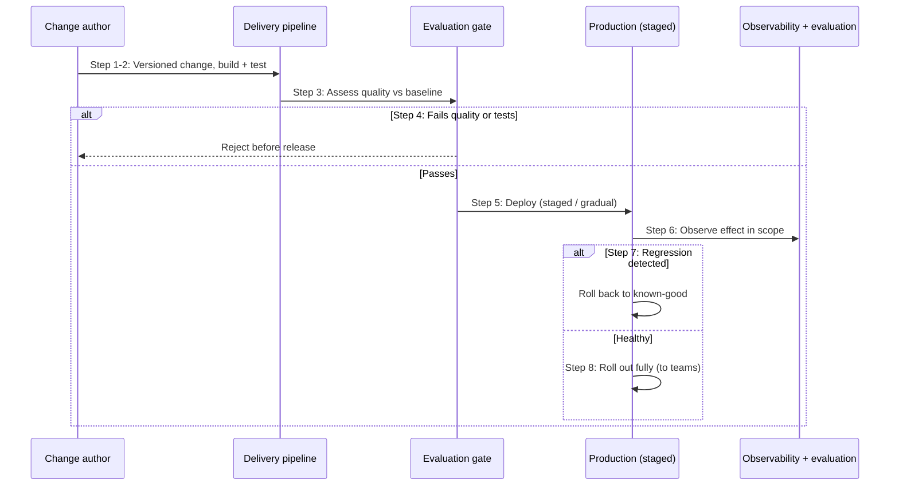

# Chapter 27: Delivery, Deployment and Change

The operations chapters so far have addressed running a GenAI system: keeping it resilient, observable, good, performant and affordable. This final chapter of Part V addresses changing it. GenAI systems are not built once and left alone; they evolve continuously. Prompts are refined, models are updated or swapped, retrieval configurations are tuned, agents are adjusted, and the underlying infrastructure changes. Each change is an opportunity to improve, and a risk of breaking or degrading what worked. Delivery, deployment and change management is the discipline of making those changes safely.

GenAI adds a distinctive twist to a familiar discipline. In a conventional system, a change is largely to code, and tests verify behaviour deterministically. In a GenAI system, the things that change include prompts, model choices and retrieval configurations, whose effect is on probabilistic quality that cannot be verified by conventional tests alone. This is why the delivery discipline of this chapter connects so tightly to the evaluation discipline of Chapter 24: for GenAI, the gate that decides whether a change is safe to release is, crucially, a quality gate, not only a functional one.

---

## 1. The Architectural Problem

A GenAI system in production must change, and change is where working systems break. A refined prompt may improve some responses and quietly degrade others. A new model may be better on average but worse for a particular task the system relies on. A retrieval tuning may help common queries and hurt edge cases. An infrastructure change may disrupt teams depending on a shared platform. Each change carries the risk of regression, and in GenAI that regression is often a silent quality regression, invisible to functional tests and detectable only by evaluation.

The problem is that, without a delivery discipline, change is unsafe and untraceable. Changes made ad hoc, without versioning, cannot be reproduced or rolled back. Changes released without evaluation may degrade quality with no one noticing until users lose trust. Changes to a shared platform, pushed carelessly, break the many teams that depend on it. And a system whose prompts, models and configurations are not versioned cannot answer the basic question of what changed when something goes wrong.

The constraint is that the things that change in GenAI are broader than code, prompts, models, retrieval configurations, agents, as well as infrastructure, and their effect is on probabilistic quality. So the delivery discipline must version all of these, and must gate changes on evaluation, not only on functional correctness, because a change can be functionally correct and qualitatively worse.

The architectural question is: how do we deliver changes to a GenAI system, code, prompts, models, retrieval, agents, infrastructure, safely, reproducibly and reversibly, gating them on quality as well as correctness, across a federated estate of many dependent teams?

---

## 2. 🧩 The Pattern at a Glance

- **Pattern name:** GenAI Delivery and Change Management
- **Problem solved:** Change is where GenAI systems break, often through silent quality regression that functional tests miss, and ad hoc change is unsafe, irreversible and untraceable.
- **Primary objective:** Safe, reproducible, reversible delivery of all GenAI changes, gated on quality as well as correctness.
- **When to use:** Any evolving production GenAI system, essentially all of them; systems change.
- **When not to use:** No genuine exception for production; rigour scales with the system's criticality and rate of change.
- **Key AWS services:** Infrastructure as code and delivery pipelines; the evaluation discipline (Chapter 24) as the quality gate; versioned artefacts; the federated platform (Chapters 14-16) as the delivery context.
- **Primary architectural concern:** Versioning the full set of GenAI artefacts and gating changes on evaluation, safely across a federated estate.

Delivery for GenAI extends familiar CI/CD with two GenAI-specific requirements: version more than code, and gate on quality, not just tests.

---

## 3. The Architecture

The architecture applies disciplined delivery to the full set of GenAI artefacts.

- **Versioned artefacts** cover everything that changes: code, prompts, model choices and configurations, retrieval configurations, agent definitions, and infrastructure.
- **Infrastructure as code** defines the platform and its capabilities, so infrastructure changes are reproducible and reviewable.
- **Delivery pipelines** carry changes through build, test and release in a controlled, repeatable way.
- **Evaluation gates** (Chapter 24) assess a change's effect on quality before release, so quality regression is caught before it reaches users, not after.
- **Deployment strategies**, staged or gradual release, let a change be exposed carefully and its effect observed before full rollout.
- **Rollback** restores the previous known-good version quickly when a change proves harmful, made possible by versioning everything.
- **Federated delivery** respects the estate: platform changes are delivered reliably to dependent teams, and teams deliver their own changes within the framework.

```mermaid
flowchart LR
    subgraph Artefacts["Versioned artefacts"]
        Code["Code"]
        Prompt["Prompts"]
        Model["Model choices"]
        Retr["Retrieval config"]
        Agent["Agent definitions"]
        Infra["Infrastructure (IaC)"]
    end

    Pipeline["Delivery pipeline<br/>(build, test)"]
    Gate["Evaluation gate<br/>(quality + correctness)"]
    Deploy["Deployment strategy<br/>(staged / gradual)"]
    Prod["Production"]
    Rollback["Rollback<br/>(to known-good version)"]

    Artefacts --> Pipeline
    Pipeline --> Gate
    Gate -->|Pass| Deploy
    Gate -->|Fail| Artefacts
    Deploy --> Prod
    Prod -.->|On regression| Rollback
    Rollback -.-> Prod
```

The architecture threads every kind of GenAI artefact through a pipeline that includes an evaluation gate, deploys carefully, and can roll back, so change is safe, reproducible and reversible.

---

## 4. Request and Data Flow

Tracing a change from proposal to production:

> **Step 1:** A change is proposed to any GenAI artefact, code, a prompt, a model choice, a retrieval configuration, an agent, or infrastructure, as a versioned change.
> **Step 2:** The delivery pipeline builds the change and runs functional tests for correctness.
> **Step 3:** An evaluation gate assesses the change's effect on quality, comparing against the current baseline (Chapter 24).
> **Step 4:** If the change degrades quality or fails tests, it is rejected before release, not discovered in production.
> **Step 5:** A passing change is deployed using a staged or gradual strategy, exposed to a limited scope first.
> **Step 6:** Its effect is observed in that scope, technical signals and quality, before wider rollout.
> **Step 7:** If it proves harmful, it is rolled back to the previous known-good version quickly.
> **Step 8:** For a shared platform, the change is delivered reliably to dependent teams; for a team's own system, within the federated framework.

The flow shows the safeguards in sequence: version, build, test, gate on quality, deploy carefully, observe, roll back if needed, so a change is proven safe before it fully lands.

---

## 5. Why This Pattern Works

The discipline works because it treats change as a managed risk rather than an act of faith. Versioning everything that changes, not only code but prompts, models, retrieval and agents, means every change is reproducible, traceable and reversible, so the question "what changed?" always has an answer and any change can be undone. This alone transforms change from a source of untraceable breakage into a controlled operation.

It works because it gates on quality, which is the GenAI-specific insight. Conventional CI/CD gates on functional tests, but a GenAI change can pass every functional test and still degrade quality, since quality is probabilistic and not captured by deterministic tests. By making evaluation (Chapter 24) a gate, the discipline catches quality regression before release, which is the failure most likely to slip through otherwise, precisely because it is silent. This is why delivery and evaluation are so tightly linked for GenAI: the gate that matters most is the quality gate.

And it works because careful deployment and ready rollback contain the risk that a gate cannot fully eliminate. Staged or gradual rollout exposes a change to a limited scope first, so any problem the gate missed affects few before it is caught; rollback, enabled by versioning, restores the known-good state quickly. Across a federated estate, reliable delivery means platform changes reach dependent teams without breaking them, and teams change their own systems within the framework, so change scales without becoming chaos. Managed, gated, reversible change is what lets a GenAI system evolve continuously without continuously breaking.

---

## 6. 🏗️ Architectural Decisions

| Decision | Options | Recommended approach | Reason |
| --- | --- | --- | --- |
| What is versioned | Code only / All GenAI artefacts | Code, prompts, models, retrieval, agents, infra | Reproducible, traceable, reversible |
| Infrastructure | Manual / As code | Infrastructure as code | Reproducible and reviewable |
| Release gate | Functional tests only / + evaluation | Gate on quality and correctness | Catch silent quality regression |
| Deployment | All at once / Staged or gradual | Staged or gradual | Contain the effect of a change |
| Rollback | None / To known-good version | Ready rollback | Recover quickly from harm |
| Federated delivery | Ad hoc / Reliable, framework-based | Reliable delivery within the framework | Change without breaking teams |

The two defining decisions are GenAI-specific: version the full set of artefacts, not just code, and gate changes on evaluation, not just tests. Together they address the reality that GenAI change is broader than code and its risk is largely to probabilistic quality.

---

## 7. ⚖️ Trade-offs

**Benefits:** Safe, reproducible, reversible change; silent quality regression caught before release; careful rollout containing residual risk; reliable delivery across a federated estate; and the confidence to evolve the system continuously.

**Costs and limitations:** The discipline is effort: pipelines, versioning of many artefact types, evaluation gates, and rollback all take work to build and maintain. Evaluation gates depend on good evaluation, which is itself hard (Chapter 24), and a weak gate gives false confidence. Staged rollout and rollback add operational complexity.

**Complexity:** Moderate; it extends familiar CI/CD, but versioning GenAI-specific artefacts and integrating quality gates adds new dimensions.

**Operational overhead:** Ongoing: pipelines and gates to maintain, versioned artefacts to manage, and deployments to operate and observe.

**Security implications:** Positive: disciplined, versioned, reviewable delivery is more secure than ad hoc change, since changes are traceable and reversible, and infrastructure as code is reviewable for security. Delivery pipelines themselves must be secured, as they can change production.

**Performance implications:** None at runtime; this is a delivery-time concern, though staged rollout briefly runs mixed versions.

**Cost implications:** Pipelines, evaluation gates and staging have cost, justified by the far greater cost of an unsafe change degrading quality or breaking teams in production.

---

## 8. 🔐 Security and Governance

Disciplined delivery is itself a security and governance strength. Versioned, reviewable, reproducible change is inherently more secure and governable than ad hoc change: every change is traceable to who made it and what it altered, changes can be reviewed before release, and anything harmful can be rolled back. Infrastructure as code makes the platform's configuration reviewable and auditable, so security properties can be inspected rather than discovered. The delivery pipeline is thus part of the governance apparatus, providing the change record and control that governance (Chapter 21) requires.

The pipeline must itself be secured, because it can change production: access to it should be least-privilege and its actions audited, since a compromised delivery pipeline is a path to compromising every system it delivers to. Evaluation gates serve governance as well as quality, they provide evidence that changes were assessed before release, and they enforce that quality (a responsible-AI concern) is maintained through change, not just at launch. In a federated estate, delivery discipline is what lets central governance ensure changes across many teams meet the framework's standards while teams retain the autonomy to change their own systems, the federation of Part III applied to change. Governed change is change that is reviewed, gated, traceable and reversible.

---

## 9. 🌐 Networking

Networking is a minor concern for delivery, arising mainly where changes affect the connectivity of Chapter 17. Infrastructure-as-code definitions include network configuration, so network changes are versioned, reviewable and reversible like any other, which is valuable given that a network misconfiguration can silently expose data (Chapter 17's principal risk). Delivery pipelines that provision infrastructure should provision correct, private, least-privilege connectivity by default, echoing the golden-path principle of Chapter 16, so that changes cannot accidentally introduce insecure network access. The point is simply that network configuration is one of the artefacts the delivery discipline versions and gates, which makes network changes as safe and traceable as any other.

---

## 10. ⚠️ Failure Modes and Resilience

The failure modes of change management are the ways change breaks systems.

- **Silent quality regression:** A change degrades quality while passing functional tests, reaching users undetected, the defining GenAI change failure, mitigated by evaluation gates.
- **Unversioned change:** A change to a prompt, model or configuration is not versioned, so it cannot be reproduced or rolled back, and "what changed?" cannot be answered.
- **Unsafe rollout:** A change is released everywhere at once, so a problem affects everyone before it is caught; mitigated by staged or gradual deployment.
- **No rollback:** A harmful change cannot be quickly undone, prolonging the damage; mitigated by versioning everything and readying rollback.
- **Weak gate:** An evaluation gate that does not genuinely assess quality gives false confidence, letting regressions through; mitigated by sound evaluation (Chapter 24).
- **Breaking dependent teams:** A shared-platform change pushed carelessly breaks the teams that depend on it; mitigated by reliable, framework-based federated delivery.
- **Compromised pipeline:** An insecure delivery pipeline becomes a path to compromise production; mitigated by securing and auditing the pipeline.

The theme is that change is the primary source of breakage, and its most dangerous form in GenAI is the silent quality regression, so the discipline centres on gating quality, versioning everything, and being able to roll back.

---

## 11. 👁️ Observability and Operations

Delivery depends on the observability and evaluation of the preceding chapters. Evaluation (Chapter 24) is the quality gate and the means of detecting regression after a staged deployment; observability (Chapter 23) provides the technical signals that confirm a change is healthy in its initial scope before wider rollout. Together they let a change be judged, before release by the gate, and after partial release by observation, so that both functional and quality effects are seen. Watching a change's effect during staged rollout is what turns deployment from a leap into a controlled, observed step.

Operationally, delivery is a continuous practice: maintaining pipelines and gates, managing versioned artefacts, operating deployments, and being ready to roll back. It is federated like the rest of the platform: central delivery of shared platform changes, with teams delivering their own within the framework. The discipline connects to the "test, don't assume" theme throughout Part V, a rollback path that has never been exercised may not work when needed, so deployment and rollback should be practised, not merely designed. As always, the technical and quality signals it relies on are distinct disciplines that together give the full picture of whether a change is safe.

---

## 12. 💷 Cost and FinOps

Delivery discipline has a cost, pipelines, evaluation gates, staging environments, and the effort to maintain them, but it is modest against the cost of unsafe change. A quality regression released to production erodes trust and may drive bad outcomes; a shared-platform change that breaks dependent teams disrupts many at once; an unversioned change that cannot be rolled back prolongs any damage. Disciplined delivery prevents these, and prevention is far cheaper than remediation.

Evaluation gates carry the evaluation cost of Chapter 24, since assessing a change's quality effect consumes evaluation resources, and this is a sound investment because it catches expensive regressions before release. The main efficiency lever, consistent with the rest of the book, is the platform: when versioning, pipelines, evaluation gates and deployment strategies are provided as platform capabilities and paved roads (Chapters 15 and 16), teams inherit safe delivery by default rather than each building it, which is both cheaper and more reliable than per-team delivery machinery. Delivery discipline built into the platform makes safe change the default and its cost shared.

---

## 13. When to Use This Pattern

Use this pattern when:

- a production GenAI system will change over time, essentially always;
- changes span prompts, models, retrieval and agents as well as code and infrastructure;
- quality regression must be caught before release, requiring evaluation gates; or
- changes to a shared platform must be delivered reliably to dependent teams.

Delivery discipline is required for any evolving production system; its rigour scales with the system's criticality and how often it changes.

---

## 14. When NOT to Use This Pattern

There is no genuine case for undisciplined change to a production system; the question is rigour, not existence. Scale the effort when:

- an experimental or throwaway system does not warrant full pipelines and gates, though versioning and the ability to revert still help; or
- a system changes very rarely and simply, where lighter delivery may suffice, provided changes are still versioned and evaluated.

Even minimal systems benefit from versioning and a way to roll back. The mistake this pattern guards against is ad hoc, unversioned, ungated change, especially trusting functional tests alone for a system whose real risk is silent quality regression, and, conversely, building delivery machinery heavier than a simple system warrants. Proportionate, quality-gated, reversible delivery is the goal.

---

## 15. Pattern Variations

- **Small organisation:** Versioned artefacts and a simple pipeline with basic evaluation before release, and a way to revert.
- **Medium enterprise:** Full pipelines versioning all GenAI artefacts, evaluation gates, staged deployment and ready rollback.
- **Large enterprise:** Mature, federated delivery across the platform, comprehensive versioning, robust evaluation gates, gradual rollout, reliable delivery to dependent teams, and secured pipelines, integrated with governance.
- **Highly regulated enterprise:** Rigorous, auditable delivery with documented change control, strong evaluation gates, conservative rollout, and full traceability of every change for governance.

The variations scale the rigour and formality of delivery with criticality and regulation, but versioning all artefacts, gating on quality, and enabling rollback are constant.

---

## 16. Architecture Decision Checklist

- [ ] Are all GenAI artefacts, code, prompts, models, retrieval, agents, infrastructure, versioned?
- [ ] Is infrastructure defined as code so changes are reproducible and reviewable?
- [ ] Do releases pass an evaluation gate for quality, not only functional tests?
- [ ] Are changes deployed with a staged or gradual strategy to contain their effect?
- [ ] Can any change be rolled back quickly to a known-good version?
- [ ] Is the effect of a change observed, technical and quality, during staged rollout before full release?
- [ ] Are shared-platform changes delivered reliably to dependent teams within the federated framework?
- [ ] Is the delivery pipeline itself secured and audited, given it can change production?
- [ ] Is rollback tested, not merely assumed to work?
- [ ] Is safe delivery provided as a platform capability so teams inherit it?

---

## 17. 📐 The Architect's Verdict

> Change is where working GenAI systems break, and for GenAI the most dangerous breakage is the silent quality regression that passes every functional test and reaches users unseen. Disciplined delivery addresses this with two GenAI-specific moves on top of familiar CI/CD: version the full set of artefacts, prompts, models, retrieval and agents as well as code and infrastructure, so every change is reproducible, traceable and reversible; and gate changes on evaluation, not only tests, so quality regression is caught before release rather than discovered after. Deploy in stages to contain what a gate might miss, ready rollback so harm is brief, and, across a federated estate, deliver reliably so platform changes do not break dependent teams. Secure the pipeline, since it can change production, and test rollback rather than assume it. Build safe delivery into the platform so teams inherit it by default. Managed, quality-gated, reversible change is what lets a GenAI system evolve continuously without continuously breaking, and it is the final operational discipline that makes a system truly production-grade.
