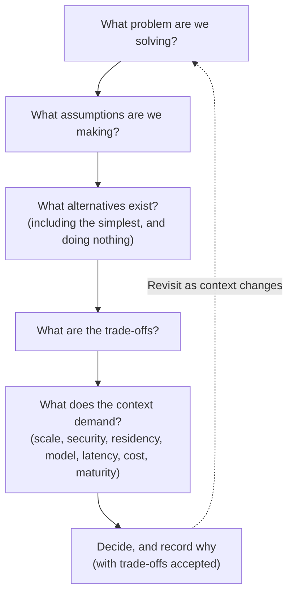

# Chapter 28: Architectural Trade-offs and Decision-Making

This book has presented many patterns, and for each it has insisted on the same discipline: understand the problem, weigh the alternatives, examine the trade-offs, and decide whether the pattern fits the context. Part VI steps back from individual patterns to the judgement that runs through all of them. This chapter is about how an architect actually decides, the reasoning, the frameworks and the restraint that turn a catalogue of patterns into sound architecture.

The central conviction of the book surfaces most clearly here: good architecture is not about maximising sophistication but about applying the right complexity to the problem. Every pattern in this book has both a "when to use" and a "when not to use", because every pattern is right in some contexts and wrong in others. The skill this chapter addresses is not knowing the patterns, that is the easy part, but knowing which to choose, when, and, crucially, when to choose none of them. This is a synthesis chapter rather than a pattern chapter, so it follows the reasoning rather than the pattern blueprint, but its purpose is the same as every verdict in the book: to help the reader decide.

---

## Why Context Determines Architecture

There is no architecture that is correct independent of its context. This is perhaps the most important idea in the book, and it is worth stating without qualification: a pattern that is exactly right for one organisation can be exactly wrong for another, and the difference lies not in the pattern but in the context around it.

The federated multi-account platform of Part III is excellent for a large enterprise with many teams, genuine governance needs and the maturity to operate shared services. The same platform imposed on a small organisation with one team is a burden, expensive, slow to build, and solving problems the organisation does not have. Direct Bedrock integration (Chapter 6) is exactly right for that small organisation and exactly wrong for the large enterprise that needs consistent governance across many consumers. Neither pattern is better; they fit different contexts.

The factors that make up context recur throughout the book, and they are the real inputs to every architectural decision:

- **Scale** — how many users, teams, requests and data domains, now and plausibly later.
- **Security and regulatory requirements** — what must be protected and demonstrated, and to what standard.
- **Data residency and sovereignty** — where data, including data in transit to inference, may be.
- **Operating model** — whether the organisation is centralised, federated or distributed in how it runs technology.
- **Latency** — how quickly responses are needed.
- **Cost constraints** — the budget within which the system must be sustainable.
- **Organisational maturity** — the skills, tooling and operational capability actually available, not those one wishes for.

An architect who reaches for a pattern without weighing these is guessing. An architect who weighs them is deciding. The difference between the two is the difference between architecture and pattern-matching.

---

## ⚖️ The Shape of an Architectural Decision

Every significant architectural decision in this book has followed, explicitly or implicitly, the same shape, the reasoning the chapter blueprint encoded. Made explicit as a reusable framework, it is:

> **What problem are we solving?** State the actual problem, not the solution. Many poor decisions begin by reaching for a technology before the problem is clear.
>
> **What assumptions are we making?** Surface the assumptions, about scale, load, requirements, that the decision rests on, because an unstated assumption is the commonest reason a design fails later.
>
> **What alternatives exist?** Identify the genuine alternatives, including the simplest one and the option of doing nothing new.
>
> **What are the trade-offs?** For each alternative, weigh benefits against costs, complexity, operational overhead, security, performance and cost.
>
> **What does the context demand?** Judge the alternatives against the actual constraints, scale, security, residency, operating model, latency, cost, maturity.
>
> **Decide, and state why.** Choose, and record the reasoning and the trade-offs accepted, so the decision can be understood and revisited later.

This framework is deliberately simple, and its value is in the discipline, not the novelty. Its most under-used steps are the second and third: surfacing assumptions, and genuinely considering the simplest alternative and the option of doing nothing new. An architect who consistently asks these questions will make better decisions than one who knows more patterns but skips the reasoning.

---

## ⚖️ Recognising the Recurring Trade-offs

Certain trade-offs recur across nearly every pattern in this book, and recognising them as recurring, rather than rediscovering them each time, is part of an architect's fluency. The major ones:

- **Consistency versus autonomy.** Centralising a concern gives consistency and governance; leaving it to teams gives autonomy and speed. The AI Gateway, federation and the platform all navigate this, and the answer is usually federation: consistent where it must be, autonomous where it can be.
- **Simplicity versus capability.** More sophisticated patterns do more but cost more in complexity, operational overhead and risk. Direct integration, RAG, agents and multi-agent systems form a ladder of increasing capability and cost, and the right rung is the lowest that meets the need.
- **Cost versus quality versus latency.** The model-selection triangle of Chapter 4 recurs everywhere: you rarely optimise all three, and the balance is set by the workload.
- **Control versus blast radius.** Centralising control concentrates both governance and risk; distributing contains blast radius but fragments governance. Federation and account boundaries navigate this.
- **Autonomy versus safety.** For agents especially, more autonomy is more capable and more dangerous; controlled autonomy, the least that does the job, is the resolution.
- **Performance and availability versus cost.** Higher targets cost more; the right level is the workload's genuine requirement, not the maximum.

None of these has a universal answer, which is precisely the point. Each is resolved by the context, and an architect's job is to recognise which trade-off is in play and judge it against the constraints, rather than to have a fixed preference.

---

## The Discipline of Restraint: When Not to Build

The hardest architectural discipline, and the one this book has emphasised most, is restraint, choosing less rather than more. The instinct to build the sophisticated thing is strong, and often wrong. Some of the clearest examples from the book:

- **When not to build a platform.** The Core GenAI platform of Chapter 15 is powerful and, for a small organisation or one with few teams, entirely unwarranted. A platform is justified by genuine scale and genuine duplication; built ahead of them, it is complexity created for a problem the organisation does not have. The mature path is usually to grow into a platform, starting with simpler patterns, not to build it first.
- **When not to use an agent.** Agents (Chapter 11) are the pattern most often reached for out of enthusiasm. Where a single inference or a fixed workflow suffices, an agent adds risk, cost and unpredictability for no benefit. The default should be the simpler, more predictable pattern.
- **When not to use multi-agent.** Multi-agent systems (Chapter 12) compound this: they should be used only where a task genuinely decomposes, and the default assumption should be that a single agent or simpler pattern is preferable.
- **When not to federate.** Federation (Chapter 14) is right for a multi-account enterprise and overhead for a small one.
- **When not to over-provision.** Resilience, performance and availability (Chapters 22 and 25) should be sized to the workload, not maximised, because gold-plating is as much a failure as neglect.

The common thread is that maximum sophistication is rarely the right answer, and choosing less is usually the more mature decision. This is not timidity; it is judgement. Applying the right complexity to the problem, and no more, is the definition of good architecture that the book has returned to throughout, and it is the hardest thing to do well because it runs against the instinct to build impressively.

---

## Decision Checklists as a Tool

Throughout the book, each pattern chapter ended with an architecture decision checklist. These are not bureaucracy; they are a practical tool for applying judgement consistently, a way of ensuring the important questions are asked every time rather than only when someone remembers. Their value is twofold: they make the reasoning repeatable, so decisions do not depend on who happens to be in the room, and they surface the questions most easily forgotten, the assumptions, the simplest alternative, the context, the trade-offs accepted.

A general decision checklist, distilled from the pattern-specific ones, might ask:

- Is the actual problem clearly stated, before any solution is chosen?
- Have the assumptions the decision rests on been made explicit?
- Has the simplest alternative, including doing nothing new, been genuinely considered?
- Have the trade-offs of each alternative been weighed, not just the benefits?
- Has the decision been judged against the real context, scale, security, residency, operating model, latency, cost, maturity?
- Is the chosen complexity the least that meets the need?
- Have the trade-offs accepted been recorded, so the decision can be revisited?
- Is the decision revisited as the context changes, rather than treated as permanent?

Checklists like these turn the book's patterns and principles into a repeatable practice. They are how an architect ensures that the discipline described in this chapter is applied in fact, not just in intention.

---

## Decisions Are Not Permanent

A final principle: architectural decisions are made in a context, and contexts change. An organisation grows, its regulatory environment shifts, its maturity increases, and the technology itself evolves. A decision that was right when made can become wrong as its context changes, and part of architectural judgement is recognising when to revisit.

This is why the decision framework loops back, and why the book has repeatedly described patterns as things to grow into: direct integration giving way to a gateway as consumers multiply, a gateway growing into a platform as scale justifies it, simpler patterns yielding to more sophisticated ones as genuine need appears. The mature approach is not to pick the eventual end-state architecture at the start, but to choose what fits the current context and evolve deliberately as it changes, carrying the decisions and their recorded reasoning forward so that evolution is informed rather than a series of rewrites.

An architecture is not a monument. It is a set of decisions, appropriate to a moment, that should be revisited as the moment passes. Holding a decision too long, past the point where its context has changed, is as much an error as choosing it wrongly in the first place.

---

## 📐 The Architect's Verdict

> The patterns in this book are the easy part; the judgement to choose among them is the craft. No architecture is correct independent of its context, so every decision must be weighed against the real constraints, scale, security, residency, operating model, latency, cost and maturity, rather than reached for by preference or reflex. The reasoning is always the same shape: state the problem, surface the assumptions, consider the alternatives including the simplest and doing nothing, weigh the trade-offs, judge against the context, and decide with the reasons recorded. Recognise the recurring trade-offs, consistency versus autonomy, simplicity versus capability, control versus blast radius, autonomy versus safety, and resolve each by context rather than fixed preference. Above all, practise restraint: maximum sophistication is rarely the right answer, choosing less is usually the more mature decision, and applying the right complexity to the problem, and no more, is the whole of good architecture. And because contexts change, revisit decisions rather than enshrining them. An architect is not measured by the sophistication of what they build, but by the fit between what they build and the problem in front of them.
