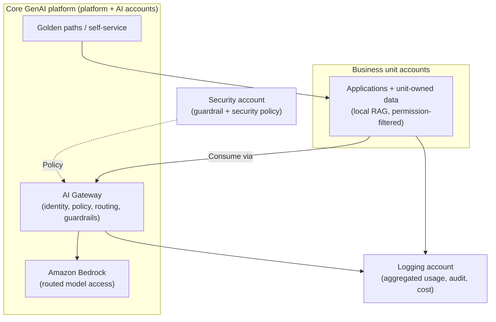

# Chapter 29: Case Study — Designing an Enterprise GenAI Platform

The preceding chapters built patterns and the judgement to choose among them. This chapter puts both to work in a single, connected design. It follows a hypothetical enterprise from an initial brief through the architectural decisions that shape its GenAI capability, applying the patterns of the book in context, weighing the alternatives, and recording the trade-offs accepted.

A necessary and honest caveat: the enterprise in this chapter is hypothetical, constructed to illustrate the reasoning, not drawn from a real client, and it contains no real figures, benchmarks or claims. Its value is not that it describes what some organisation actually did, but that it shows how the decision-making of Chapter 28 applies the patterns of the book to a coherent problem. The specifics are invented to be plausible; the reasoning is the point. Read it as a worked example of judgement, not as a case history.

---

## The Brief (Hypothetical)

Imagine a large financial-services enterprise, call it Meridian, operating on AWS across many accounts. Meridian has several business units, each with its own applications, data and engineering teams. It is regulated, with genuine obligations around data protection, residency and auditability. It has been experimenting with GenAI: two teams built promising proofs of concept, an internal knowledge assistant and a customer-support drafting tool, and leadership now wants GenAI adopted more broadly, safely and sustainably, across the enterprise.

The stated goals are to let many teams use foundation models, to ground responses in each unit's own data, to enforce consistent security and governance given the regulatory context, to see and control cost, and to avoid every team reinventing the same solutions. The constraints are equally clear: strict security and compliance, data residency requirements, a federated operating model (business units have real autonomy), a need for auditability, and a finite budget. Meridian has reasonable engineering maturity but has not previously run a shared AI platform.

This brief is deliberately a strong fit for much of the book, precisely so the reasoning can be shown end to end. A different brief, a small startup, an unregulated single-team shop, would lead to very different, and often much simpler, decisions, which is exactly the point Chapter 28 made about context.

---

## Framing the Problem

Before choosing anything, the problem must be stated, following the decision framework. Meridian's problem is not "which model should we use", nor "how do we build an AI app". It is: how to provide GenAI as a governed, shared capability to many autonomous, regulated business units, so they can build on their own data safely and sustainably, without each reinventing the controls and without a central team becoming a bottleneck.

Stated this way, the problem is recognisably the one Part III addresses. The scale (many teams), the operating model (federated), the regulatory constraints, and the duplication already emerging (two teams solving the same problems separately) all point toward an enterprise platform on a federated foundation. But that conclusion must be earned decision by decision, not assumed, and each decision must consider the simpler alternative.

A first, important judgement: is a platform justified at all, or is this a case for the simpler patterns of Part II used directly? Chapter 28 warned against building a platform ahead of genuine scale and duplication. Here, the scale (many business units), the duplication (already visible), and the regulatory need for consistent governance are genuine, so a platform is warranted, but Meridian should grow into it rather than build the whole of Chapter 15 at once. This tension, real justification for a platform, but a caution against over-building, shapes the sequencing of what follows.

---

## The Decisions

### Account structure: federate

The first structural decision is how to place GenAI across Meridian's many accounts. The options are centralise everything, distribute freely, or federate (Chapter 14). Centralising would force each unit's regulated data into a shared account, conflict with the units' autonomy, and create an enterprise-wide blast radius, unacceptable given the regulatory context. Distributing freely would fragment governance, exactly what a regulated enterprise cannot afford, and duplicate effort. Federation fits: govern centrally through platform, security and logging accounts, while business units keep their own data and applications in their own accounts. The trade-off accepted is the genuine complexity of a multi-account federated design and the maturity it demands, justified by the fit with Meridian's operating model and regulatory needs.

### Access to models: an AI Gateway

With federation chosen, how do units reach models? Direct integration per team (Chapter 6) is rejected here, not because it is a bad pattern, but because it does not fit this context: many regulated teams reaching models independently would reinvent controls and offer no consistent governance point. An AI Gateway (Chapter 7) fits: a central control plane enforcing identity, policy and guardrails consistently and non-bypassably, and providing aggregated usage visibility. The trade-off accepted is an added hop and a shared dependency that must be made resilient, justified by the consistency and governance a regulated, multi-team enterprise requires.

### Grounding: RAG with local, unit-owned data

Meridian needs responses grounded in each unit's data. RAG (Chapter 8) is the clear fit over model customisation, since the data is private, changing and unit-owned, and grounding must be citable for audit. The key decision is data ownership: a shared index versus local, unit-owned indexes. Given regulatory data-protection and residency requirements and the units' autonomy, local unit-owned retrieval is chosen, so each unit's data stays under its control and its access boundaries survive into retrieval. Permission-filtered retrieval is mandatory given the regulatory context. As the corpora grow, the advanced retrieval of Chapter 9, hybrid search, re-ranking, evaluation, can be adopted incrementally. The trade-off accepted is the operational cost of retrieval infrastructure per domain, justified by data ownership and compliance.

### Model choice: routing at the gateway

Meridian's traffic is heterogeneous, simple classifications alongside demanding reasoning, so routing (Chapter 10) at the gateway is chosen over a single fixed model, to serve simple requests with cheaper models and reserve powerful ones for those that need them, under central policy that also respects residency (which models may run where). This is deferred slightly: Meridian starts with a small, clear model set and adds routing sophistication as usage patterns emerge, per the "start with clear rules" guidance. The trade-off accepted is the routing policy's maintenance, justified by cost control and governance over which models handle regulated data.

### Agents: sparingly, and later

Should Meridian build agents (Chapters 11-12)? Following the restraint of Chapter 28, the answer is not yet, and only where warranted. The initial use cases, knowledge assistance and support drafting, are well served by RAG-grounded inference, not agents. Agents would add autonomy, risk and cost the initial cases do not need. If a genuinely open-ended, multi-step task appears later, a narrowly-bounded, least-privilege agent with human approval for consequential actions can be introduced then, and multi-agent systems only if a task genuinely decomposes. The trade-off accepted is deferring a capability, justified by avoiding unwarranted risk and cost, and by the maturity agents demand that Meridian should build up to.

### Security, governance and networking

Given the regulatory context, the controls of Part IV are not optional extras but foundational. Real identity propagates to every access decision (Chapter 18); data is protected everywhere it flows and rests, with residency respected in every store and log; guardrails are enforced centrally and non-bypassably at the gateway (Chapter 19); threats are modelled systematically (Chapter 20); and governance translates Meridian's responsible-AI and regulatory obligations into owned, verified, demonstrable controls (Chapter 21). Networking (Chapter 17) makes this real: private paths to Bedrock, private cross-account connectivity, isolated data stores, controlled egress, and residency enforced in topology. The trade-off accepted is significant design and operational rigour, non-negotiable for a regulated enterprise.

### Operations

Meridian's platform must be run, not just built. Resilience (Chapter 22), with safe refusal and fail-safe behaviour; observability (Chapter 23) aggregated in the logging account; evaluation (Chapter 24) of quality, especially important for a regulated context where wrong answers carry real consequences; performance and availability (Chapter 25) sized to each workload; FinOps (Chapter 26) with cost attributed per unit; and disciplined, quality-gated delivery (Chapter 27), all apply. Crucially, platform engineering (Chapter 16), golden paths and self-service, is what lets the platform serve many units without the central team becoming a bottleneck, and lets units inherit security, governance and cost discipline by default.

---

## The Shape of the Result

Taken together, these decisions describe a Core GenAI platform (Chapter 15) on a federated foundation: business units in their own accounts, consuming a platform, an AI Gateway with routing and guardrails, shared model access, retrieval offered as a capability while data stays unit-owned, central governance and aggregated observability and cost, delivered through golden paths and self-service, with agents held in reserve for genuine need.

Importantly, Meridian does not build all of this at once. It grows into it: a gateway and federation first, with the two existing use cases migrated onto them; retrieval and routing next; platform engineering and self-service as more units onboard; advanced retrieval, agents and further sophistication only as genuine need and maturity justify. This sequencing is itself an architectural decision, applying Chapter 28's principle that one grows into a platform rather than building it ahead of need.

---

## Reviewing the Design Against the Checklist

Chapter 28 offered a general decision checklist. Reviewing Meridian's design against it:

- **Is the problem clearly stated?** Yes: governed, shared GenAI for many autonomous, regulated units.
- **Are the assumptions explicit?** Yes: genuine scale, real duplication, federated operating model, regulatory constraints, reasonable but untested platform maturity.
- **Was the simplest alternative considered?** Yes: direct integration and no platform were considered and rejected for this context, though adopted as the starting point to grow from.
- **Were trade-offs weighed, not just benefits?** Yes: each decision recorded the cost accepted, complexity, operational overhead, deferred capability.
- **Judged against real context?** Yes: scale, security, residency, operating model, cost and maturity all drove the decisions.
- **Is the chosen complexity the least that meets the need?** Largely: the platform is justified, but it is grown into rather than built whole, and agents are deferred, applying restraint.
- **Are accepted trade-offs recorded?** Yes, decision by decision.
- **Will the design be revisited as context changes?** Yes: the sequencing anticipates evolution as Meridian's scale, maturity and needs grow.

The review shows the design is a considered fit to the context, not a reach for maximum sophistication. A different context would have yielded a different, and probably simpler, answer, which is exactly what Chapter 28 argued.

---

## What a Different Context Would Change

To reinforce that context determines architecture, consider how the design would change for a different, hypothetical organisation. A small, unregulated startup with one team and one use case would not federate, would not build a platform, and would not need a gateway; direct Bedrock integration (Chapter 6) with basic RAG, sensible security and cost defaults, and simple observability would be the right, proportionate answer, and building Meridian's platform for it would be a serious over-engineering error. A mid-sized, lightly-regulated company with a few teams might build a lightweight version, a gateway with aggregated logging and a couple of golden paths, growing toward a fuller platform only if scale demanded.

The same patterns, the same book, produce very different architectures depending on context, and recognising which architecture a context calls for is the judgement the whole book has been building toward.

---

## 📐 The Architect's Verdict

> This hypothetical case study shows the book's patterns and judgement working together on a coherent problem, and its lesson is the reasoning, not the specific answer. For a large, regulated, federated enterprise like the imagined Meridian, the decisions compose into a Core GenAI platform on a federated foundation, gateway, routed model access, local unit-owned retrieval, central governance, aggregated observability and cost, self-service delivery, with agents held in reserve, because that is what this context genuinely demands. But every decision was earned by framing the problem, weighing alternatives including the simplest, judging against real constraints, and recording the trade-offs accepted, and the platform is grown into rather than built ahead of need, applying restraint even where sophistication is justified. Change the context, a small startup, a lightly-regulated mid-sized firm, and the same patterns yield a very different, simpler architecture. That is the whole point: there is no correct architecture in the abstract, only an architecture that fits the problem in front of you. The case study is invented; the discipline of fitting architecture to context is what an architect actually does.
